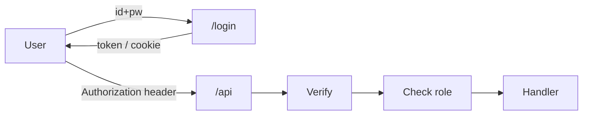

# Authentication and Authorization

> Backend Development 101 series (6/10)

<!-- a-grade-intro:begin -->

**Core question**: From the *server* point of view, what does "logged in" actually mean?

> A user has *proven who they are* and the server now knows *what they can do* on this request. Authentication and authorization are *two different problems*.

<!-- a-grade-intro:end -->

## What You Will Learn

- The difference between authentication and authorization
- Minimum safe practices for password storage
- Sessions vs JWT — when to use which
- How to build a protected endpoint in FastAPI
- How to model permissions as roles

## Why It Matters

Auth is the *one area* where a single mistake can sink a company. A line that stored passwords as plain text or skipped a token check returns *years later* as a security incident.

> Auth code must be small, standard, and boring.

## Concept at a Glance



Authentication asks *who*; authorization asks *can you*.

## Key Terms

- **Authentication**: identity check.
- **Authorization**: action permission.
- **Hash**: an *irreversible* transformation of a password.
- **Session**: server-side state that tracks a user.
- **JWT**: a signed token that can be verified without server state.

## Before/After

**Before (plain text password)**

```python
def register(name, password):
    db.execute("INSERT INTO users(name, pw) VALUES(?, ?)", (name, password))
```

**After (hash and verify)**

```python
from passlib.hash import bcrypt
def register(name, password):
    pw_hash = bcrypt.hash(password)
    db.execute("INSERT INTO users(name, pw_hash) VALUES(?, ?)", (name, pw_hash))

def verify(name, password):
    row = db.fetchone("SELECT pw_hash FROM users WHERE name=?", (name,))
    return row and bcrypt.verify(password, row["pw_hash"])
```

A leaked database no longer leaks usable passwords.

## Hands-on: Five Steps Through an Auth Flow

### Step 1 — Hash a password

```python
# 1_hash.py
from passlib.hash import bcrypt
hashed = bcrypt.hash("mySecret123")
print(bcrypt.verify("mySecret123", hashed))  # True
```

### Step 2 — Issue a JWT

```python
# 2_jwt.py
import jwt, time
SECRET = "change-me"
token = jwt.encode({"sub": "alice", "exp": time.time() + 3600}, SECRET, algorithm="HS256")
print(token)
```

### Step 3 — Verify a JWT

```python
# 3_verify.py
import jwt
data = jwt.decode(token, SECRET, algorithms=["HS256"])
print(data["sub"])
```

### Step 4 — Protect an endpoint

```python
# 4_protected.py
from fastapi import FastAPI, Depends, HTTPException, Header

app = FastAPI()

def current_user(authorization: str = Header(...)):
    try:
        token = authorization.removeprefix("Bearer ")
        data = jwt.decode(token, SECRET, algorithms=["HS256"])
        return data["sub"]
    except Exception:
        raise HTTPException(401)

@app.get("/me")
def me(user: str = Depends(current_user)):
    return {"user": user}
```

### Step 5 — Role-based access

```python
# 5_role.py
def require_role(role: str):
    def _dep(user: dict = Depends(current_user_with_role)):
        if user["role"] != role:
            raise HTTPException(403)
        return user
    return _dep

@app.delete("/admin/users/{uid}")
def delete_user(uid: int, _: dict = Depends(require_role("admin"))):
    return {"deleted": uid}
```

## What to Notice in This Code

- Passwords are *never* stored as plain text.
- JWT secrets are *never* hard-coded — use env vars.
- 401 (no auth) and 403 (no permission) carry *different meanings*.

## Five Common Mistakes

1. **Hashing passwords with MD5 or SHA-1.** Use bcrypt or argon2.
2. **Omitting `exp` from JWTs.** Tokens become valid *forever*.
3. **Storing JWTs only in localStorage.** XSS can steal them — consider httpOnly cookies.
4. **Doing permission checks only on the frontend.** The server must always re-check.
5. **Locking every endpoint behind auth.** Make public ones (`/healthz`, `/login`) explicit.

## How This Shows Up in Production

Most SaaS products start with *bcrypt + JWT + role-based access*. As they grow, they add OAuth2, MFA, and permission matrices, but the core stays the same — only code that *cleanly separates* authentication from authorization scales.

## How a Senior Engineer Thinks

- Auth code is *small* and uses *standard* libraries.
- Secrets live in environment variables and a secret manager.
- Tokens expire *quickly* and refresh tokens handle longevity.
- Permissions are modeled as *roles* or *policies*.
- Failed auth attempts are *monitored* — they signal brute force.

## Checklist

- [ ] You can hash and verify with bcrypt.
- [ ] You can issue a JWT with an expiration.
- [ ] You can protect a FastAPI endpoint.
- [ ] You can tell 401 from 403.
- [ ] You can write a role-based check.

## Practice Problems

1. Build a service with `/register`, `/login`, `/me` endpoints.
2. Set the JWT expiration to one minute and verify a 401 after it expires.
3. Add an `/admin` route accessible only to the `admin` role.

## Wrap-up and Next Steps

Authentication is *identity*; authorization is *permission*. Next, we look at the operator's eyes — *Logging and Error Handling*.

- [What Is Backend Development?](./01-what-is-backend-development.md)
- [Building an HTTP Server](./02-building-an-http-server.md)
- [Routing and Controllers](./03-routing-and-controllers.md)
- [The Service Layer](./04-service-layer.md)
- [The Database Layer](./05-database-layer.md)
- **Authentication and Authorization (current)**
- Logging and Error Handling (upcoming)
- Testing the Backend (upcoming)
- Deploying the Backend (upcoming)
- A Production-Ready Backend Structure (upcoming)
## References

- [OWASP Authentication Cheat Sheet](https://cheatsheetseries.owasp.org/cheatsheets/Authentication_Cheat_Sheet.html)
- [FastAPI Security](https://fastapi.tiangolo.com/tutorial/security/)
- [JWT Introduction](https://jwt.io/introduction)
- [Passlib bcrypt docs](https://passlib.readthedocs.io/en/stable/lib/passlib.hash.bcrypt.html)

Tags: Backend, Auth, Security, JWT, Python

---

© 2026 YeongseonBooks. All rights reserved.
