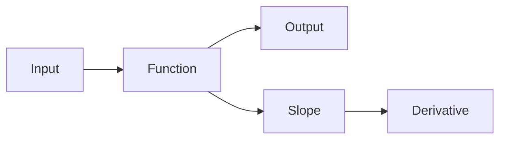

# Functions and Slope

> Calculus for ML 101 series (2/10)

<!-- a-grade-intro:begin -->

**Core question**: How do the *shape* of a function and its *slope* relate?

> A *function* is a *contract* from input to output, and a *slope* is the *direction and speed* of change.

<!-- a-grade-intro:end -->

## What You Will Learn

- The definition of a *function*
- *Slope* of a *linear* function
- *Local slope* of a *nonlinear* function
- The *graphical meaning* of a derivative
- Intuition for ML *activations*

## Why It Matters

ML models are *function compositions*, and training pushes signals through *each function gradient*.

## Concept at a Glance



## Key Terms

- **function**: maps *input* to *output*.
- **slope**: the *ratio* of change.
- **linear**: a *straight* line.
- **nonlinear**: a *curve*.
- **activation**: a *nonlinear* ML function.

## Before/After

**Before**: a function is only a *formula*.

**After**: a function is also a *graph* with a *slope*.

## Hands-on: Mini Function Kit

### Step 1 — Linear

```python
def linear(x, a=2, b=1):
    return a * x + b
```

### Step 2 — Linear Slope

```python
def linear_slope(a):
    return a
```

### Step 3 — Nonlinear

```python
def relu(x):
    return max(0.0, x)
```

### Step 4 — ReLU Local Slope

```python
def relu_grad(x):
    return 1.0 if x > 0 else 0.0
```

### Step 5 — Sigmoid

```python
import math

def sigmoid(x):
    return 1 / (1 + math.exp(-x))
```

## What to Notice in This Code

- A linear slope is a *constant*.
- *ReLU* has a slope of *0 or 1*.
- *Sigmoid* is a *smooth step*.

## Five Common Mistakes

1. **Confusing *linear* and *nonlinear*.**
2. **Ignoring that *ReLU* is *not differentiable* at *0*.**
3. **Ignoring the *saturated* region of *sigmoid*.**
4. **Ignoring how *zero gradients* in activations matter.**
5. **Comparing inputs of *different scales* directly.**

## How This Shows Up in Production

Picking *activations*, building *graphical intuition*, and diagnosing *vanishing gradients* all start from function-slope thinking.

## How a Senior Engineer Thinks

- *Functions* are model *bricks*.
- Suspect any *zero-gradient* region.
- *Plot* the function.
- Align *input scales*.
- Treat *nonlinearity* as a *goal*.

## Checklist

- [ ] *Plot* the function.
- [ ] Inspect the *gradient distribution*.
- [ ] Check *saturated* regions.
- [ ] Align *input scales*.

## Practice Problems

1. State the slope of a *linear* function in one line.
2. State the slope of *ReLU* in one line.
3. Describe the *sigmoid* gradient in one line.

## Wrap-up and Next Steps

Next post: *Partial Derivatives*.

- [What Is a Derivative](./01-what-is-derivative.md)
- **Functions and Slope (current)**
- Partial Derivatives (upcoming)
- Gradient (upcoming)
- Chain Rule (upcoming)
- Loss Function (upcoming)
- Gradient Descent (upcoming)
- Optimization (upcoming)
- Backpropagation Intuition (upcoming)
- Calculus in Deep Learning (upcoming)
## References

- [Functions - Khan Academy](https://www.khanacademy.org/math/algebra/x2f8bb11595b61c86:functions)
- [Activation Functions - Stanford CS231n](https://cs231n.github.io/neural-networks-1/)
- [Deep Learning Book - MLP](https://www.deeplearningbook.org/contents/mlp.html)
- [PyTorch Activations](https://pytorch.org/docs/stable/nn.html#non-linear-activations-weighted-sum-nonlinearity)

Tags: Calculus, ML, Functions, Slope, Beginner

---

© 2026 YeongseonBooks. All rights reserved.
