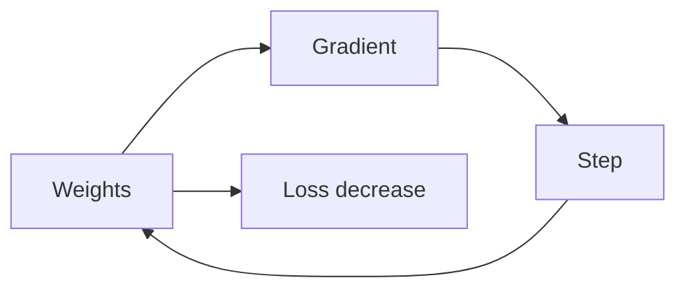

# Gradient Descent

> Calculus for ML 101 series (7/10)

<!-- a-grade-intro:begin -->

**Core question**: How can we find *optimal weights* using only the *loss gradient*?

> *Gradient descent* repeatedly takes a *small step* in the *opposite* direction of the gradient.

<!-- a-grade-intro:end -->

## What You Will Learn

- The *gradient descent* algorithm
- The role of the *learning rate*
- *Convergence* and *divergence*
- *Stochastic* gradient descent (SGD)
- Intuition for *mini-batches*

## Why It Matters

Most ML training is a *variant* of gradient descent.

## Concept at a Glance



## Key Terms

- **GD**: gradient over *all data*.
- **SGD**: gradient over *one sample*.
- **mini-batch**: gradient over a *small batch*.
- **lr**: *learning rate*.
- **convergence**: settling to a *minimum*.

## Before/After

**Before**: try every combination via *grid search*.

**After**: move *efficiently* using the gradient.

## Hands-on: Mini GD Kit

### Step 1 — Loss and Gradient

```python
def loss(w):
    return (w - 3) ** 2

def grad(w):
    return 2 * (w - 3)
```

### Step 2 — One GD Step

```python
def step(w, lr=0.1):
    return w - lr * grad(w)
```

### Step 3 — Training Loop

```python
def train(w0, lr=0.1, steps=100):
    w = w0
    for _ in range(steps):
        w = step(w, lr)
    return w
```

### Step 4 — SGD

```python
import random

def sgd(data, w0, lr=0.01, epochs=10):
    w = w0
    for _ in range(epochs):
        random.shuffle(data)
        for x in data:
            w -= lr * 2 * (w - x)
    return w
```

### Step 5 — Learning Rate Effect

```python
for lr in [0.001, 0.1, 1.5]:
    print(lr, train(0.0, lr, 50))
```

## What to Notice in This Code

- One *opposite-sign* step.
- The *learning rate* is *decisive*.
- *SGD* introduces *noise*.

## Five Common Mistakes

1. **Setting the *learning rate* far too high.**
2. **Using the same *lr* for differently-scaled weights.**
3. **Stopping *before convergence*.**
4. **Ignoring *SGD noise*.**
5. **Initializing all weights to *zero*.**

## How This Shows Up in Production

*Adam*, *Momentum*, and *RMSProp* are all *refinements* of gradient descent.

## How a Senior Engineer Thinks

- *Learning rate* is the most important hyperparameter.
- See divergence? Cut the *learning rate*.
- *SGD noise* gives *implicit regularization*.
- Use *warmup* and *scheduling*.
- Always inspect the *loss curve*.

## Checklist

- [ ] Search the *learning rate*.
- [ ] Monitor *convergence*.
- [ ] *Early-stop* on divergence.
- [ ] Vary *initialization*.

## Practice Problems

1. Define *gradient descent* in one line.
2. State the role of the *learning rate* in one line.
3. State the difference between *SGD* and *GD* in one line.

## Wrap-up and Next Steps

Next post: *Optimization*.

- [What Is a Derivative](./01-what-is-derivative.md)
- [Functions and Slope](./02-functions-and-slope.md)
- [Partial Derivatives](./03-partial-derivatives.md)
- [Gradient](./04-gradient.md)
- [Chain Rule](./05-chain-rule.md)
- [Loss Function](./06-loss-function.md)
- **Gradient Descent (current)**
- Optimization (upcoming)
- Backpropagation Intuition (upcoming)
- Calculus in Deep Learning (upcoming)
## References

- [Gradient Descent - CS231n](https://cs231n.github.io/optimization-1/)
- [Adam Optimizer - Kingma and Ba](https://arxiv.org/abs/1412.6980)
- [Deep Learning Book - Optimization](https://www.deeplearningbook.org/contents/optimization.html)
- [PyTorch Optimizers](https://pytorch.org/docs/stable/optim.html)

Tags: Calculus, ML, GradientDescent, Optimization, Beginner

---

© 2026 YeongseonBooks. All rights reserved.
