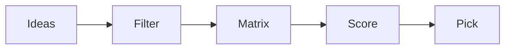

# Choosing a Topic

> Capstone Project 101 series (2/10)

<!-- a-grade-intro:begin -->

**Core question**: *What* does a *good topic* look like, and *how* do you pick one?

> A topic that is *small*, *measurable*, and *within your team's reach* is a *good topic*.

<!-- a-grade-intro:end -->

## What You Will Learn

- *Criteria* for a good topic
- Building a *candidate list*
- *Comparison matrix*
- *Scope* tuning
- *Final* pick

## Why It Matters

If the *topic* shakes, the *remaining semester* shakes.

## Concept at a Glance



## Key Terms

- **idea**: a *candidate*.
- **filter**: rejection *criteria*.
- **matrix**: comparison *table*.
- **score**: a *number*.
- **pick**: *final selection*.

## Before/After

**Before**: You only chase *cool topics*.

**After**: You pick a *topic that fits your team*.

## Hands-on: Topic Comparison Matrix

### Step 1 — Candidates

```python
ideas = ["schedule_checker", "mood_diary", "campus_map"]
```

### Step 2 — Score axes

```python
axes = ["impact", "feasibility", "interest"]
```

### Step 3 — Score table

```python
score = {"schedule_checker": [4, 5, 4], "mood_diary": [3, 4, 5], "campus_map": [4, 3, 3]}
```

### Step 4 — Totals

```python
total = {k: sum(v) for k, v in score.items()}
```

### Step 5 — Pick

```python
pick = max(total, key=total.get)
```

## What to Notice in This Code

- *Comparison* makes the *decision* easy.
- *Axes* are the *criteria*.
- Look at *balance* too, not only *totals*.

## Five Common Mistakes

1. **Chasing *trends* only.**
2. **Overestimating *team capacity*.**
3. **Picking by *gut* with no *score table*.**
4. ***Mixing* axis definitions.**
5. **Not *keeping alternatives*.**

## How This Shows Up in Production

Product *priority meetings* use *similar matrices*.

## How a Senior Engineer Thinks

- Stay *small*.
- *Compare*.
- *Document*.
- Keep *alternatives*.
- Allow *revisits*.

## Checklist

- [ ] *Three or more candidates*.
- [ ] *Three axes*.
- [ ] *Score table*.
- [ ] *Reason for pick*.

## Practice Problems

1. Define *impact* in one line.
2. Define *feasibility* in one line.
3. State the meaning of *topic selection* in one line.

## Wrap-up and Next Steps

Next post: *Defining the Problem*.

- [What is a Capstone Project](./01-what-is-capstone.md)
- **Choosing a Topic (current)**
- Defining the Problem (upcoming)
- Organizing Requirements (upcoming)
- Splitting Team Roles (upcoming)
- Designing the MVP (upcoming)
- Choosing the Tech Stack (upcoming)
- Schedule Management (upcoming)
- Building Presentation Materials (upcoming)
- Project Retrospective (upcoming)
## References

- [The Mom Test](http://momtestbook.com/)
- [Jobs to be Done](https://strategyn.com/jobs-to-be-done/)
- [How to Get Startup Ideas - Paul Graham](http://paulgraham.com/startupideas.html)
- [Atlassian Decision Matrix](https://www.atlassian.com/work-management/project-management/decision-matrix)

Tags: Capstone, Topic, Ideation, Scope, Beginner

---

© 2026 YeongseonBooks. All rights reserved.
