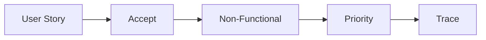

# Organizing Requirements

> Capstone Project 101 series (4/10)

<!-- a-grade-intro:begin -->

**Core question**: *Why* is a *feature list alone* not enough?

> Without *non-functional* needs and *priorities*, *decisions* will *shake*.

<!-- a-grade-intro:end -->

## What You Will Learn

- *User stories*
- *Non-functional* needs
- Setting *priority*
- *Acceptance* criteria
- Requirement *traceability*

## Why It Matters

Requirements must become a *spec* so *changes* can be *traced*.

## Concept at a Glance



## Key Terms

- **user story**: *user-perspective* request.
- **acceptance**: *accept* criteria.
- **non-functional**: *non functional* need.
- **MoSCoW**: *priority* labels.
- **traceability**: *trace links*.

## Before/After

**Before**: A *list of features*.

**After**: *Stories + criteria + priority*.

## Hands-on: Requirements Table

### Step 1 — User story

```python
story = "as a student I want instant conflict detection"
```

### Step 2 — Acceptance criteria

```python
accept = ["input 5s", "result 1s", "error clear"]
```

### Step 3 — Non-functional

```python
nf = ["mobile", "no_signup", "korean_first"]
```

### Step 4 — Priority

```python
prio = {"core": "Must", "share": "Should", "ai": "Could"}
```

### Step 5 — Trace

```python
trace = {"ST-1": ["F-1", "F-2"]}
```

## What to Notice in This Code

- *Stories* start with *verbs*.
- *Criteria* combine *numbers* and *readability*.
- *Trace* uses *IDs*.

## Five Common Mistakes

1. **The *story* drifts into *feature description*.**
2. **Forgetting *non-functional* needs.**
3. ***Everything Must*.**
4. **Subjective *criteria*.**
5. **No *traceability*.**

## How This Shows Up in Production

Startup PMs use *Must/Should/Could* labels every week.

## How a Senior Engineer Thinks

- *Stories* stay *short*.
- *Criteria* are *measurable*.
- *Priority* is *three or four buckets*.
- *Non-functional* is *separate*.
- *Trace* is *documented*.

## Checklist

- [ ] *Five+ stories*.
- [ ] *Acceptance criteria*.
- [ ] *Non-functional* table.
- [ ] *Priority* labels.

## Practice Problems

1. Define *user story* in one line.
2. Define *acceptance criteria* in one line.
3. State the meaning of *MoSCoW* in one line.

## Wrap-up and Next Steps

Next post: *Splitting Team Roles*.

- [What is a Capstone Project](./01-what-is-capstone.md)
- [Choosing a Topic](./02-choosing-a-topic.md)
- [Defining the Problem](./03-defining-the-problem.md)
- **Organizing Requirements (current)**
- Splitting Team Roles (upcoming)
- Designing the MVP (upcoming)
- Choosing the Tech Stack (upcoming)
- Schedule Management (upcoming)
- Building Presentation Materials (upcoming)
- Project Retrospective (upcoming)
## References

- [User Stories Applied - Mike Cohn](https://www.mountaingoatsoftware.com/books/user-stories-applied)
- [MoSCoW Method - Atlassian](https://www.atlassian.com/agile/product-management/requirements)
- [Specification by Example](https://gojko.net/books/specification-by-example/)
- [INVEST in Good Stories](https://www.agilealliance.org/glossary/invest/)

Tags: Capstone, Requirements, Spec, Scope, Beginner

---

© 2026 YeongseonBooks. All rights reserved.
