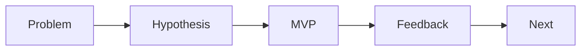

# Designing the MVP

> Capstone Project 101 series (6/10)

<!-- a-grade-intro:begin -->

**Core question**: *Why* is an *MVP* a *learning tool* rather than a *small product*?

> Because it lets you *test* a *hypothesis* at *minimum cost*.

<!-- a-grade-intro:end -->

## What You Will Learn

- *MVP* definition
- One *core flow*
- *Out-of-scope* decisions
- A *demo scenario*
- Collecting *feedback*

## Why It Matters

An *MVP* is where *learning* actually begins.

## Concept at a Glance



## Key Terms

- **MVP**: *Minimum Viable Product*.
- **happy path**: the *normal flow*.
- **out of scope**: outside the *scope*.
- **demo**: a *live walkthrough*.
- **feedback**: structured *responses*.

## Before/After

**Before**: Build *every feature*.

**After**: *Finish one flow*.

## Hands-on: MVP Table

### Step 1 — Pick the core flow

```python
flow = "register -> upload -> share"
```

### Step 2 — Out of scope list

```python
out = ["payment", "i18n", "admin"]
```

### Step 3 — Demo scenario

```python
demo = ["login_demo_user", "upload_sample", "show_share_link"]
```

### Step 4 — Success criteria

```python
success = {"happy_path": "<= 60s", "errors": 0}
```

### Step 5 — Feedback form

```python
form = ["clarity", "speed", "value"]
```

## What to Notice in This Code

- The *flow* is one *sentence*.
- *Out of scope* is *explicit*.
- *Criteria* are *numbers*.

## Five Common Mistakes

1. **Measuring *progress* by *feature count*.**
2. **Trying to handle *every* exception.**
3. **No *demo scenario*.**
4. **No *feedback* form.**
5. **Adding *external dependencies* that grow risk.**

## How This Shows Up in Production

Startups also start with a *one-line happy path*.

## How a Senior Engineer Thinks

- An *MVP* is a *learning tool*.
- The *flow* is *single*.
- *Cutting* scope is *bold*.
- The *demo* is *scripted*.
- *Feedback* is *structured*.

## Checklist

- [ ] *Core flow* defined.
- [ ] *Out-of-scope* list.
- [ ] *Demo* scenario.
- [ ] *Feedback* form.

## Practice Problems

1. State what *MVP* means in one line.
2. Define *happy path* in one line.
3. State the meaning of *out of scope* in one line.

## Wrap-up and Next Steps

Next post: *Choosing the Tech Stack*.

- [What is a Capstone Project](./01-what-is-capstone.md)
- [Choosing a Topic](./02-choosing-a-topic.md)
- [Defining the Problem](./03-defining-the-problem.md)
- [Organizing Requirements](./04-organizing-requirements.md)
- [Splitting Team Roles](./05-splitting-team-roles.md)
- **Designing the MVP (current)**
- Choosing the Tech Stack (upcoming)
- Schedule Management (upcoming)
- Building Presentation Materials (upcoming)
- Project Retrospective (upcoming)
## References

- [The Lean Startup - Eric Ries](http://theleanstartup.com/)
- [MVP - Lean Methodology](https://www.atlassian.com/agile/product-management/minimum-viable-product)
- [Inspired - Marty Cagan](https://svpg.com/inspired-how-to-create-products-customers-love/)
- [Continuous Discovery Habits](https://www.producttalk.org/continuous-discovery/)

Tags: Capstone, MVP, Scope, Product, Beginner

---

© 2026 YeongseonBooks. All rights reserved.
