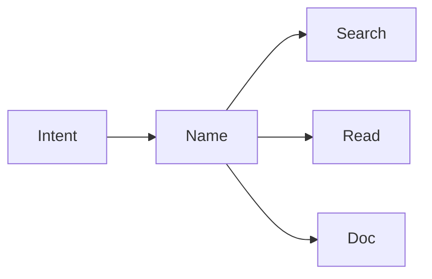

# Naming

> Clean Code 101 series (2/10)

<!-- a-grade-intro:begin -->

**Core question**: How much shorter does a good name make your code?

> A good name removes half of the comments. And it makes a single grep accurate.

<!-- a-grade-intro:end -->

## What You Will Learn

- Six signals of a good name
- The differences between variable, function, and class names
- Bringing domain terms into code
- The most common naming mistakes
- A safe procedure for renaming

## Why It Matters

Names are the most-read element of code. Pick a wrong one and you keep saying it forever.

> A searchable name is the start of maintainability.

## Concept at a Glance



The name lifts intent into view.

## Key Terms

- **Intention-revealing**: Says what and why.
- **Searchable**: Found by grep in one shot.
- **Pronounceable**: A name you can say in a meeting.
- **Domain term**: Use the business word as-is.
- **Length budget**: Shorter is not better; accuracy first.

## Before/After

**Before**

```python
d = 86400  # ?
```

**After**

```python
SECONDS_PER_DAY = 86400
```

The constant carries meaning.

## Hands-on: Six Naming Principles

### Step 1 — Reveal intent

```python
# 1_intent.py
def f(x): return x[0]            # of what?
def first_completed_order(orders): return orders[0]
```

The name explains the call site.

### Step 2 — Searchable

```python
# 2_search.py
TAX = 0.08                       # used where? unclear
DEFAULT_SALES_TAX_RATE = 0.08
```

Caught by a single grep.

### Step 3 — Domain terms

```python
# 3_domain.py
def calc(items): ...             # domain lost
def calculate_invoice_subtotal(line_items): ...
```

Code and business speak the same word.

### Step 4 — Avoid negatives

```python
# 4_negative.py
if not is_not_empty(x): ...      # double negative
if is_empty(x): ...
```

Affirmatives use less brain.

### Step 5 — Balance brevity and accuracy

```python
# 5_balance.py
i, j, k                          # short loops are fine
customer_balance_cents           # domain names can be long
```

Narrow scope: short. Wide scope: precise.

## What to Notice in This Code

- The name creates meaning at the call site.
- Searchability enables future analysis.
- Domain terms bridge users and developers.

## Five Common Mistakes

1. **`data`, `info`, `obj`.** Zero information.
2. **Heavy abbreviations.** Names like `usrCtxMgr`.
3. **Numeric suffixes.** `process2`, `process3` carry no meaning.
4. **Type in the name.** Use `user`, not `user_dict`.
5. **Lying names.** `getXxx` that mutates.

## How This Shows Up in Production

Mature teams keep a domain glossary in the repo and enforce consistency in PRs. Lints forbid one-letter variables outside loops and require an abbreviation allow-list.

## How a Senior Engineer Thinks

- Names are half the documentation.
- Accuracy beats brevity.
- Searchability decides future cost.
- Bring domain terms straight into code.
- A lying name is fraud.

## Checklist

- [ ] Does the name reveal intent?
- [ ] Is it grep-searchable?
- [ ] Does it use a domain term?
- [ ] Did you avoid negatives?
- [ ] Is length appropriate to scope?

## Practice Problems

1. Find five `data`/`info`/`obj` and rename them.
2. Expand five abbreviations.
3. Build a one-page domain glossary.

## Wrap-up and Next Steps

Naming is the single highest-leverage readability tool. Next we shrink the unit those names point at — small functions.

- [What Is Clean Code?](./01-what-is-clean-code.md)
- **Naming (current)**
- Small Functions (upcoming)
- Simplifying Conditionals (upcoming)
- Removing Duplication (upcoming)
- Error Handling (upcoming)
- Comments and Documentation (upcoming)
- Testable Code (upcoming)
- Refactoring Basics (upcoming)
- Good Code Review Standards (upcoming)
## References

- [Clean Code (Ch. 2 Meaningful Names)](https://www.oreilly.com/library/view/clean-code-a/9780136083238/)
- [Domain-Driven Design — Eric Evans](https://www.oreilly.com/library/view/domain-driven-design-tackling/0321125215/)
- [Google Style Guide — Naming](https://google.github.io/styleguide/pyguide.html#316-naming)
- [PEP 8 — Naming Conventions](https://peps.python.org/pep-0008/#naming-conventions)

Tags: Computer Science, CleanCode, Naming, Readability, Refactoring, SoftwareEngineering

---

© 2026 YeongseonBooks. All rights reserved.
