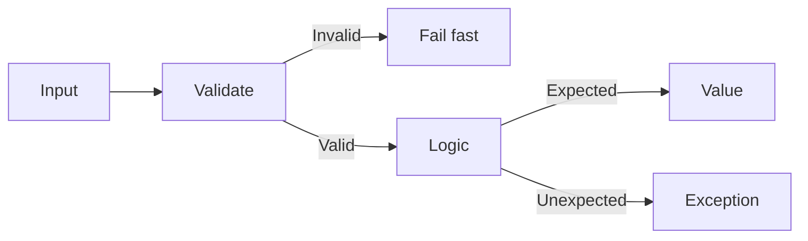

# Error Handling

> Clean Code 101 series (6/10)

<!-- a-grade-intro:begin -->

**Core question**: Should you raise an exception or return a value?

> Use values when the caller is expected to decide what to do; use exceptions when the caller cannot reasonably handle the situation.

<!-- a-grade-intro:end -->

## What You Will Learn

- When to use exceptions vs return values
- The Fail Fast principle
- The "errors as values" pattern
- Retry with exponential backoff
- Try/except anti-patterns

## Why It Matters

When error handling code outweighs business logic, the code stops being readable.

> Error handling is a first-class citizen, but never the lead role.

## Concept at a Glance



Validate up front; raise only when control is lost.

## Key Terms

- **Fail Fast**: Surface invalid state immediately.
- **Result/Either**: Encode success/failure as a value.
- **Exception**: Situation the caller cannot recover from locally.
- **Retry**: Repeat a transient failure.
- **Backoff**: Increase the delay between retries.

## Before/After

**Before**

```python
def fetch(url):
    try:
        ...
    except Exception:
        return None  # swallows everything
```

**After**

```python
class FetchError(Exception): ...

def fetch(url):
    try:
        return _http_get(url)
    except TimeoutError as e:
        raise FetchError(f"timeout: {url}") from e
```

Errors travel upward with meaning intact.

## Hands-on: Five Steps to Robust Error Handling

### Step 1 — Fail fast

```python
# 1_fail_fast.py
def transfer(amount):
    if amount <= 0:
        raise ValueError("amount must be positive")
    ...
```

Reject bad input immediately.

### Step 2 — Errors as values

```python
# 2_result.py
from dataclasses import dataclass
@dataclass
class Result:
    ok: bool
    value: object = None
    error: str = ""

def parse_int(s):
    try: return Result(True, int(s))
    except ValueError as e: return Result(False, error=str(e))
```

When the caller will branch, return a value.

### Step 3 — Exception chaining

```python
# 3_chain.py
class ConfigError(Exception): ...

def load_config(path):
    try:
        with open(path) as f: return f.read()
    except FileNotFoundError as e:
        raise ConfigError(f"missing config: {path}") from e
```

`from e` preserves the cause.

### Step 4 — Retry + backoff

```python
# 4_retry.py
import time, random
def with_retry(fn, attempts=3):
    for i in range(attempts):
        try: return fn()
        except TimeoutError:
            if i == attempts - 1: raise
            time.sleep((2 ** i) + random.random())
```

Exponential backoff with jitter.

### Step 5 — Catch only at boundaries

```python
# 5_boundary.py
def handle_request(req):
    try:
        return business_logic(req)
    except ValueError as e:
        return {"status": 400, "error": str(e)}
    except Exception:
        return {"status": 500, "error": "internal"}
```

Use broad catches only at outer boundaries.

## What to Notice in This Code

- Validation and handling are separated.
- Domain exception classes carry meaning.
- Retries are safe only when operations are idempotent.

## Five Common Mistakes

1. **Empty except blocks.** All information is lost.
2. **Catching `Exception` indiscriminately.** Debugging becomes impossible.
3. **Logging and continuing anyway.** Bad state accumulates.
4. **Infinite retry loops.** They take systems down.
5. **Using exceptions for control flow.** Expensive and hard to read.

## How This Shows Up in Production

In an API server the handler is the boundary. Domain logic raises typed exceptions; the handler maps them to HTTP responses. Only idempotent operations are auto-retried.

## How a Senior Engineer Thinks

- Validates at the entry point and never again.
- Defines domain exception types.
- Distinguishes recoverable from unrecoverable.
- Pairs idempotency with retry.
- Restricts broad catches to boundaries.

## Checklist

- [ ] Is input validation at the top of the function?
- [ ] Are there domain exception types?
- [ ] Is the except clause narrow enough?
- [ ] Did you preserve the cause with `from e`?
- [ ] Is retry limited to idempotent operations?

## Practice Problems

1. Replace one empty except in your code with meaningful handling.
2. Refactor one parse-style function to the Result pattern.
3. Add backoff retry to one external call.

## Wrap-up and Next Steps

Treat errors as first-class but never as the lead role. Next: an often misused tool — comments and documentation.

- [What Is Clean Code?](./01-what-is-clean-code.md)
- [Naming](./02-naming.md)
- [Small Functions](./03-small-functions.md)
- [Simplifying Conditionals](./04-simplifying-conditionals.md)
- [Removing Duplication](./05-removing-duplication.md)
- **Error Handling (current)**
- Comments and Documentation (upcoming)
- Testable Code (upcoming)
- Refactoring Basics (upcoming)
- Good Code Review Standards (upcoming)
## References

- [Clean Code (Ch. 7 Error Handling)](https://www.oreilly.com/library/view/clean-code-a/9780136083238/)
- [Joel Spolsky — Exceptions](https://www.joelonsoftware.com/2003/10/13/13/)
- [Google SRE — Handling Overload](https://sre.google/sre-book/handling-overload/)
- [AWS — Exponential Backoff and Jitter](https://aws.amazon.com/builders-library/timeouts-retries-and-backoff-with-jitter/)

Tags: Computer Science, CleanCode, ErrorHandling, Exceptions, Robustness, Reliability

---

© 2026 YeongseonBooks. All rights reserved.
