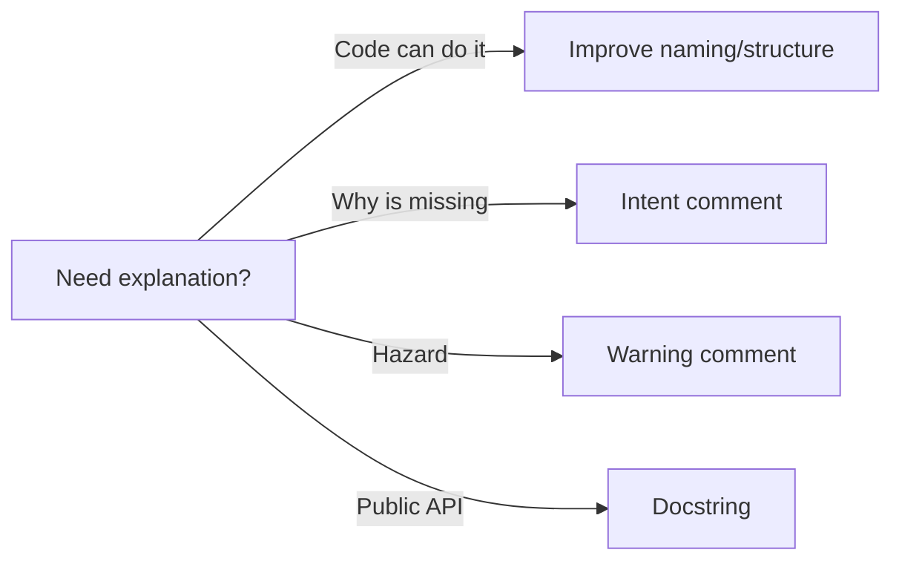

# Comments and Documentation

> Clean Code 101 series (7/10)

<!-- a-grade-intro:begin -->

**Core question**: What does a good comment look like?

> One that explains the "why" the code cannot. The "what" should be visible in the code itself.

<!-- a-grade-intro:end -->

## What You Will Learn

- When not to write a comment
- Intent comments and warning comments
- Docstring conventions in Python
- Documenting public APIs
- Managing TODO and FIXME

## Why It Matters

Comments tend to lie. Code changes; comments rarely follow.

> The best comment is the one you no longer need.

## Concept at a Glance



If something needs explaining, fix the code first.

## Key Terms

- **Self-documenting code**: Names and structure expose intent.
- **Intent comment**: Explains why a piece of code exists.
- **Docstring**: Usage information attached to a function or class.
- **TODO/FIXME**: Markers for future work; must be traceable.
- **API doc**: The contract of a public interface.

## Before/After

**Before**

```python
# increment i by one
i = i + 1

# user list
def gu(): ...
```

**After**

```python
def get_active_users(): ...
```

The name replaces the comment.

## Hands-on: Five Steps to Useful Documentation

### Step 1 — Intent comment

```python
# 1_intent.py
# The payment gateway sometimes returns 200 with an error in the body,
# so we read body.status instead of the HTTP status code.
def is_paid(resp):
    return resp.json().get("status") == "PAID"
```

Capture context that the code cannot show.

### Step 2 — Warning comment

```python
# 2_warning.py
# WARNING: this function performs IO. Do not call inside a transaction.
def upload_invoice(path): ...
```

Place warnings where the caller can be hurt.

### Step 3 — Docstring

```python
# 3_doc.py
def discount(price: int, rate: float) -> int:
    """Return the price after applying a discount.

    Args:
        price: Integer price in cents.
        rate: Discount rate in [0, 1].

    Returns:
        Rounded integer price.

    Raises:
        ValueError: When rate is out of range.
    """
    if not 0 <= rate <= 1:
        raise ValueError("rate out of range")
    return int(price * (1 - rate))
```

Public functions deserve a docstring.

### Step 4 — README header

```markdown
<!-- 4_readme.md -->
# checkout-service

Payment domain service that responds within 5 seconds.

- Run: `make run`
- Test: `make test`
- Env vars: `GATEWAY_URL`, `SECRET_KEY`
```

A new contributor should onboard in 30 seconds.

### Step 5 — TODO with an owner

```python
# 5_todo.py
# TODO(yeongseon, 2026-06-01): replace simple retry with exponential backoff.
def retry_simple(): ...
```

Every TODO needs a person and a date.

## What to Notice in This Code

- Code expresses "what"; comments express "why".
- Docstrings make the usage contract explicit.
- TODOs are traceable.

## Five Common Mistakes

1. **Comments that restate the code.** Pure noise.
2. **Stale comments.** They become lies.
3. **Anonymous TODOs.** They live forever.
4. **Boilerplate docstrings on every function.** Zero information.
5. **Secrets or local paths in comments.** Bad for security and portability.

## How This Shows Up in Production

Strong teams require docstrings on public APIs and allow only intent comments internally. Every TODO carries an issue link.

## How a Senior Engineer Thinks

- Improves names and structure before adding a comment.
- Writes only "why" comments.
- States contracts on public APIs.
- Tags TODOs with an owner and a date.
- Updates stale comments together with the code change.

## Checklist

- [ ] Is the code self-explanatory?
- [ ] Does the comment explain "why"?
- [ ] Do public functions have a docstring?
- [ ] Do TODOs have an owner and date?
- [ ] Are old comments still accurate?

## Practice Problems

1. Delete three noise comments and improve names instead.
2. Add a docstring to one public function.
3. Attach an issue link and date to one TODO.

## Wrap-up and Next Steps

Good comments are few and accurate. Next we tackle what truly decides a codebase's fate: testable code.

- [What Is Clean Code?](./01-what-is-clean-code.md)
- [Naming](./02-naming.md)
- [Small Functions](./03-small-functions.md)
- [Simplifying Conditionals](./04-simplifying-conditionals.md)
- [Removing Duplication](./05-removing-duplication.md)
- [Error Handling](./06-error-handling.md)
- **Comments and Documentation (current)**
- Testable Code (upcoming)
- Refactoring Basics (upcoming)
- Good Code Review Standards (upcoming)
## References

- [Clean Code (Ch. 4 Comments)](https://www.oreilly.com/library/view/clean-code-a/9780136083238/)
- [PEP 257 — Docstring Conventions](https://peps.python.org/pep-0257/)
- [Google Python Style Guide — Comments](https://google.github.io/styleguide/pyguide.html#38-comments-and-docstrings)
- [Write the Docs — Documentation Guide](https://www.writethedocs.org/guide/)

Tags: Computer Science, CleanCode, Comments, Documentation, Docstring, Readability

---

© 2026 YeongseonBooks. All rights reserved.
