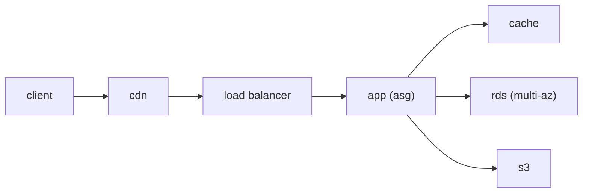

# Cloud Architecture Basics

> Cloud Computing 101 series (10/10)

<!-- a-grade-intro:begin -->

**Core question**: How do all the pieces from this series stitch together into one well-built cloud system?

> *Anchor on the five Well-Architected pillars (operations, security, reliability, performance, cost), then assemble a layered, loosely coupled design.*

<!-- a-grade-intro:end -->

## What You Will Learn

- The five Well-Architected pillars
- A layered web architecture pattern
- Stateless vs stateful separation
- Why IaC is non-negotiable
- Five common pitfalls

## Why It Matters

The same feature can cost ten times more or ten times less depending on the architecture. This final post pulls the whole series into one picture.

## Concept at a Glance



## Key Terms

- **Well-Architected**: AWS framework of design best practices.
- **Stateless**: the server holds no client state.
- **IaC**: infrastructure expressed as code (Terraform, CloudFormation).
- **Loose coupling**: components decoupled through queues.
- **Idempotent**: a request can be repeated safely.

## Before/After

**Before**: a monolith pinned to one server — changes are scary, outages are catastrophic.

**After**: stateless app tier plus a Multi-AZ database, all defined in IaC. Change is safe.

## Hands-on: Layered Web Architecture (illustrative)

### Step 1 — IaC skeleton (pseudo-Terraform)

```python
def vpc(): return {"cidr": "10.0.0.0/16", "azs": 2}
def subnets(): return ["public-a", "public-b", "private-a", "private-b"]
```

### Step 2 — Compute

```python
def asg(min_, max_): return {"min": min_, "max": max_, "policy": "cpu>60"}
```

### Step 3 — Data

```python
def rds(): return {"engine": "postgres", "multi_az": True, "backup_days": 7}
def cache(): return {"engine": "redis", "nodes": 2}
```

### Step 4 — Object and queue

```python
def s3(): return {"versioning": True, "lifecycle": "to-glacier-90d"}
def queue(): return {"visibility_timeout": 30, "dlq": True}
```

### Step 5 — Routing

```python
def alb(): return {"listeners": [{"port": 443, "tls": True}], "target": "asg"}
```

## What to Notice in This Code

- Multi-AZ is the default, not a feature flag.
- A DLQ is your retry safety net.
- Stateless is the precondition for ASG to actually work.

## Five Common Mistakes

1. **Trying to horizontally scale a stateful app.**
2. **Running databases in a single AZ.**
3. **Manual changes, no IaC.**
4. **Calling external services without retries.**
5. **Never practicing backup restore.**

## How This Shows Up in Production

CloudFront in front of ALB, an ASG of stateless apps, RDS Multi-AZ, Redis for hot data, S3 for blobs. Terraform reproduces the same shape across environments. On-call leans on dashboards and runbooks.

## How a Senior Engineer Thinks

- Well-Architected is a conversation tool, not a checklist.
- Change safety beats every other quality.
- Restore drills matter more than backups.
- Start small, modularize as you grow.
- Docs and runbooks ship with the code.

## Checklist

- [ ] Multi-AZ enabled.
- [ ] Environment is reproducible from IaC.
- [ ] Restore drill scheduled.
- [ ] Five-pillar review at least once a quarter.

## Practice Problems

1. List all five Well-Architected pillars.
2. Give one canonical technique for making an app stateless.
3. Explain in one line why IaC is safer than manual changes.

## Wrap-up and Next Steps

That closes out *Cloud Computing 101*. The next series — *Containers 101*, *Kubernetes 101*, and *Serverless 101* — go deep on the compute abstractions.

- [What is Cloud Computing?](./01-what-is-cloud-computing.md)
- [IaaS, PaaS, SaaS](./02-iaas-paas-saas.md)
- [Region and Availability Zone](./03-region-and-availability-zone.md)
- [Compute](./04-compute.md)
- [Storage](./05-storage.md)
- [Network](./06-network.md)
- [Identity and Security](./07-identity-and-security.md)
- [Monitoring](./08-monitoring.md)
- [Cost Management](./09-cost-management.md)
- **Cloud Architecture Basics (current)**
## References

- [AWS Well-Architected Framework](https://docs.aws.amazon.com/wellarchitected/latest/framework/welcome.html)
- [Multi-AZ design](https://docs.aws.amazon.com/whitepapers/latest/aws-overview/global-infrastructure.html)
- [Terraform AWS Provider](https://registry.terraform.io/providers/hashicorp/aws/latest/docs)
- [Twelve-Factor App](https://12factor.net/)

Tags: Cloud, Architecture, WellArchitected, AWS, DevOps

---

© 2026 YeongseonBooks. All rights reserved.
