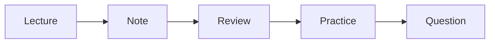

# How to Study Computer Science

> Computer Science Major 101 series (8/10)

<!-- a-grade-intro:begin -->

**Core question**: Can changing only your *study method* really *double* the *result* in the *same time*?

> Yes. The *combo* of *routine*, *review*, and *coding drills* is the key.

<!-- a-grade-intro:end -->

## What You Will Learn

- *Weekly routine*
- *Lecture notes*
- *Review cycle*
- *Coding drills*
- *Asking* questions

## Why It Matters

*Study efficiency* makes the *remaining gap* among CS students.

## Concept at a Glance



## Key Terms

- **routine**: *repeating* schedule.
- **note**: *summary* memo.
- **review**: *re study*.
- **drill**: repeated *practice*.
- **office hour**: *consult* time.

## Before/After

**Before**: You only study *right before exams*.

**After**: You *spread* it through a *weekly routine*.

## Hands-on: Study Tracking Script

### Step 1 — Register subjects

```python
log = {"algorithms": [], "os": [], "db": []}
```

### Step 2 — Record sessions

```python
log["algorithms"].append({"date": "2026-05-01", "hours": 2})
```

### Step 3 — Mark reviewed

```python
def reviewed(entry):
    return entry.get("review", False)
```

### Step 4 — Weekly total

```python
total = sum(e["hours"] for e in log["algorithms"])
```

### Step 5 — Find weak subjects

```python
weak = [c for c, es in log.items() if sum(e["hours"] for e in es) < 5]
```

## What to Notice in This Code

- *Logging* builds *habits*.
- *Review marks* show *spacing*.
- *Totals* reveal *weight*.

## Five Common Mistakes

1. **Just *transcribing* notes.**
2. **Watching *progress* without *review*.**
3. **Pushing *coding drills* to *exam week*.**
4. **Being *embarrassed* to *ask*.**
5. **Replacing *sleep* with *study*.**

## How This Shows Up in Production

A new hire's *growth speed* tracks *question frequency* and *logging habit*.

## How a Senior Engineer Thinks

- *Routine* beats *talent*.
- *Logs* compound.
- *Questions* are *honest*.
- *Sleep* is *productivity*.
- *Review* is *real learning*.

## Checklist

- [ ] *Routine* table.
- [ ] *Note* format.
- [ ] *Review* cycle.
- [ ] *Question* list.

## Practice Problems

1. Define *routine* in one line.
2. Define *review* in one line.
3. State the meaning of *office hours* in one line.

## Wrap-up and Next Steps

Next post: *Build Your Portfolio*.

- [What Computer Science Majors Learn](./01-what-cs-majors-learn.md)
- [Understanding First Year Subjects](./02-first-year-subjects.md)
- [Data Structures and Algorithms](./03-data-structures-and-algorithms.md)
- [Understanding Systems Subjects](./04-systems-subjects.md)
- [Database and Network](./05-database-and-network.md)
- [AI and Data Science](./06-ai-and-data-science.md)
- [Project Subjects](./07-project-subjects.md)
- **How to Study Computer Science (current)**
- Build Your Portfolio (upcoming)
- Skills to Have Before Graduation (upcoming)
## References

- [Make It Stick](https://www.hup.harvard.edu/catalog.php?isbn=9780674729018)
- [A Mind for Numbers - Barbara Oakley](https://barbaraoakley.com/books/a-mind-for-numbers/)
- [Learning How to Learn - Coursera](https://www.coursera.org/learn/learning-how-to-learn)
- [Spaced Repetition - SuperMemo](https://www.supermemo.com/en/articles/theory)

Tags: CS, Study, Habit, Learning, Beginner

---

© 2026 YeongseonBooks. All rights reserved.
