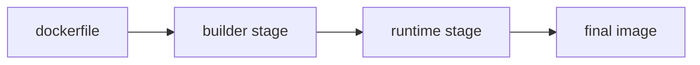

# Dockerfile

> Containers 101 series (4/10)

<!-- a-grade-intro:begin -->

**Core question**: How can a five-line difference in a Dockerfile produce a 10x size and 5x build-time gap for the same app?

> *Three principles — instruction order, cache friendliness, and multi-stage — completely change the result.*

<!-- a-grade-intro:end -->

## What You Will Learn

- The role and order of instructions
- Cache-friendly authoring
- Multi-stage builds
- Security defaults
- Five common pitfalls

## Why It Matters

A Dockerfile directly drives team productivity and security. Get it right once and it pays back for years.

## Concept at a Glance



## Key Terms

- **FROM**: the base image.
- **WORKDIR**: the working directory.
- **COPY/ADD**: copy files in.
- **RUN**: command at build time.
- **CMD/ENTRYPOINT**: the default command at run time.

## Before/After

**Before**: a single-stage build produces a 900MB image.

**After**: multi-stage plus a slim base lands at about 80MB.

## Hands-on: A Python App Dockerfile (illustrative)

### Step 1 — Base

```python
def base_stage():
    return [
        "FROM python:3.12-slim AS builder",
        "WORKDIR /app",
    ]
```

### Step 2 — Dependencies first

```python
def deps_stage():
    return [
        "COPY requirements.txt .",
        "RUN pip install --user -r requirements.txt",
    ]
```

### Step 3 — Code

```python
def code_stage():
    return [
        "COPY . .",
    ]
```

### Step 4 — Runtime stage

```python
def runtime_stage():
    return [
        "FROM python:3.12-slim",
        "WORKDIR /app",
        "COPY --from=builder /root/.local /root/.local",
        "COPY --from=builder /app .",
        "ENV PATH=/root/.local/bin:$PATH",
    ]
```

### Step 5 — Non-root and run

```python
def finalize():
    return [
        "RUN useradd -m app && chown -R app:app /app",
        "USER app",
        "CMD [\"python\", \"main.py\"]",
    ]
```

## What to Notice in This Code

- `requirements.txt` is copied *before* code so the layer caches.
- `--from=builder` brings results from the previous stage.
- `USER app` avoids root.

## Five Common Mistakes

1. **`COPY .` first — kills the cache.**
2. **`apt update` standalone — leaves stale cache.**
3. **Running as root.**
4. **Storing secrets in `ENV`.**
5. **Using `latest` for the base image.**

## How This Shows Up in Production

Multi-stage separates build tools. `.dockerignore` shrinks the build context. Digest pins guarantee reproducibility. The container runs as a non-root user.

## How a Senior Engineer Thinks

- A Dockerfile deserves the same review as application code.
- Cache-friendly order *is* productivity.
- Secrets belong in build args or BuildKit secrets, not ENV.
- The base image is small and verified.
- Image scans are part of CI.

## Checklist

- [ ] Multi-stage in use.
- [ ] `.dockerignore` written.
- [ ] Non-root user.
- [ ] Digest pin in production.

## Practice Problems

1. Why must `COPY requirements` come before `COPY .`? Answer in one line.
2. Name one signature benefit of multi-stage builds.
3. Recommend one safe way to handle secrets in a Dockerfile.

## Wrap-up and Next Steps

Once images exist, the next question is *where to put state*. The next post covers Volume.

- [What is a Container?](./01-what-is-a-container.md)
- [Image and Layer](./02-image-and-layer.md)
- [Runtime](./03-runtime.md)
- **Dockerfile (current)**
- Volume (upcoming)
- Network (upcoming)
- Registry (upcoming)
- Container Security (upcoming)
- Containers vs VMs (upcoming)
- Build a Container App (upcoming)
## References

- [Dockerfile reference](https://docs.docker.com/engine/reference/builder/)
- [Multi-stage builds](https://docs.docker.com/build/building/multi-stage/)
- [Dockerfile best practices](https://docs.docker.com/develop/develop-images/dockerfile_best-practices/)
- [BuildKit secrets](https://docs.docker.com/build/building/secrets/)

Tags: Containers, Docker, Dockerfile, Build, DevOps

---

© 2026 YeongseonBooks. All rights reserved.
