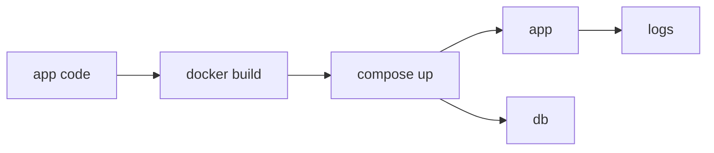

# Build a Container App

> Containers 101 series (10/10)

<!-- a-grade-intro:begin -->

**Core question**: When everything you have learned is wrapped into *one app*, *what flow* does it form?

> *Dockerfile + Compose + healthcheck + secrets + logs* working from one *single command* is the *finish line* of the basics.

<!-- a-grade-intro:end -->

## What You Will Learn

- A *Dockerfile* for a *FastAPI* app
- *Compose* with a *DB* connection
- Defining a *healthcheck*
- Splitting *secrets*
- *Logs* and *restart policy*

## Why It Matters

Every concept above only sticks once you *integrate* it into *one running result*. That is the meaning of this *final post*.

## Concept at a Glance



## Key Terms

- **Dockerfile**: a *recipe* for building an image.
- **Compose**: a tool that ties *multiple containers* together via *YAML*.
- **healthcheck**: a *liveness signal*.
- **restart policy**: an *auto-restart rule on failure*.
- **logs driver**: a *log collection backend*.

## Before / After

**Before**: many *manual docker run* lines that no one can reproduce.

**After**: `docker compose up` runs the *whole stack* in *one line*.

## Hands-on: A FastAPI + Postgres Stack

### Step 1 — app/main.py

```python
from fastapi import FastAPI
import os, psycopg

app = FastAPI()

@app.get("/health")
def health():
    return {"ok": True}

@app.get("/users")
def users():
    with psycopg.connect(os.environ["DB_URL"]) as conn:
        with conn.cursor() as cur:
            cur.execute("SELECT count(*) FROM users")
            return {"count": cur.fetchone()[0]}
```

### Step 2 — Dockerfile

```python
"""
FROM python:3.12-slim
WORKDIR /app
COPY requirements.txt .
RUN pip install --no-cache-dir -r requirements.txt
COPY app ./app
USER 1000
EXPOSE 8080
HEALTHCHECK CMD curl -f http://localhost:8080/health || exit 1
CMD ["uvicorn", "app.main:app", "--host", "0.0.0.0", "--port", "8080"]
"""
```

### Step 3 — docker-compose.yml

```python
"""
services:
  app:
    build: .
    ports: ["8080:8080"]
    environment:
      DB_URL: postgresql://app:secret@db:5432/app
    depends_on:
      db: { condition: service_healthy }
    restart: unless-stopped
  db:
    image: postgres:16
    environment:
      POSTGRES_USER: app
      POSTGRES_PASSWORD: secret
      POSTGRES_DB: app
    healthcheck:
      test: ["CMD-SHELL", "pg_isready -U app"]
      interval: 5s
"""
```

### Step 4 — Automate startup

```python
import subprocess

def up():
    subprocess.run(["docker", "compose", "up", "-d", "--build"], check=True)

def logs():
    subprocess.run(["docker", "compose", "logs", "--tail=100"], check=False)
```

### Step 5 — Tear down

```python
def down():
    subprocess.run(["docker", "compose", "down", "-v"], check=True)
```

## What to Notice in This Code

- *USER 1000* enforces *non-root*.
- The *healthcheck* drives *Compose* dependency ordering.
- *depends_on + service_healthy* is a paired pattern.

## Five Common Mistakes

1. **Storing the *DB password* as plain text in *Compose* forever.**
2. **Using *depends_on* without a *healthcheck*.**
3. **Forgetting a *restart policy* and propagating failures.**
4. **Missing *volumes* and losing data.**
5. **Writing *logs* only inside the container.**

## How This Shows Up in Production

*Local development* runs on *Compose*; *production* runs on *Kubernetes*; the *same image* is operated by *different orchestrators*.

## How a Senior Engineer Thinks

- A *one-line bring-up* defines *onboarding cost*.
- The *healthcheck* is the *signal for orchestration*.
- *Env vars* should be the *only difference* across environments.
- *Logs* go to *stdout*.
- Even *teardown* is automated.

## Checklist

- [ ] *Non-root* at runtime.
- [ ] *Healthcheck* defined.
- [ ] *Secrets* split out.
- [ ] *Teardown* command documented.

## Practice Problems

1. Explain in one line *why* the Dockerfile *USER* matters.
2. Explain in one line why *depends_on alone* is insufficient.
3. Name *one thing* Compose and Kubernetes share.

## Wrap-up and Next Steps

This is the *finale* of *Containers 101*. The next step is *Kubernetes 101*, where you enter the world of *orchestration*.

- [What is a Container?](./01-what-is-a-container.md)
- [Image and Layer](./02-image-and-layer.md)
- [Runtime](./03-runtime.md)
- [Dockerfile](./04-dockerfile.md)
- [Volume](./05-volume.md)
- [Network](./06-network.md)
- [Registry](./07-registry.md)
- [Container Security](./08-container-security.md)
- [Containers vs VMs](./09-container-vs-vm.md)
- **Build a Container App (current)**
## References

- [Docker Compose](https://docs.docker.com/compose/)
- [FastAPI in containers](https://fastapi.tiangolo.com/deployment/docker/)
- [Dockerfile best practices](https://docs.docker.com/develop/develop-images/dockerfile_best-practices/)
- [HEALTHCHECK reference](https://docs.docker.com/engine/reference/builder/#healthcheck)

Tags: Containers, Docker, Compose, FastAPI, DevOps

---

© 2026 YeongseonBooks. All rights reserved.
