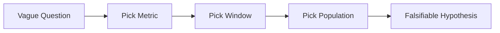

# Turning a Problem into a Data Problem

> Data Science 101 series (2/10)

<!-- a-grade-intro:begin -->

**Core question**: How do you turn *“why did revenue drop?”* into something *the data can actually answer*?

> *Once a question becomes *measurable*, the data starts to *answer*.*

<!-- a-grade-intro:end -->

## What You Will Learn

- A 5-step framing for *business question → data question*
- How to pick a *measurable metric*
- How to write a *falsifiable hypothesis*
- A *5-step* framing exercise
- Five common traps

## Why It Matters

A *fuzzy question* gives you *no way to choose* the right data. *Framing* is *half of the analysis*.

> *One precise sentence saves *three weeks* of analysis.*

## Concept at a Glance



## Key Terms

- **Metric**: a *number* you can measure (DAU, conversion rate, revenue).
- **Window**: the *time range* of analysis (last 30 days).
- **Population**: the *group* you analyze (paid subscribers).
- **Hypothesis**: a statement that *could be wrong*.
- **Counterfactual**: the *“what if” scenario* — what would have happened without the change.

## Before / After

**Before**: *“Why did revenue drop?”* → no idea where to start.

**After**: *“Did paid-subscriber MRR drop more than 5% in the last 30 days vs the previous 30 days?”* → one query.

## Hands-on: 5-step Framing

### Step 1 — Write the vague question

```text
"Revenue feels like it's dropping"
```

### Step 2 — Pick a metric

```text
metric = monthly_revenue
```

### Step 3 — Pick a window

```text
window = last 30 days vs previous 30 days
```

### Step 4 — Narrow the population

```text
population = paid subscribers (excluding trials)
```

### Step 5 — Rewrite as falsifiable

```text
"Paid-subscriber monthly revenue dropped more than 5% in the last 30 days versus the prior 30 days."
```

## What to Notice in This Code

- The *metric* is the spine of the analysis.
- *Window* and *population* keep the comparison *fair*.
- A hypothesis must be *falsifiable* before the data can answer.

## Five Common Mistakes

1. **Choosing the *metric last*.** The analysis loses direction.
2. **Using *different windows* across teams.** Comparisons become *unfair*.
3. **Letting the *population shift*.** Trends get *contaminated*.
4. **Writing *unfalsifiable* hypotheses.** *“We are growing”* can never be proven or disproven.
5. **Asking *several questions at once*.** Answers blur together.

## How This Shows Up in Production

When PMs send a *fuzzy request*, the data team *rewrites* it through the 5-step frame and replies with a *clear question*. Many teams treat this as a *question review* — same rigor as a code review.

## How a Senior Engineer Thinks

- Pick the *metric first*.
- Document *window and population* explicitly.
- Always check *falsifiability*.
- Treat *question review* as seriously as *code review*.
- *If you can't answer it*, rewrite the question.

## Checklist

- [ ] I can write *metric, window, population* clearly.
- [ ] I can write a *falsifiable hypothesis*.
- [ ] I understand *counterfactual*.
- [ ] I can rewrite a *vague request* as a clean question.

## Practice Problems

1. Frame *“churn is up”* using the 5-step process.
2. Write 3 *unfalsifiable* hypotheses, then rewrite each to be *falsifiable*.
3. Pick one metric and show how *different windows* change the conclusion.

## Wrap-up and Next Steps

Only *answerable questions* are the start of analysis. Next, we will look at *how to collect* the data behind those questions.

- [What Is Data Science?](./01-what-is-data-science.md)
- **Turning a Problem into a Data Problem (current)**
- Data Collection (upcoming)
- Data Cleaning (upcoming)
- Exploratory Data Analysis (upcoming)
- Visualization (upcoming)
- Modeling (upcoming)
- Evaluation (upcoming)
- Result Interpretation (upcoming)
- End-to-End Data Project Flow (upcoming)
## References

- [Google — Rules of Machine Learning (Rule #1)](https://developers.google.com/machine-learning/guides/rules-of-ml)
- [Cassie Kozyrkov — How to Ask Smart Questions](https://kozyrkov.medium.com/)
- [Stitch Fix — A/B Testing Lessons](https://multithreaded.stitchfix.com/)
- [Andrew Gelman — Statistical Modeling Blog](https://statmodeling.stat.columbia.edu/)

Tags: DataScience, ProblemFraming, Metrics, Workflow, Beginner

---

© 2026 YeongseonBooks. All rights reserved.
