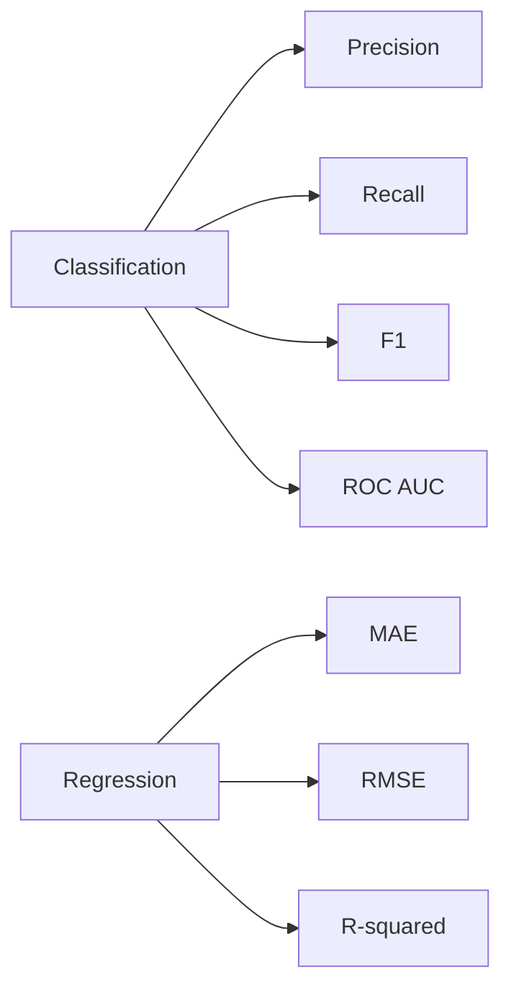

# Evaluation

> Data Science 101 series (8/10)

<!-- a-grade-intro:begin -->

**Core question**: Does *high accuracy* really mean a *good model*? Which *metric* should you use *when*?

> *Choosing a metric is the *same act* as defining the problem.*

<!-- a-grade-intro:end -->

## What You Will Learn

- How *accuracy can mislead*
- Classification: *precision / recall / F1 / ROC AUC*
- Regression: *MAE / RMSE / R²*
- A 5-step evaluation exercise
- Five common pitfalls

## Why It Matters

If the metric *misaligns with the problem*, the model learns the *wrong direction*. Encoding *business cost* into the metric makes *decisions land*.

> *Metrics are *what you optimize* — choose them carefully.*

## Concept at a Glance



## Key Terms

- **Confusion matrix**: TP / FP / FN / TN table.
- **Precision**: of *predicted positives*, how many are right.
- **Recall**: of *actual positives*, how many we caught.
- **F1**: *harmonic mean* of P and R.
- **ROC AUC**: threshold-independent *separability*.

## Before / After

**Before**: fraud model hits *99% accuracy*, but *recall is 5%* — most fraud is missed.

**After**: *recall* is the primary metric, with *F1 / cost* as secondary.

## Hands-on: 5-step Evaluation

### Step 1 — Confusion matrix

```python
from sklearn.metrics import confusion_matrix
cm = confusion_matrix(y_test, y_pred)
print(cm)
```

### Step 2 — Precision / Recall / F1

```python
from sklearn.metrics import precision_score, recall_score, f1_score
print(precision_score(y_test, y_pred))
print(recall_score(y_test, y_pred))
print(f1_score(y_test, y_pred))
```

### Step 3 — ROC AUC

```python
from sklearn.metrics import roc_auc_score
proba = model.predict_proba(X_test)[:, 1]
print(roc_auc_score(y_test, proba))
```

### Step 4 — Regression metrics

```python
from sklearn.metrics import mean_absolute_error, mean_squared_error, r2_score
import numpy as np

print("MAE :", mean_absolute_error(y_test, y_pred))
print("RMSE:", np.sqrt(mean_squared_error(y_test, y_pred)))
print("R^2 :", r2_score(y_test, y_pred))
```

### Step 5 — Encode business cost

```python
# A false negative costs 5x a false positive
cost = 5 * cm[1, 0] + 1 * cm[0, 1]
print("expected cost:", cost)
```

## What to Notice in This Code

- The *confusion matrix* is the *root* of every classification metric.
- *Probability-based* metrics like ROC AUC are *threshold-independent*.
- *Business cost* should be computed *directly* and treated as a metric.

## Five Common Mistakes

1. **Watching only *accuracy*.** Misleading on imbalanced data.
2. **Looking at only *one threshold*.** Always pair with *ROC*.
3. **Watching only *RMSE*.** It's *too sensitive* to outliers.
4. **Tuning the *threshold on the test set*.** That's *data leakage*.
5. **Ignoring *business cost*.** Decisions and metrics drift apart.

## How This Shows Up in Production

Teams pair a *primary metric* with *guardrail metrics*. Example: primary = *recall*, guardrail = *precision >= 0.7*.

## How a Senior Engineer Thinks

- Pick the *metric with the problem*.
- Document the *cost matrix* in writing.
- Separate *primary* from *guardrails*.
- Tune *thresholds on validation*, never on test.
- Treat *metric changes* as *PR-worthy*.

## Checklist

- [ ] I know the difference between *Precision / Recall / F1*.
- [ ] I understand *ROC AUC*.
- [ ] I know the difference between *MAE / RMSE / R²*.
- [ ] I can build a *cost matrix*.

## Practice Problems

1. On *imbalanced data*, build a case where *accuracy and recall disagree*.
2. Plot a *ROC curve* and observe the *threshold trade-off*.
3. Define a *cost-based metric* and pick the *optimal threshold*.

## Wrap-up and Next Steps

Evaluation is the *conversation* between problem and model. Next we look at how to *interpret* the results into a *decision*.

- [What Is Data Science?](./01-what-is-data-science.md)
- [Turning a Problem into a Data Problem](./02-problem-to-data-problem.md)
- [Data Collection](./03-data-collection.md)
- [Data Cleaning](./04-data-cleaning.md)
- [Exploratory Data Analysis](./05-exploratory-data-analysis.md)
- [Visualization](./06-visualization.md)
- [Modeling](./07-modeling.md)
- **Evaluation (current)**
- Result Interpretation (upcoming)
- End-to-End Data Project Flow (upcoming)
## References

- [scikit-learn — Model Evaluation](https://scikit-learn.org/stable/modules/model_evaluation.html)
- [Google — Classification Metrics](https://developers.google.com/machine-learning/crash-course/classification)
- [Wikipedia — Receiver Operating Characteristic](https://en.wikipedia.org/wiki/Receiver_operating_characteristic)
- [Aurelien Geron — Hands-On ML](https://github.com/ageron/handson-ml3)

Tags: DataScience, Evaluation, Metrics, ScikitLearn, Beginner

---

© 2026 YeongseonBooks. All rights reserved.
