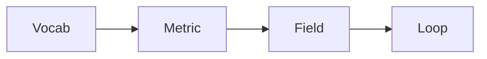

# Building Domain Expertise

> Data Science Career 101 series (9/10)

<!-- a-grade-intro:begin -->

**Core question**: How do you build *domain expertise*?

> Questions, metrics, documents, the field, vocabulary.

<!-- a-grade-intro:end -->

## What You Will Learn

- The definition of *domain*
- Learning the *glossary*
- Understanding key *metrics*
- *Field* observation
- A *continuous* loop

## Why It Matters

Tech can be replicated; domain compounds.

## Concept at a Glance



## Key Terms

- **domain**: An industry or business area.
- **glossary**: A list of defined terms.
- **KPI**: Key performance indicator.
- **playbook**: Operational response guide.
- **shadowing**: Job-shadow observation.

## Before/After

**Before**: "I tweak dashboards without knowing the industry."

**After**: "I converse using KPIs and vocabulary."

## Hands-on: Five-Step Domain Study

### Step 1 — Build a Glossary

```text
- 30 words
- definition + example
```

### Step 2 — Five Key Metrics

```text
- definition
- formula
- consuming team
```

### Step 3 — Field Shadowing

```text
- spend a day with sales or operations
- notes and questions
```

### Step 4 — External Study

```text
- one industry conference per quarter
- industry news RSS
```

### Step 5 — Quarterly Retro

```text
- ten new words
- three new metrics
```

## What to Notice in This Code

- Vocabulary is the entry point.
- Metrics give direction.
- The field reveals truth.

## Five Common Mistakes

1. **Going deep on tech only.**
2. **No vocabulary.**
3. **Vague metric definitions.**
4. **Not knowing the field.**
5. **Skipping external study.**

## How This Shows Up in Production

In fintech, healthcare, and games, the domain shifts the answer.

## How a Senior Engineer Thinks

- Vocabulary first.
- Define metrics.
- Observe the field.
- Study externally.
- Sustain the loop.

## Checklist

- [ ] 30 vocabulary terms.
- [ ] Five KPIs.
- [ ] One shadow day.
- [ ] Quarterly retro.

## Practice Problems

1. One line: define KPI.
2. One line: example of a playbook.
3. One line: criterion for domain study.

## Wrap-up and Next Steps

Next post covers *The Path to Senior in Data*.

- [What Is a Data Career](./01-what-is-data-career.md)
- [Analyst vs Scientist vs Engineer](./02-analyst-scientist-engineer.md)
- [Designing the Learning Path](./03-learning-path.md)
- [The Data Portfolio](./04-data-portfolio.md)
- [SQL and Analytics Interviews](./05-sql-and-analytics-interview.md)
- [The ML Interview](./06-ml-interview.md)
- [The Case Interview](./07-case-interview.md)
- [Settling into the First Data Job](./08-first-job.md)
- **Building Domain Expertise (current)**
- The Path to Senior in Data (upcoming)
## References

- [Domain-Driven Design](https://www.domainlanguage.com/ddd/)
- [Lean Analytics](https://leananalyticsbook.com/)
- [Industry KPI catalogs](https://www.klipfolio.com/resources/kpi-examples)
- [The Personal MBA](https://personalmba.com/)

Tags: DataCareer, Domain, Expertise, BusinessSense, Beginner

---

© 2026 YeongseonBooks. All rights reserved.
