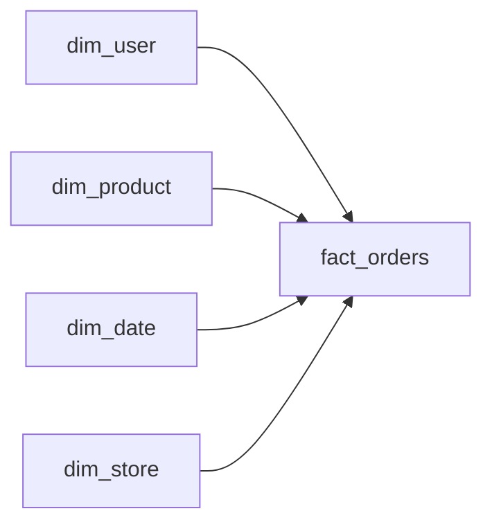

# Star Schema

> Data Warehouse 101 series (4/10)

<!-- a-grade-intro:begin -->

**Core question**: Why does the *star shape* work for analytics? Wouldn't *more normalization* make things better?

> *A star schema is the shape of a query that joins once and answers.*

<!-- a-grade-intro:end -->

## What You Will Learn

- The structure of a *star schema*
- Differences from the *snowflake schema*
- Why BI tools *love* the star shape
- Five-step design hands-on
- Five common pitfalls

## Why It Matters

Analytical queries get faster as joins decrease. A star schema keeps *one fact* and *its dimensions* — the *minimum joins needed*. BI tools also assume the star shape and build *drill-down* on top of it.

> *Analytics is a read game. The simpler the shape, the faster the answer.*

## Concept at a Glance



## Key Terms

- **Star Schema**: Central *fact*, surrounding *dimensions*. *One join hop*.
- **Snowflake Schema**: Dimensions *normalized further*. *Multiple hops*.
- **Galaxy Schema**: *Multiple facts* sharing common dimensions.
- **Drill-down**: Moving from *summary* into *detail*.
- **Slice and dice**: Looking at *subsets* of a single slice.

## Before/After

**Before**: dim_user → dim_country → dim_continent — *three-hop joins*. BI is *slow*.

**After**: dim_user holds country and continent inline — *one join*.

## Hands-on: Design in Five Steps

### Step 1 — Fact definition

```sql
CREATE TABLE fact_orders (
    order_id BIGINT,
    user_key BIGINT,
    product_key BIGINT,
    date_key INT,
    store_key BIGINT,
    amount NUMERIC(12, 2),
    qty INT
);
```

### Step 2 — Dimension definition

```sql
CREATE TABLE dim_product (
    product_key BIGINT PRIMARY KEY,
    product_id BIGINT,
    name TEXT,
    category TEXT,
    brand TEXT
);
```

### Step 3 — Star-shape join

```sql
SELECT p.category, SUM(f.amount) AS revenue
FROM fact_orders f
JOIN dim_product p ON p.product_key = f.product_key
GROUP BY p.category;
```

### Step 4 — Multiple dimensions

```sql
SELECT d.year, p.category, SUM(f.amount) AS revenue
FROM fact_orders f
JOIN dim_product p ON p.product_key = f.product_key
JOIN dim_date d ON d.date_key = f.date_key
GROUP BY d.year, p.category;
```

### Step 5 — Drill-down

```sql
-- Category to brand, one step deeper
SELECT p.brand, SUM(f.amount) AS revenue
FROM fact_orders f
JOIN dim_product p ON p.product_key = f.product_key
WHERE p.category = 'Coffee'
GROUP BY p.brand;
```

## What to Notice in This Code

- Every join is *fact ↔ dimension*, one hop.
- Category and brand live *inside the dimension*.
- BI drill-down maps *directly to SQL*.

## Five Common Mistakes

1. **Over-normalizing into a *snowflake*.** *More joins, slower BI*.
2. **Stuffing every column into the *fact*.** The star shape *collapses*.
3. **Making dimensions *narrower over time*.** Later you need to *widen them again*.
4. **Using *natural keys only*.** Upstream changes *shake the fact*.
5. **Letting facts use *separate dim_date* tables.** *Share* what is shareable.

## How This Shows Up in Production

Tableau, Looker, and Power BI *assume* a star schema. dbt's *mart* layer is typically modeled as a star.

## How a Senior Engineer Thinks

- *Each join hop is a *cost*. Reduce them.*
- *Dimensions are *wide and short*.*
- *Use *SCD strategies* for changing attributes.*
- *Honor the *BI tool's assumptions* in the data model.*
- *Use snowflake only when the *reason is explicit*.*

## Checklist

- [ ] You can distinguish *star* from *snowflake*.
- [ ] You know what *galaxy* means.
- [ ] You can explain why BI *prefers stars*.
- [ ] You can write a *drill-down* query.

## Practice Problems

1. List *five dimensions* around *fact_payments*.
2. Describe an *exception* where snowflake is better.
3. Write a drill-down going *category → brand → product*.

## Wrap-up and Next Steps

Star schema is the *simplest analytical shape*. Next, we tackle *partitioning and clustering* for fast reads.

- [What Is a Data Warehouse?](./01-what-is-data-warehouse.md)
- [OLTP and OLAP](./02-oltp-and-olap.md)
- [Fact and Dimension](./03-fact-and-dimension.md)
- **Star Schema (current)**
- Partition and Clustering (upcoming)
- ETL and ELT (upcoming)
- BI and Dashboard (upcoming)
- Data Mart (upcoming)
- Performance Optimization (upcoming)
- Warehouse Design Example (upcoming)
## References

- [Kimball — Star Schema](https://www.kimballgroup.com/data-warehouse-business-intelligence-resources/kimball-techniques/dimensional-modeling-techniques/star-schemas/)
- [Microsoft — Star Schema and Power BI](https://learn.microsoft.com/en-us/power-bi/guidance/star-schema)
- [dbt — Mart Layer](https://docs.getdbt.com/best-practices/how-we-structure/4-marts)
- [Wikipedia — Star Schema](https://en.wikipedia.org/wiki/Star_schema)

Tags: DataWarehouse, StarSchema, Modeling, Snowflake, Analytics

---

© 2026 YeongseonBooks. All rights reserved.
