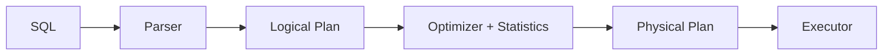

# Query Optimization

> Database Systems 101 series (8/10)

<!-- a-grade-intro:begin -->

**Core question**: Why is the same SQL 1 ms one day and 10 seconds the next, and what should you actually look at?

> The optimizer is code that estimates costs from statistics and picks the cheapest-looking execution plan. When statistics are stale or the data distribution shifts, the optimizer takes the wrong road. The skill of reading EXPLAIN is the skill of auditing that decision after the fact.

<!-- a-grade-intro:end -->

## What You Will Learn

- The big picture of how the optimizer chooses an execution plan
- Why statistics are decisive
- How to read EXPLAIN and EXPLAIN ANALYZE
- Four common tuning signals

## Why It Matters

When the same SQL suddenly slows down, the cause is almost always "the optimizer picked a different plan." Statistics, data volume, added or dropped indexes, and parameter sniffing all trigger this. Without EXPLAIN, you are debugging by guessing.

> Ninety percent of tuning is understanding "what does the optimizer know, and what doesn't it?"

## Concept at a Glance



A single logical plan can produce many physical plans (index scan, sequential scan, different join algorithms). The optimizer picks one based on a statistics-driven cost.

## Key Terms

- **Optimizer**: the module that picks the cheapest plan among candidates.
- **Statistics**: metadata about column value distribution, row counts, index selectivity.
- **Cardinality estimate**: the optimizer's guess at how many rows will flow out of a step.
- **Plan node**: Seq Scan, Index Scan, Hash Join, Nested Loop, Sort, Aggregate, etc.
- **EXPLAIN ANALYZE**: a command that shows actual execution numbers next to the plan.

## Before/After

**Before — stale stats lead to a full scan**

```sql
EXPLAIN ANALYZE SELECT * FROM orders WHERE user_id = 7;
-- Seq Scan on orders ... (cost=... rows=50000) (actual rows=50)
```

**After — ANALYZE then index scan**

```sql
ANALYZE orders;
EXPLAIN ANALYZE SELECT * FROM orders WHERE user_id = 7;
-- Index Scan using idx_user on orders ... (cost=... rows=60) (actual rows=50)
```

Once the estimated and actual rows are close, the optimizer switches to the index plan.

## Hands-on: Read Plans With EXPLAIN

### Step 1 — Set up data and indexes

```python
# setup.py
import sqlite3, random

with sqlite3.connect("opt.db") as db:
    db.executescript("""
        DROP TABLE IF EXISTS orders;
        CREATE TABLE orders (
            id INTEGER PRIMARY KEY,
            user_id INTEGER NOT NULL,
            status TEXT NOT NULL,
            total INTEGER NOT NULL
        );
    """)
    rows = [
        (i, random.randint(1, 1000), random.choice(["paid","pending","cancelled"]), random.randint(1,1000))
        for i in range(1, 100001)
    ]
    db.executemany("INSERT INTO orders VALUES (?,?,?,?)", rows)
    db.execute("CREATE INDEX idx_user ON orders(user_id)")
    db.execute("ANALYZE")
```

### Step 2 — A simple index scan

```python
import sqlite3
with sqlite3.connect("opt.db") as db:
    plan = db.execute("EXPLAIN QUERY PLAN SELECT * FROM orders WHERE user_id=7").fetchall()
    for row in plan:
        print(row)
```

If the plan shows `SEARCH orders USING INDEX idx_user`, the index is in use.

### Step 3 — Compare join algorithms

```sql
EXPLAIN ANALYZE
SELECT u.email, count(*)
FROM users u
JOIN orders o ON o.user_id = u.id
GROUP BY u.email;
```

Depending on data volume and indexes, the optimizer picks Nested Loop, Hash Join, or Merge Join. You should be able to explain the choice from the statistics.

### Step 4 — See the effect of refreshing statistics

```sql
-- after a bulk INSERT
ANALYZE orders;
EXPLAIN ANALYZE SELECT * FROM orders WHERE user_id = 7;
```

ANALYZE raises the resolution of the world the optimizer can see. Auto-statistics run on a schedule, but a manual ANALYZE after large data changes is helpful.

### Step 5 — Function calls that kill an index

```sql
EXPLAIN ANALYZE SELECT * FROM users WHERE lower(email) = 'a@x.com';
-- Seq Scan (the index is not used)

CREATE INDEX idx_users_email_lower ON users (lower(email));
EXPLAIN ANALYZE SELECT * FROM users WHERE lower(email) = 'a@x.com';
-- Index Scan
```

Wrapping a column in a function disables the regular index. You need a functional index or a precomputed column.

## What to Notice in This Code

- The optimizer's primary input is **statistics**. Stale stats mean bad plans.
- A large gap between estimated and actual rows is almost always a problem signal.
- The same query can switch plans when the data distribution changes.
- Function calls and casts in WHERE are the most common reason an index gets skipped.

## Five Common Mistakes

1. **Saying "it is slow" without EXPLAIN.** Guess-based tuning rarely works.
2. **Adding indexes without ANALYZE.** The optimizer does not know about the new index until then.
3. **Wrapping a WHERE column in a function.** Patterns like `WHERE lower(email)=?` skip the index.
4. **`SELECT *` everywhere.** You lose covering-index opportunities and inflate network cost.
5. **Confusing OR conditions with IN.** The optimizer treats them differently. Verify with EXPLAIN.

## How This Shows Up in Production

Query tuning follows a standard loop. (1) Identify the slowest queries (slow query log, APM, `pg_stat_statements`). (2) Run EXPLAIN ANALYZE on a representative one. (3) Use the gap between estimates and actuals to adjust statistics, indexes, or query shape. (4) Measure before and after.

For operational systems, "regression detection" matters as much as tuning. A query that was 1 ms suddenly running 100 ms is usually a stats or distribution change. Auto-statistics, index monitoring, and slow-query alerts run together.

## How a Senior Engineer Thinks

- They validate new queries with EXPLAIN ANALYZE before merging.
- A 10x gap between estimate and actual immediately raises stats or distribution suspicion.
- An index PR includes a comment naming the query it supports.
- Optimizer hints are a last resort. Model, indexes, and statistics come first.
- "Fast today" does not mean "fast tomorrow." Monitoring and alerting protect you.

## Checklist

- [ ] Have you run EXPLAIN ANALYZE on the critical queries at least once?
- [ ] Are statistics refreshed regularly?
- [ ] Are there no function calls or casts on WHERE columns?
- [ ] Is the slow query log monitored?
- [ ] When you add an index, do you record which query it supports?

## Practice Problems

1. EXPLAIN ANALYZE shows `rows=10` estimated but `actual rows=10000`. What should you suspect first?
2. Name one optimization the optimizer can apply when you list specific columns instead of `SELECT *`.
3. In one sentence, explain why `WHERE id IN (1,2,3)` and `WHERE id=1 OR id=2 OR id=3` can behave differently.

## Wrap-up and Next Steps

The optimizer picks among possible plans using a statistics-based cost model, and EXPLAIN ANALYZE is the most reliable way to audit that choice. The next post moves beyond a single database — replication and backup. We pull together the two pillars of a system that is both fast and safe.

- [What Is a Database System?](./01-what-is-a-database.md)
- [The Relational Model](./02-relational-model.md)
- [SQL and Query Processing](./03-sql-and-query-processing.md)
- [Indexes](./04-indexes.md)
- [Transactions and ACID](./05-transactions-and-acid.md)
- [Isolation Levels](./06-isolation-levels.md)
- [Normalization and Modeling](./07-normalization-and-modeling.md)
- **Query Optimization (current)**
- Replication and Backup (upcoming)
- OLTP and OLAP (upcoming)
## References

- [PostgreSQL — Using EXPLAIN](https://www.postgresql.org/docs/current/using-explain.html)
- [PostgreSQL — Statistics Used by the Planner](https://www.postgresql.org/docs/current/planner-stats.html)
- [Use The Index, Luke!](https://use-the-index-luke.com/)
- [SQLite — The Next-Generation Query Planner](https://www.sqlite.org/queryplanner-ng.html)

Tags: Computer Science, Database, Optimizer, Statistics, EXPLAIN, Tuning

---

© 2026 YeongseonBooks. All rights reserved.
