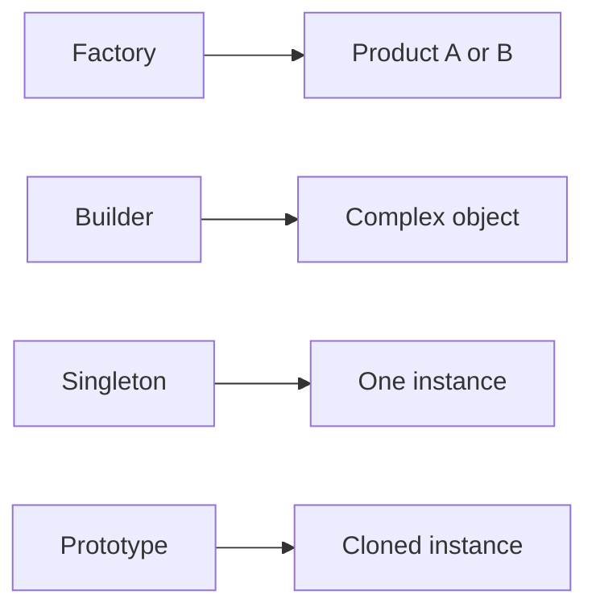

# Creational Patterns

> Design Patterns 101 series (2/10)

<!-- a-grade-intro:begin -->

**Core question**: Why do we need patterns just for *creating* objects?

> Because who builds an object, when, and in what shape decides how tightly the rest of the system gets coupled.

<!-- a-grade-intro:end -->

## What You Will Learn

- The problem creational patterns solve
- Factory Method and Abstract Factory
- When you actually need a Builder
- The risks of Singleton
- Where Prototype fits

## Why It Matters

When `new SomeService()` is sprinkled throughout the code, coupling is already locked in. Concentrating construction in one place makes swapping easy.

> Where you build an object matters more than what you build.

## Concept at a Glance



Four ways to separate the responsibility of construction.

## Key Terms

- **Factory Method**: A subclass decides which concrete class to build.
- **Abstract Factory**: Build families of related objects together.
- **Builder**: Assemble a complex object step by step.
- **Singleton**: Guarantee a single instance.
- **Prototype**: Build new objects by cloning an existing one.

## Before / After

**Before**

```python
def make_notifier(kind):
    if kind == "email": return EmailNotifier(smtp_host="...")
    elif kind == "sms": return SmsNotifier(api_key="...")
```

**After**

```python
class NotifierFactory:
    def create(self, kind) -> Notifier: ...

# the caller knows nothing about the concrete class
notifier = factory.create(kind)
```

The construction responsibility lives in one place.

## Hands-on: Five Steps Through Creational

### Step 1 — Factory Method

```python
# 1_factory.py
class Notifier:
    def send(self, msg): ...

class NotifierFactory:
    def create(self, kind: str) -> Notifier:
        if kind == "email": return EmailNotifier()
        if kind == "sms": return SmsNotifier()
        raise ValueError(kind)
```

The branching lives in one place.

### Step 2 — Abstract Factory

```python
# 2_abstract_factory.py
class UIFactory:
    def button(self) -> "Button": ...
    def textbox(self) -> "TextBox": ...

class MacFactory(UIFactory): ...
class WinFactory(UIFactory): ...
```

Build a family together.

### Step 3 — Builder

```python
# 3_builder.py
class QueryBuilder:
    def __init__(self): self.parts = []
    def select(self, *cols): self.parts.append(("SELECT", cols)); return self
    def from_(self, t): self.parts.append(("FROM", t)); return self
    def where(self, c): self.parts.append(("WHERE", c)); return self
    def build(self) -> str: ...
```

Step-by-step assembly for complex objects.

### Step 4 — Singleton (carefully)

```python
# 4_singleton.py
# In Python, the module itself is usually a singleton.
# A dedicated class is rarely necessary.
import logging
logger = logging.getLogger("app")
```

Always treat global state with suspicion.

### Step 5 — Prototype

```python
# 5_prototype.py
import copy

class ReportTemplate:
    def __init__(self, layout): self.layout = layout

base = ReportTemplate({"header": "Q1", "rows": []})
def new_report():
    return copy.deepcopy(base)
```

Use Prototype when cloning is cheaper than creating.

## What to Notice in This Code

- The caller does not know the concrete class.
- Adding a new kind does not change caller code.
- Complex assembly is broken into readable steps.

## Five Common Mistakes

1. **Singleton overuse.** It just becomes a global variable.
2. **Business logic inside the factory.** Construction and policy mix.
3. **Builder for simple objects.** All ceremony, no payoff.
4. **Abstract Factory introduced too early.** Only one family exists.
5. **Ignoring Prototype's deep-copy cost.** A performance trap.

## How This Shows Up in Production

DI containers, ORM query builders, UI widget libraries — creational patterns sit at the bones of many frameworks.

## How a Senior Engineer Thinks

- They concentrate the construction responsibility.
- They keep Singleton as a last resort.
- They reach for Builder when there are more than six arguments.
- They use Abstract Factory when there are at least two families.
- They always measure the cost of cloning.

## Checklist

- [ ] Is the caller free of the concrete class?
- [ ] Does adding a new kind avoid breaking caller code?
- [ ] Is the Singleton truly necessary?
- [ ] Does the Builder really lower complexity?
- [ ] Did you measure the Prototype cost?

## Practice Problems

1. Find a class with more than five `new Xxx()` calls and consolidate them in a Factory.
2. Apply a Builder to a constructor with seven arguments.
3. See if a Singleton can be replaced by a module-level variable.

## Wrap-up and Next Steps

Once you control creation, coupling loosens. Next up — how objects get *composed* together — Structural patterns.

- [What Are Design Patterns?](./01-what-are-design-patterns.md)
- **Creational Patterns (current)**
- Structural Patterns (upcoming)
- Behavioral Patterns (upcoming)
- Strategy Pattern (upcoming)
- Adapter Pattern (upcoming)
- Observer Pattern (upcoming)
- Factory and Dependency Injection (upcoming)
- How Not to Overuse Patterns (upcoming)
- Pythonic Patterns (upcoming)
## References

- [Factory Method (refactoring.guru)](https://refactoring.guru/design-patterns/factory-method)
- [Abstract Factory (refactoring.guru)](https://refactoring.guru/design-patterns/abstract-factory)
- [Builder (refactoring.guru)](https://refactoring.guru/design-patterns/builder)
- [Singleton — Why You Should Use It Sparingly](https://martinfowler.com/bliki/InversionOfControl.html)

Tags: Computer Science, DesignPatterns, Creational, Factory, Singleton, Builder

---

© 2026 YeongseonBooks. All rights reserved.
