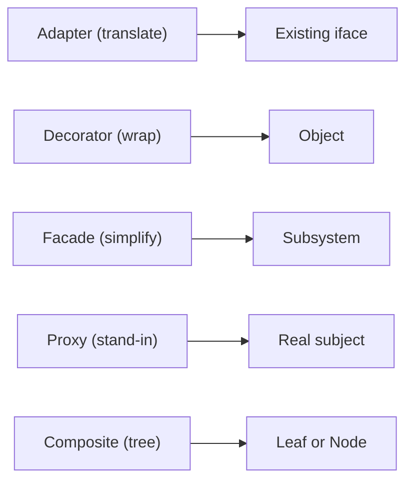

# Structural Patterns

> Design Patterns 101 series (3/10)

<!-- a-grade-intro:begin -->

**Core question**: How do we compose objects into larger structures without locking the design?

> Through composition and delegation — the named ways of doing this are the structural patterns.

<!-- a-grade-intro:end -->

## What You Will Learn

- The problem structural patterns solve
- Adapter, Decorator, Facade
- Where Proxy fits
- Composite and tree structures
- Composition vs inheritance, the basic rule

## Why It Matters

Inheritance freezes the structure quickly. Composition lets you assemble responsibilities and stay flexible to change.

> Favor composition over inheritance.

## Concept at a Glance



Five ways to compose.

## Key Terms

- **Adapter**: convert an existing interface to the shape we want.
- **Decorator**: dynamically add responsibility to an object.
- **Facade**: a simple entry point in front of a complex subsystem.
- **Proxy**: a stand-in that controls access, caching, or lazy load.
- **Composite**: treat single objects and groups uniformly.

## Before/After

**Before**

```python
# external library calls leak into the domain
import boto3
s3 = boto3.client("s3")
s3.put_object(Bucket="b", Key="k", Body=data)
```

**After**

```python
# Adapter aligns the dependency to a domain interface
class FileStore:
    def put(self, key, data): ...

class S3FileStore(FileStore):
    def put(self, key, data): self._s3.put_object(...)
```

The domain no longer knows about the external library.

## Hands-on: Five Steps to Practice Structural Patterns

### Step 1 — Adapter

```python
# 1_adapter.py
class LegacyPrinter:
    def write_line(self, s): ...

class NewPrinter:
    def print(self, s): ...

class PrinterAdapter(NewPrinter):
    def __init__(self, legacy): self.legacy = legacy
    def print(self, s): self.legacy.write_line(s)
```

Match the old object to the new contract.

### Step 2 — Decorator

```python
# 2_decorator.py
class Logger:
    def __init__(self, inner): self.inner = inner
    def send(self, msg):
        print("LOG:", msg); self.inner.send(msg)

notifier = Logger(EmailNotifier())
```

Wrap to add behavior.

### Step 3 — Facade

```python
# 3_facade.py
class CheckoutFacade:
    def buy(self, user, item):
        cart.add(user, item); pay.charge(user); ship.send(user, item)
```

A single entry point for a complex flow.

### Step 4 — Proxy

```python
# 4_proxy.py
class CachedRepo:
    def __init__(self, real): self.real = real; self.cache = {}
    def get(self, k):
        if k not in self.cache: self.cache[k] = self.real.get(k)
        return self.cache[k]
```

Stand in for the real object and add a responsibility.

### Step 5 — Composite

```python
# 5_composite.py
class Node:
    def total(self): ...

class File(Node):
    def __init__(self, size): self.size = size
    def total(self): return self.size

class Folder(Node):
    def __init__(self, children): self.children = children
    def total(self): return sum(c.total() for c in self.children)
```

Single items and groups behave alike.

## What to Notice in This Code

- Every pattern uses *composition* as its tool.
- Interfaces stay stable while implementations swap in and out.
- The inheritance tree barely grows.

## Five Common Mistakes

1. **Business logic in the Adapter.** Translation and policy get tangled.
2. **Stacking Decorators too deep.** Debugging becomes painful.
3. **Facade growing into a god object.** Responsibilities explode.
4. **Proxy with a different signature than the real object.** Callers break.
5. **Forcing Composite where there is no real tree.** Awkward fit.

## How This Shows Up in Production

Flask middleware is a Decorator chain. The `requests.Session` object is a Facade. ORM lazy proxies are Proxies. Structural patterns sit quietly inside almost every library you use.

## How a Senior Engineer Thinks

- Composition is the default.
- Adapter belongs at external boundaries.
- Decorators stack on the same interface.
- Facade is *simplification*, not extra features.
- Composite only where the data is genuinely a tree.

## Checklist

- [ ] Are Adapters at the external boundary?
- [ ] Is the Decorator stack at a reasonable depth?
- [ ] Does the Facade simplify rather than add features?
- [ ] Does the Proxy share the real object's signature?
- [ ] Does the Composite model a real tree?

## Practice Problems

1. Wrap an external SaaS call behind a domain interface and an Adapter.
2. Add a Logger Decorator to an existing Notifier.
3. Model a folder/file structure with Composite.

## Wrap-up and Next Steps

Composition keeps structure ready for change. The next post moves from structure to *behavior* — the Behavioral patterns.

- [What Are Design Patterns?](./01-what-are-design-patterns.md)
- [Creational Patterns](./02-creational-patterns.md)
- **Structural Patterns (current)**
- Behavioral Patterns (upcoming)
- Strategy Pattern (upcoming)
- Adapter Pattern (upcoming)
- Observer Pattern (upcoming)
- Factory and Dependency Injection (upcoming)
- Avoiding Pattern Overuse (upcoming)
- Pythonic Patterns (upcoming)
## References

- [Adapter Pattern (refactoring.guru)](https://refactoring.guru/design-patterns/adapter)
- [Decorator Pattern (refactoring.guru)](https://refactoring.guru/design-patterns/decorator)
- [Facade Pattern (refactoring.guru)](https://refactoring.guru/design-patterns/facade)
- [Composite Pattern (refactoring.guru)](https://refactoring.guru/design-patterns/composite)

Tags: Computer Science, DesignPatterns, Structural, Adapter, Decorator, Facade

---

© 2026 YeongseonBooks. All rights reserved.
