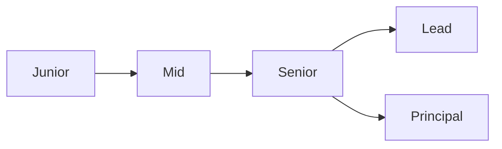

# What Is a Developer Career

> Developer Career 101 series (1/10)

<!-- a-grade-intro:begin -->

**Core question**: Is a developer *career* just a chronological list of *job titles*?

> It is the joint growth of role, skill, and impact.

<!-- a-grade-intro:end -->

## What You Will Learn

- The *three axes* of a career
- Expectations *by stage*
- The *T-shaped* engineer
- *Radius* of impact
- Why *records* matter

## Why It Matters

Without direction, five years later you are still at square one.

## Concept at a Glance



## Key Terms

- **junior**: Works from instructions.
- **mid**: Self-directed.
- **senior**: Defines problems.
- **lead**: Owns team outcomes.
- **principal**: Shapes org direction.

## Before/After

**Before**: "I work only for the next promotion."

**After**: "I sketch a skill curve and grow my impact."

## Hands-on: Plot Your Career Coordinate

### Step 1 — Current Stage

```text
one of: junior / mid / senior
```

### Step 2 — Core Skills

```text
- technical
- collaborative
- domain
```

### Step 3 — Impact Radius

```text
- self
- team
- org
- industry
```

### Step 4 — Six-Month Goals

```markdown
- one technical depth
- one new domain
- one talk delivered
```

### Step 5 — Quarterly Retro

```markdown
## Q2 retro
- went well
- gaps
- one thing for next quarter
```

## What to Notice in This Code

- Stages are continuous.
- Axes are plural.
- Retros set direction.

## Five Common Mistakes

1. **Treating titles as the only goal.**
2. **Going deep only on tech.**
3. **Skipping impact measurement.**
4. **No retrospectives.**
5. **No written record.**

## How This Shows Up in Production

Career ladders at companies make role, impact, and responsibility explicit on multiple axes.

## How a Senior Engineer Thinks

- Career is a marathon.
- Skills compound.
- Impact must be documented.
- T-shape stays flexible.
- Feedback is fuel.

## Checklist

- [ ] Current stage defined.
- [ ] Six-month goals written.
- [ ] Quarterly retro scheduled.
- [ ] Records started.

## Practice Problems

1. One line: define a T-shaped engineer.
2. One line: example of impact radius.
3. One line: purpose of a quarterly retro.

## Wrap-up and Next Steps

Next post covers *Understanding Roles*.

- **What Is a Developer Career (current)**
- Understanding Roles (upcoming)
- Building a Learning Plan (upcoming)
- Resume and Portfolio (upcoming)
- Preparing for Coding Interviews (upcoming)
- System Design Interviews (upcoming)
- Settling into the First Job (upcoming)
- Side Projects and Learning (upcoming)
- Mentoring and Networking (upcoming)
- The Path to Senior (upcoming)
## References

- [Career Ladders for Software Engineers](https://www.progression.fyi/)
- [Dropbox Engineering Career Framework](https://dropbox.github.io/dbx-career-framework/)
- [Staff Engineer's Path](https://noidea.dog/staff)
- [Developer roadmap](https://roadmap.sh/)

Tags: Career, Developer, Growth, Junior, Beginner

---

© 2026 YeongseonBooks. All rights reserved.
