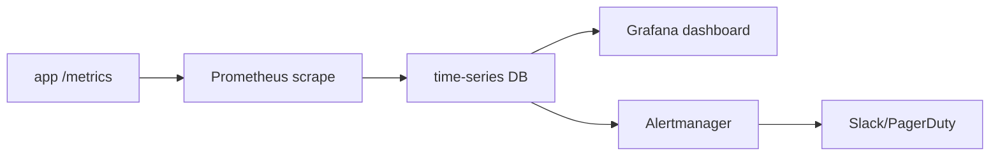

# Monitoring and Alerting

> DevOps 101 series (7/10)

<!-- a-grade-intro:begin -->

**Core question**: Has your *customer ever told you first* that *the service is down*?

> Good monitoring tells *us before the customer does*.

<!-- a-grade-intro:end -->

## What You Will Learn

- The *three signals* of monitoring (logs, metrics, traces)
- The basic flow of *Prometheus* and *Grafana*
- The *RED / USE* metric patterns
- Designing *meaningful alerts*
- Five common pitfalls

## Why It Matters

Incidents *always come*. The difference is *how fast you know* and *how fast you can localize*.

> Operating without monitoring is *driving with eyes closed*.

## Concept at a Glance



## Key Terms

- **Metric**: a *number over time* (request count, latency, etc.).
- **Counter**: a metric that *only goes up*.
- **Gauge**: a metric that *can go up and down*.
- **Histogram**: records a *distribution* (p50, p95, p99).
- **SLO**: the *service level objective* you commit to.

## Before/After

**Before (logs only)**

```text
- During an incident, you *grep -i error*
- No trends, no idea *why it slowed down*
- Alerts arrive as *customer emails*
```

**After (metrics + alerts)**

```python
from prometheus_client import Counter, Histogram

requests = Counter("http_requests_total", "Total", ["path", "status"])
latency = Histogram("http_latency_seconds", "Latency", ["path"])
```

## Hands-on: Five Steps for Monitoring

### Step 1 - Expose /metrics in the app

```python
from prometheus_client import make_asgi_app
app.mount("/metrics", make_asgi_app())
```

### Step 2 - Configure Prometheus

```yaml
scrape_configs:
  - job_name: myapp
    static_configs:
      - targets: ['myapp:8000']
```

### Step 3 - Track RED metrics

```text
- Rate (request rate)
- Errors (error ratio)
- Duration (response time p95)
```

### Step 4 - Build a Grafana dashboard

```text
- Panel 1: rate(http_requests_total[5m])
- Panel 2: rate(http_requests_total{status=~"5.."}[5m])
- Panel 3: p95 latency
```

### Step 5 - Meaningful alerts

```yaml
- alert: HighErrorRate
  expr: rate(http_requests_total{status=~"5.."}[5m]) > 0.01
  for: 5m
  annotations:
    summary: "5xx error rate above 1%"
```

## What to Notice in This Code

- *Sustained 5 minutes* before alert — ignore *momentary spikes*.
- *Error rate* must be a *ratio*. Absolutes shift with traffic.
- *p95* is more meaningful than *the average*.

## Five Common Mistakes

1. **Too many alerts.** *Alert fatigue* makes you ignore *real ones*.
2. **Watching only *average latency*.** The *tail (p99)* is the real problem.
3. **Metric *cardinality explosion*.** Never label by *high-cardinality* values like user_id.
4. **Alerts with *no response guide*.** What do you do at *3 AM*?
5. **Monitoring is *not monitored*.** Watch for *Prometheus down* from outside.

## How This Shows Up in Production

Mature teams use *SLO-based alerting*. They define an *error budget* and only alert when the *budget burn rate* is fast.

## How a Senior Engineer Thinks

- *Alerts demand action*. Informational signals belong on *dashboards*.
- *Dashboards must answer in one minute*.
- *Cardinality* is cost. Label carefully.
- *SLOs* are an *agreement between team and business*.
- *Monitoring is also a code-review subject*.

## Checklist

- [ ] *RED metrics* exist for every service.
- [ ] *p95 latency* lives on the dashboard.
- [ ] *Alerts include a runbook link*.
- [ ] *Alert noise* is measured.

## Practice Problems

1. Add a */metrics* endpoint to your app.
2. Build a *RED dashboard* in Grafana.
3. Create an alert for *5xx > 1% sustained 5 minutes*.

## Wrap-up and Next Steps

Monitoring is the *eyes*. In the next post we cover *logs*, the *ears*.

- [What Is DevOps?](./01-what-is-devops.md)
- [CI Pipeline](./02-ci-pipeline.md)
- [CD and Deployment Strategies](./03-cd-and-deployment.md)
- [Environments and Configuration](./04-environments-and-config.md)
- [Infrastructure as Code](./05-infrastructure-as-code.md)
- [Containers and Build](./06-containers-and-build.md)
- **Monitoring and Alerting (current)**
- Logging and Analysis (upcoming)
- Incident Response and On-Call (upcoming)
- An Operable DevOps Flow (upcoming)
## References

- [Prometheus docs](https://prometheus.io/docs/)
- [Grafana docs](https://grafana.com/docs/)
- [Google SRE — Monitoring](https://sre.google/sre-book/monitoring-distributed-systems/)
- [The RED Method (Tom Wilkie)](https://www.weave.works/blog/the-red-method-key-metrics-for-microservices-architecture/)

Tags: DevOps, Monitoring, Prometheus, Alerting, SRE

---

© 2026 YeongseonBooks. All rights reserved.
