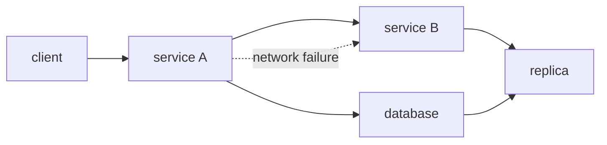

# What Is a Distributed System?

> Distributed Systems 101 series (1/10)

<!-- a-grade-intro:begin -->

**Core question**: Why is running the same code on one machine so different from running it on a hundred?

> A distributed system is not just "many computers." Three essential differences — latency, failure, and coordination — bend every intuition you carry from single-machine programming.

<!-- a-grade-intro:end -->

## What You Will Learn

- The definition of a distributed system and how it really differs from a single machine
- The meaning of the three axes: latency, failure, and coordination
- Lessons from the eight fallacies of distributed computing
- A typical topology of a distributed system
- The big picture this series will cover

## Why It Matters

Almost every service you build today is effectively a distributed system. A single database with a replica is distributed. Two microservices talking are distributed. Code written with single-machine intuition (instant response, always success, one clock) breaks the moment it sees production traffic.

> Distributed systems live exactly where the assumptions of a single-machine program break.

## Concept at a Glance



Every arrow can carry latency, partial failure, and an unknown response. That is fundamentally different from a function call.

## Key Terms

- **Distributed system**: A set of independent nodes cooperating through message passing.
- **Latency**: The time a message takes to reach the other side.
- **Failure**: A node, network, or disk stopping in part or whole.
- **Coordination**: The process of multiple nodes agreeing on a decision.
- **Partial failure**: Some nodes alive, others dead — the signature condition of distribution.

## Before/After

**Before — single-machine intuition**

```text
calls finish instantly / always succeed / there is one clock
```

**After — distributed environment**

```text
calls take ms to s / can fail in part / each node has its own clock
```

That simple shift is what produces every topic of this series: retries, timeouts, consensus.

## Hands-on: Feel the Difference

### Step 1 — A local function call

```python
# 1_local.py
def add(a, b):
    return a + b

print(add(1, 2))  # 3, instantly
```

The call lasts microseconds. There is no failure to worry about.

### Step 2 — Same machine, separate process (HTTP)

```python
# 2_local_http.py
# pip install fastapi uvicorn requests
from fastapi import FastAPI
app = FastAPI()
@app.get("/add")
def add(a: int, b: int): return {"r": a + b}
# run: uvicorn 2_local_http:app --port 8001
```

```python
# 2_client.py
import requests
print(requests.get("http://127.0.0.1:8001/add", params={"a":1,"b":2}, timeout=1).json())
```

Even on the same machine, latency jumps to milliseconds. That is the cost of the first split.

### Step 3 — Kill the server

```bash
# after killing the server with ctrl+c
python3 2_client.py
# requests.exceptions.ConnectionError
```

The caller does not know the server's state. This kind of error never appeared on a single machine.

### Step 4 — What if the response is slow?

```python
# 4_slow.py
@app.get("/slow")
def slow():
    import time; time.sleep(5)
    return {"ok": True}
```

```python
requests.get("http://127.0.0.1:8001/slow", timeout=1)
# requests.exceptions.ReadTimeout
```

Without a timeout the call blocks for five seconds. In distributed systems a timeout is mandatory, not optional.

### Step 5 — Clock skew between nodes

```python
# 5_clock.py
import time
print("server time:", time.time())
# run the same code on another machine and the two values
# will not match exactly even with NTP (millisecond-level drift)
```

Never decide ordering with a wall clock. Episode 6 (consensus) and episode 8 (message ordering) attack this directly.

## What to Notice in This Code

- The same call gains a different class of error once a network is involved.
- Timeouts, retries, and idempotency are concepts that did not exist on a single machine.
- Clocks never line up exactly.
- A new state appears alongside success/failure: "unknown."

## Five Common Mistakes

1. **Calling without a timeout.** The response may never come.
2. **Retrying without idempotency.** Double-charging customers is a classic outcome.
3. **Ordering by wall clock.** Each node sees a different time.
4. **Ignoring partial failure.** It is the most common production state.
5. **Sizing capacity from single-machine latency.** Network latency dominates the budget.

## How This Shows Up in Production

Every web backend is effectively a distributed system. An RDBMS with a replica plus failover is one. Redis Cluster, Kafka, and Cassandra obviously are. So are AZ-level redundancy in cloud, multi-region setups, and CDNs.

## How a Senior Engineer Thinks

- They explicitly distrust single-machine intuition.
- They design timeouts, retries, and idempotency from line one.
- They include the "unknown" state in the system model.
- They trust monotonic clocks and treat wall clocks as display only.
- They recognize when distribution is not needed (a single machine suffices).

## Checklist

- [ ] Can you define a distributed system in one sentence?
- [ ] Can you explain the three axes of latency, failure, and coordination?
- [ ] Can you describe how partial failure differs from single-machine failure?
- [ ] Can you say why timeouts are mandatory?
- [ ] Do you know the difference between wall clock and monotonic clock?

## Practice Problems

1. Find a piece of code that calls an external API without a timeout and add one.
2. List two examples each of operations that are safe to retry and operations that are not.
3. Design an idempotency-key approach so that processing the same message twice produces the same result.

## Wrap-up and Next Steps

Distributed systems differ from single-machine programs along three axes: latency, failure, and coordination. Next, we model failure itself (crash, omission, Byzantine) so we can reason about it precisely.

- **What Is a Distributed System? (current)**
- failure models (upcoming)
- RPC and message passing (upcoming)
- consistency and CAP (upcoming)
- replication (upcoming)
- consensus and Raft (upcoming)
- leader election (upcoming)
- message queues and event sourcing (upcoming)
- distributed transactions (upcoming)
- patterns for operable distributed systems (upcoming)
## References

- [Distributed computing (Wikipedia)](https://en.wikipedia.org/wiki/Distributed_computing)
- [Fallacies of distributed computing (Wikipedia)](https://en.wikipedia.org/wiki/Fallacies_of_distributed_computing)
- [Designing Data-Intensive Applications — Martin Kleppmann](https://dataintensive.net/)
- [Distributed Systems for Fun and Profit](http://book.mixu.net/distsys/)

Tags: Computer Science, Distributed Systems, Fundamentals, Latency, Failure, Coordination

---

© 2026 YeongseonBooks. All rights reserved.
