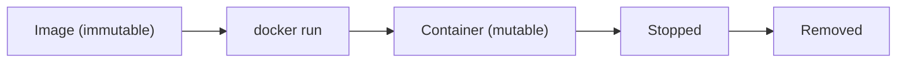

# Images and Containers

> Docker 101 series (2/10)

<!-- a-grade-intro:begin -->

**Core question**: *Images are immutable; containers change* — what does that *actually* mean in practice?

> *An image is a *class*; a container is an *instance*. Keeping them separate makes debugging tractable.*

<!-- a-grade-intro:end -->

## What You Will Learn

- The *lifecycle* of *images* and *containers*
- *Layers* and *copy-on-write*
- The *ten commands* you actually use
- How to *look inside* a container
- Five common pitfalls

## Why It Matters

If you do not understand how containers behave, *debugging becomes luck*. Knowing layers and lifecycle makes *80% of issues* *predictable*.

> *Half of "non-reproducible" bugs come from *misunderstanding container state*.*

## Concept at a Glance



## Key Terms

- **Layer**: a *read-only filesystem slice* inside an image.
- **Writable layer**: the *top read-write layer* a container owns.
- **Lifecycle**: created -> running -> stopped -> removed.
- **Tag**: an image version label (`nginx:1.27`).
- **Digest**: the *immutable SHA256* identifier of an image.

## Before/After

**Before**: you `apt install` inside a container, then panic when it *vanishes on restart*.

**After**: changes are *codified in a Dockerfile*; containers can be *thrown away anytime*.

## Hands-on: Images and Containers in 5 Steps

### Step 1 — Inspect an image

```bash
docker pull nginx:1.27
docker image inspect nginx:1.27 | jq '.[0].RootFS.Layers'
docker history nginx:1.27
```

### Step 2 — Create and start a container

```bash
docker create --name web nginx:1.27   # create only
docker start web                       # then start
docker ps
```

### Step 3 — Step inside

```bash
docker exec -it web bash
# inside the container
ls /etc/nginx
exit
```

### Step 4 — Changes are *ephemeral*

```bash
docker exec web touch /tmp/hello
docker stop web && docker rm web
docker run --name web2 nginx:1.27
docker exec web2 ls /tmp/hello   # No such file
```

### Step 5 — Clean up images

```bash
docker image prune -f          # remove dangling
docker image rm nginx:1.27
```

## What to Notice in This Code

- `docker history` shows the *commands behind each layer*.
- Container changes are lost *unless you commit*.
- A *digest* is *much more trustworthy* than a tag.

## Five Common Mistakes

1. **Storing files *permanently inside the container*.** Lost on restart.
2. **Building images via `docker commit`.** *Not reproducible*.
3. **Letting stopped containers *pile up*.** `docker ps -a` becomes *hundreds of lines*.
4. **Using only `latest`.** Compatibility breaks one morning.
5. **Images with *too many layers*.** Build and pull get slow.

## How This Shows Up in Production

CI systems build with *digest pins* for reproducibility, and operations correlate *image-level change history* with Datadog/Grafana to *track change-related incidents*.

## How a Senior Engineer Thinks

- *Images are built; containers are run*.
- *Change is code*; `commit` is the *last resort*.
- *Digest pins* are the *production default*.
- *Layer caching* drives *build speed*.
- *Design containers to be discarded at any time*.

## Checklist

- [ ] You can explain *image vs container*.
- [ ] You know container changes are *ephemeral*.
- [ ] You use *layers / digests*.
- [ ] You *clean up* stopped containers.

## Practice Problems

1. Find the *number of layers* in `nginx:1.27`.
2. Create a file inside a container, restart it, confirm it is gone.
3. Run `docker image prune` to clear *unused images*.

## Wrap-up and Next Steps

Separating images and containers is the *fundamentals* of Docker. Next we *build images with Dockerfile*.

- [What Is Docker?](./01-what-is-docker.md)
- **Images and Containers (current)**
- Writing a Dockerfile (upcoming)
- Volumes and Networks (upcoming)
- Docker Compose (upcoming)
- Environment Variables and Configuration (upcoming)
- Containerizing a Python App (upcoming)
- Running with a Database (upcoming)
- Image Optimization (upcoming)
- Production-Ready Docker (upcoming)
## References

- [Docker images](https://docs.docker.com/engine/reference/commandline/image/)
- [Docker container lifecycle](https://docs.docker.com/engine/reference/commandline/container/)
- [Storage drivers and layers](https://docs.docker.com/storage/storagedriver/)
- [Image digests](https://docs.docker.com/engine/reference/commandline/pull/#pull-an-image-by-digest-immutable-identifier)

Tags: Docker, Image, Container, Layer, Lifecycle

---

© 2026 YeongseonBooks. All rights reserved.
