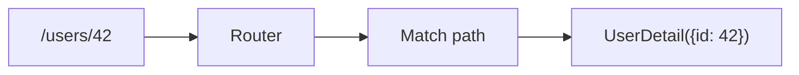

# Routing and Pages

> Frontend Development 101 series (5/10)

<!-- a-grade-intro:begin -->

**Core question**: How does a *single-page* app render *multiple screens*?

> URLs are *state*. The router reads the URL and decides *which component to render*.

<!-- a-grade-intro:end -->

## What You Will Learn

- The *principle* behind SPA routing
- Mapping paths to components
- Nested routes
- Dynamic parameters and query strings
- Code splitting and lazy loading

## Why It Matters

Routing makes *refresh-safe screens*, *shareable links*, and *back-button behavior* work correctly. Broken routing breaks *product trust*.

> Good routing makes the screen *guessable from the URL alone*.

## Concept at a Glance



## Key Terms

- **Route**: a *mapping* from URL pattern to component.
- **Nested route**: a route *inside another route*.
- **Dynamic segment**: a pattern with a *variable slot* like `/users/:id`.
- **Query string**: extra info *outside the route*, like `?q=react&page=2`.
- **Lazy loading**: *splitting code per route* so it loads only when needed.

## Before/After

**Before (server routing, full reload)**

```html
<a href="/about">About</a>
```

**After (SPA routing, smooth transition)**

```jsx
<Link to="/about">About</Link>
```

## Hands-on: React Router in Five Steps

### Step 1 — Install

```bash
npm install react-router-dom
```

### Step 2 — Define routes

```jsx
import { createBrowserRouter, RouterProvider } from "react-router-dom";

const router = createBrowserRouter([
  { path: "/", element: <Home /> },
  { path: "/about", element: <About /> },
]);

<RouterProvider router={router} />
```

### Step 3 — Use Link

```jsx
import { Link } from "react-router-dom";

<nav>
  <Link to="/">Home</Link>
  <Link to="/about">About</Link>
</nav>
```

### Step 4 — Dynamic parameters

```jsx
{ path: "/users/:id", element: <UserDetail /> }

import { useParams } from "react-router-dom";
function UserDetail() {
  const { id } = useParams();
  return <p>user {id}</p>;
}
```

### Step 5 — Lazy loading

```jsx
import { lazy } from "react";
const Settings = lazy(() => import("./Settings"));

{ path: "/settings", element: <Suspense><Settings /></Suspense> }
```

## What to Notice in This Code

- `<Link>` updates router state *without a full page reload*.
- `useParams` exposes dynamic segments as *values*.
- Lazy loading shrinks the *initial bundle*.

## Five Common Mistakes

1. **Mixing `<a>` and `<Link>`.** `<a>` triggers *full reload*, defeating SPA gains.
2. **Not protecting auth-gated routes.** Direct URL entry *bypasses* checks.
3. **Skipping lazy loading with *dozens* of routes.** Initial load becomes *brutally slow*.
4. **Not syncing query string with state.** Search results *vanish on refresh*.
5. **No 404 page.** A bad URL shows *a white screen*.

## How This Shows Up in Production

Most teams use *file-based routing* via Next.js, Remix, or Nuxt. `pages/users/[id].tsx` automatically becomes the `/users/:id` route. Hand-listing routes is becoming *less common*.

## How a Senior Engineer Thinks

- A URL is *shareable state*.
- Auth/permission route guards are *designed in from day one*.
- Lots of routes ⇒ code splitting is *mandatory*.
- Search/filter belongs in the *query string* so links stay *shareable*.
- 404 must be *friendly* and offer a *way back*.

## Checklist

- [ ] You distinguish static and dynamic routes.
- [ ] You know the difference between `<Link>` and `<a>`.
- [ ] You can read params with `useParams`.
- [ ] You have set up lazy loading at least once.
- [ ] You have a 404 page.

## Practice Problems

1. Build four routes: `/`, `/about`, `/users/:id`, `/*` (404).
2. Show the param in `/users/:id` via `useParams`.
3. Lazy-load `/settings` and verify a separate chunk in the Network tab.

## Wrap-up and Next Steps

URLs decide what users see. Next, we look at how those screens *fetch data from a server*.

- [What Is Frontend Development?](./01-what-is-frontend-development.md)
- [HTML and CSS Basics](./02-html-and-css-basics.md)
- [JavaScript Basics](./03-javascript-basics.md)
- [Components and State](./04-components-and-state.md)
- **Routing and Pages (current)**
- API Calls and Async (upcoming)
- Forms and Validation (upcoming)
- Styling and Design Systems (upcoming)
- Build Tools and Bundling (upcoming)
- Building a Small Frontend App (upcoming)
## References

- [React Router docs](https://reactrouter.com/)
- [Next.js routing](https://nextjs.org/docs/app/building-your-application/routing)
- [URL Living Standard](https://url.spec.whatwg.org/)
- [MDN History API](https://developer.mozilla.org/en-US/docs/Web/API/History_API)

Tags: Frontend, Routing, SPA, React, Web

---

© 2026 YeongseonBooks. All rights reserved.
