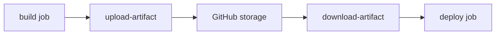

# Build Artifacts

> GitHub Actions 101 series (6/10)

<!-- a-grade-intro:begin -->

**Core question**: How do you *pass build outputs* to the *next job* or to *external users*?

> *Artifacts* are the *bridge* between *build and deploy*.

<!-- a-grade-intro:end -->

## What You Will Learn

- Using *upload-artifact / download-artifact*
- Patterns for *cross-job* output passing
- Cost control with *retention-days*
- Cutting *Releases* via *softprops/action-gh-release*
- Five common pitfalls

## Why It Matters

A workflow that *throws build outputs away* offers *no reuse, no trace*. Artifacts are *evidence and assets*.

> *Every merge* should leave a *traceable build*.

## Concept at a Glance



## Key Terms

- **Artifact**: a *file bundle produced* by a workflow.
- **upload-artifact**: the *upload* action.
- **download-artifact**: downloads from *another job*.
- **retention-days**: *how long* it's kept.
- **Release**: GitHub's *official artifact page*.

## Before/After

**Before**: when the build job's runner *vanishes*, `dist/*.whl` *vanishes with it*.

**After**: `dist/*.whl` is *stored as an artifact* and the *deploy job* downloads and uses it.

## Hands-on: Artifacts in 5 Steps

### Step 1 — Upload

```yaml
- run: python -m build
- uses: actions/upload-artifact@v4
  with:
    name: dist
    path: dist/*
    retention-days: 14
```

### Step 2 — Download

```yaml
deploy:
  needs: build
  runs-on: ubuntu-latest
  steps:
    - uses: actions/download-artifact@v4
      with:
        name: dist
        path: dist/
    - run: ls dist/
```

### Step 3 — Bundle by patterns

```yaml
- uses: actions/upload-artifact@v4
  with:
    name: reports
    path: |
      coverage.xml
      report.xml
      logs/*.log
```

### Step 4 — Auto-publish a Release

```yaml
- uses: softprops/action-gh-release@v2
  if: startsWith(github.ref, 'refs/tags/')
  with:
    files: dist/*
    generate_release_notes: true
```

### Step 5 — Retention policy

```yaml
- uses: actions/upload-artifact@v4
  with:
    name: nightly-build
    path: dist/
    retention-days: 7
```

## What to Notice in This Code

- *retention-days* controls *storage cost*.
- *generate_release_notes* writes the *changelog*.
- *download-artifact* works only *within the same workflow* (use the API otherwise).

## Five Common Mistakes

1. **`upload-artifact@v3` is *deprecated*.** Upgrade to v4.
2. **Uploading *everything*.** Cost explodes.
3. **No `retention-days`.** Defaults to *90 days* and accumulates.
4. **Reusing *artifact names*.** A second upload with the same name *errors*.
5. **No checksum on *Releases*.** No tamper detection.

## How This Shows Up in Production

Mature teams emit *checksum + SBOM* with every build and *sign* releases (e.g., sigstore).

## How a Senior Engineer Thinks

- *Traceable builds* are the start of *supply-chain security*.
- *Retention* is *cost plus compliance*.
- *Releases* are an *external interface*.
- *Artifact names* must be *unique*.
- *Checksums and signatures* are *culture*.

## Checklist

- [ ] Use *upload-artifact@v4*.
- [ ] *retention-days* is set.
- [ ] *Releases* are auto-published on *tag push*.
- [ ] *Checksums* or *signatures* are attached.

## Practice Problems

1. Upload *pytest report + coverage* as a *single artifact*.
2. Have the *deploy job* download *build job* output.
3. Auto-publish a *Release* on *tag push*.

## Wrap-up and Next Steps

Artifacts are the *receipts of your build*. Next: *Docker build*.

- [What Is GitHub Actions?](./01-what-is-github-actions.md)
- [Workflows and Jobs](./02-workflow-and-job.md)
- [Understanding Triggers](./03-triggers.md)
- [Python Test Automation](./04-python-test-automation.md)
- [Lint and Type Check](./05-lint-and-typecheck.md)
- **Build Artifacts (current)**
- Docker Build (upcoming)
- Deployment Automation (upcoming)
- Secret Management (upcoming)
- A Real-World CI/CD Pipeline (upcoming)
## References

- [actions/upload-artifact](https://github.com/actions/upload-artifact)
- [actions/download-artifact](https://github.com/actions/download-artifact)
- [softprops/action-gh-release](https://github.com/softprops/action-gh-release)
- [About artifacts](https://docs.github.com/actions/using-workflows/storing-workflow-data-as-artifacts)

Tags: GitHubActions, Artifact, Build, Release, CICD

---

© 2026 YeongseonBooks. All rights reserved.
