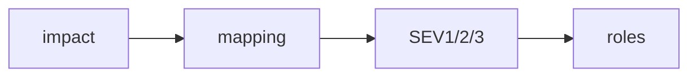

# Severity Classification

> Incident Response 101 series (2/10)

<!-- a-grade-intro:begin -->

**Core question**: How do you say *how serious* it is in a *shared language*?

> *Severity* is the agreed *language* that maps *impact* to *levels*.

<!-- a-grade-intro:end -->

## What You Will Learn

- The *definition* of *severity*
- *SEV1/2/3* mapping
- *Automated decisions*
- *Team-specific* differences
- *Common pitfalls*

## Why It Matters

Using the *same word* with *different meanings* makes response *misfire*.

## Concept at a Glance



## Key Terms

- **SEV1**: *company-wide impact*.
- **SEV2**: *major feature degradation*.
- **SEV3**: *partial degradation*.
- **scope**: the *range of impact*.
- **duration**: how *long* it lasts.

## Before/After

**Before**: vague phrases like "this is *serious*".

**After**: an agreed *level* like "*SEV2*".

## Hands-on: Severity Mapping

### Step 1 — Impact axes

```python
def axes(users, region, money_loss):
    return {"users": users, "region": region, "money": money_loss}
```

### Step 2 — Mapping

```python
def severity(a):
    if a["users"] > 100000 or a["money"] > 100000:
        return "SEV1"
    if a["users"] > 1000:
        return "SEV2"
    return "SEV3"
```

### Step 3 — Page policy

```python
def page_policy(sev):
    return {"SEV1": "all", "SEV2": "primary", "SEV3": "next-day"}[sev]
```

### Step 4 — Report cadence

```python
def report_every_min(sev):
    return {"SEV1": 15, "SEV2": 30, "SEV3": 60}[sev]
```

### Step 5 — Auto routing

```python
def route(a):
    sev = severity(a)
    return {"sev": sev, "page": page_policy(sev), "every": report_every_min(sev)}
```

## What to Notice in This Code

- *Axes* break down the *impact*.
- Each *level* maps to *behavior*.
- *Auto routing* reduces *errors*.

## Five Common Mistakes

1. ***Vague* level definitions.**
2. **Forgetting *monetary impact*.**
3. **Fuzzy line between *SEV2* and *SEV3*.**
4. **Manual classification with no *automation*.**
5. **Centering *internal impact* over *customer impact*.**

## How This Shows Up in Production

A *payment failure* defaults to *SEV1*; a *search result ordering bug* defaults to *SEV3*.

## How a Senior Engineer Thinks

- A *level* is a *shorthand for behavior*.
- Keep the *axes* to a *minimum*.
- Settle the *boundaries* with *examples*.
- *Automation* is the *default* for decisions.
- *Differentiate* by product or region.

## Checklist

- [ ] *Level definitions*.
- [ ] *Mapping code*.
- [ ] *Behavior matrix*.
- [ ] *Example cases*.

## Practice Problems

1. Define *SEV1* in one line.
2. Define *scope* in one line.
3. Define *duration* in one line.

## Wrap-up and Next Steps

Next, we cover *initial response*.

- [What is an Incident?](./01-what-is-incident.md)
- **Severity Classification (current)**
- Initial Response (upcoming)
- Communication (upcoming)
- Writing the Timeline (upcoming)
- Root Cause Analysis (upcoming)
- Mitigation and Resolution (upcoming)
- Postmortem (upcoming)
- Prevention (upcoming)
- Building an Incident Runbook (upcoming)
## References

- [Severity Levels - PagerDuty](https://response.pagerduty.com/before/severity_levels/)
- [Severity Levels - Atlassian](https://www.atlassian.com/incident-management/kpis/severity-levels)
- [Incident Severity - Datadog](https://www.datadoghq.com/blog/incident-management/)
- [Severity Classification - Google SRE Workbook](https://sre.google/workbook/incident-response/)

Tags: Incident, Severity, Triage, Response, Operations

---

© 2026 YeongseonBooks. All rights reserved.
