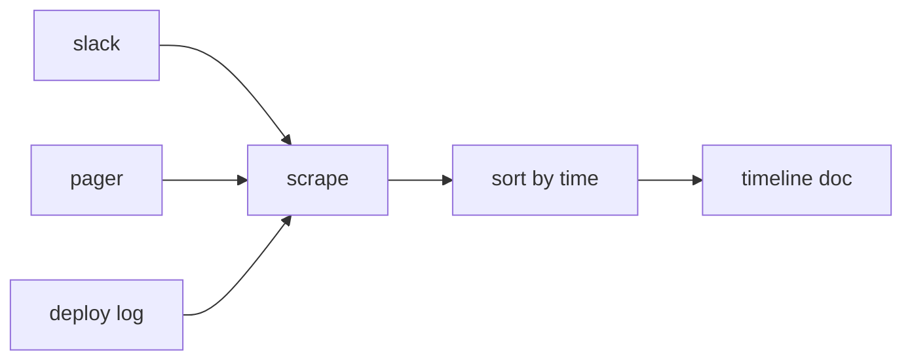

# Writing the Timeline

> Incident Response 101 series (5/10)

<!-- a-grade-intro:begin -->

**Core question**: After an *incident* ends, how do you *reconstruct* what happened *and when*?

> A *timeline* is captured *during* the response and ordered by *time*, with *facts only*.

<!-- a-grade-intro:end -->

## What You Will Learn

- *Contemporaneous logging*
- *Channel scraping*
- *Time ordering*
- Separating *fact vs interpretation*
- Feeding the *postmortem*

## Why It Matters

*Memory* drifts. The *one line* you write *now* saves *tomorrow's RCA*.

## Concept at a Glance



## Key Terms

- **timestamp**: a *UTC* time stamp.
- **scrape**: gathering events from *multiple channels*.
- **fact**: a *recorded observation*.
- **interpretation**: *guesses* and *opinions*.
- **anchor**: reference moments like *Detection* or *Mitigation*.

## Before/After

**Before**: reconstruct from *memory*.

**After**: reconstruct from *contemporaneous logs* and *channel scrapes*.

## Hands-on: A Tiny Timeline Builder

### Step 1 — Event model

```python
def event(ts, source, text):
    return {"ts": ts, "src": source, "text": text}
```

### Step 2 — Scrape a channel

```python
def scrape(channel):
    return [event(m["ts"], channel, m["text"]) for m in channel.get("messages", [])]
```

### Step 3 — Order events

```python
def order(events):
    return sorted(events, key=lambda e: e["ts"])
```

### Step 4 — Split fact and interpretation

```python
def split(events):
    facts = [e for e in events if not e["text"].startswith("?")]
    notes = [e for e in events if e["text"].startswith("?")]
    return facts, notes
```

### Step 5 — Mark anchors

```python
ANCHORS = ("detected", "acknowledged", "mitigated", "resolved")

def mark(event):
    return event["text"].lower() in ANCHORS
```

## What to Notice in This Code

- Every *event* has *three fields*.
- *Interpretation* is split off by a *prefix*.
- *Anchors* are the *dashboard* reference points.

## Five Common Mistakes

1. **Writing the timeline *after* the incident ends.**
2. **Treating *interpretation* as *fact*.**
3. **Mixing *time zones* (KST/UTC).**
4. **Scraping only *one channel*.**
5. **Pasting *sensitive data* directly.**

## How This Shows Up in Production

A *Slack bot* collects events with `!ts <text>` and *exports* them into a *postmortem doc*.

## How a Senior Engineer Thinks

- *Contemporaneous logging* is the rule.
- Standardize on *UTC*.
- *Short, frequent* lines.
- *Speculation* goes elsewhere.
- If the *anchors* are right, you can recover the rest.

## Checklist

- [ ] *Recording owner*.
- [ ] *Bot command*.
- [ ] *UTC enforcement*.
- [ ] *Anchor definitions*.

## Practice Problems

1. Define *anchor* in one line.
2. Distinguish *fact* and *interpretation* in one line.
3. Explain why *UTC* matters in one line.

## Wrap-up and Next Steps

Next, we cover *root cause analysis*.

- [What is an Incident?](./01-what-is-incident.md)
- [Severity Classification](./02-severity.md)
- [Initial Response](./03-initial-response.md)
- [Communication](./04-communication.md)
- **Writing the Timeline (current)**
- Root Cause Analysis (upcoming)
- Mitigation and Resolution (upcoming)
- Postmortem (upcoming)
- Prevention (upcoming)
- Building an Incident Runbook (upcoming)
## References

- [Postmortem Timeline - Google SRE Workbook](https://sre.google/workbook/postmortem-culture/)
- [Building an Incident Timeline - PagerDuty](https://response.pagerduty.com/after/post_mortem_process/)
- [Incident Documentation - Atlassian](https://www.atlassian.com/incident-management/postmortem)
- [Time and Postmortems - Increment](https://increment.com/postmortems/)

Tags: Incident, Timeline, Postmortem, Logging, Operations

---

© 2026 YeongseonBooks. All rights reserved.
