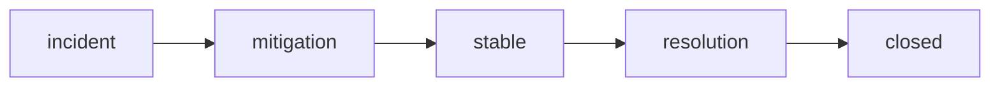

# Mitigation and Resolution

> Incident Response 101 series (7/10)

<!-- a-grade-intro:begin -->

**Core question**: Is *putting the fire out* the *same thing* as *removing the cause*?

> *Mitigation* stops the *damage*. *Resolution* removes the *cause*. Different *order*, different *owners*.

<!-- a-grade-intro:end -->

## What You Will Learn

- *Mitigation vs resolution*
- *Rollback* tactics
- *Scaling out*
- *Throttling* and *kill switches*
- *Recovery verification*

## Why It Matters

If you confuse *mitigation* with *resolution*, the *same incident* erupts again at *night*.

## Concept at a Glance



## Key Terms

- **mitigation**: *stop* the *damage*.
- **resolution**: *remove* the *cause*.
- **rollback**: revert to the *previous version*.
- **kill switch**: turn a *feature* off *immediately*.
- **throttle**: *limit* incoming traffic.

## Before/After

**Before**: announce only after a *full fix*.

**After**: announce *as soon as* damage is *contained*; announce *resolution* separately.

## Hands-on: A Mini Mitigation Kit

### Step 1 — Rollback

```python
def rollback(version):
    return {"action": "rollback", "to": version}
```

### Step 2 — Scale out

```python
def scale_out(service, replicas):
    return {"service": service, "replicas": replicas}
```

### Step 3 — Throttle

```python
def throttle(endpoint, rps):
    return {"endpoint": endpoint, "rps": rps}
```

### Step 4 — Kill switch

```python
FLAGS = {}

def kill(feature):
    FLAGS[feature] = False
    return FLAGS[feature]
```

### Step 5 — Verify recovery

```python
def verify(metrics):
    return metrics.get("err_ratio", 1) < 0.01
```

## What to Notice in This Code

- *Mitigation* is a *small* action.
- A *kill switch* is *one flag* line.
- *Verification* is *quantitative*.

## Five Common Mistakes

1. **Only *rolling forward*, never *back*.**
2. **No prepared *kill switch*.**
3. **Announcing *mitigation* as *resolution*.**
4. **Closing without *verification*.**
5. **Forgetting to *unthrottle*.**

## How This Shows Up in Production

A *feature flag* system and an *autoscaler* are wired into a single *runbook* command, so *mitigation* takes *under two minutes*.

## How a Senior Engineer Thinks

- *Mitigation first*.
- *Resolution* during *business hours*.
- A *kill switch* on *every feature*.
- *Verify* with numbers.
- *Unthrottling* is also an *event*.

## Checklist

- [ ] *Rollback procedure*.
- [ ] *Kill switch inventory*.
- [ ] *Throttling policy*.
- [ ] *Recovery verification metric*.

## Practice Problems

1. Define *mitigation* in one line.
2. Define *resolution* in one line.
3. Define *kill switch* in one line.

## Wrap-up and Next Steps

Next, we cover the *postmortem*.

- [What is an Incident?](./01-what-is-incident.md)
- [Severity Classification](./02-severity.md)
- [Initial Response](./03-initial-response.md)
- [Communication](./04-communication.md)
- [Writing the Timeline](./05-timeline.md)
- [Root Cause Analysis](./06-root-cause-analysis.md)
- **Mitigation and Resolution (current)**
- Postmortem (upcoming)
- Prevention (upcoming)
- Building an Incident Runbook (upcoming)
## References

- [Mitigation vs Resolution - PagerDuty](https://response.pagerduty.com/during/mitigation/)
- [Rollback Strategies - Google SRE Book](https://sre.google/sre-book/release-engineering/)
- [Feature Flags - Martin Fowler](https://martinfowler.com/articles/feature-toggles.html)
- [Throttling and Backpressure - Increment](https://increment.com/reliability/throttling/)

Tags: Incident, Mitigation, Resolution, Rollback, Operations

---

© 2026 YeongseonBooks. All rights reserved.
