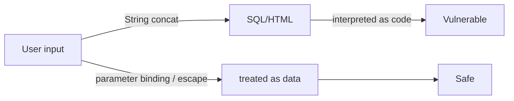

# SQL Injection and XSS

> Information Security 101 series (6/10)

<!-- a-grade-intro:begin -->

**Core question**: Where does input become code, and where does it stay data?

> Both bugs share one root: never let input be interpreted as code.

<!-- a-grade-intro:end -->

## What You Will Learn

- The exact mechanism of SQL injection
- Parameter binding and the limits of ORM safety
- The three types of XSS (Reflected, Stored, DOM-based)
- Output encoding and context awareness
- The priority of input validation vs output encoding

## Why It Matters

Both bugs have stayed in the OWASP Top 10 for years. Once you understand the principle, you can defend the same way in any new framework or language.

> Treat input as data; encode output for its context.

## Concept at a Glance



Same input, different handling — opposite outcomes.

## Key Terms

- **SQL Injection**: input parsed as SQL syntax.
- **Parameterized query**: input bound separately as data.
- **Reflected XSS**: input echoed straight back in the response.
- **Stored XSS**: input stored, then served to other users.
- **Output encoding**: escaping fitted to the output context (HTML, JS, URL).

## Before/After

**Before — String concatenation**

```python
cur.execute(f"SELECT * FROM users WHERE name='{name}'")
# name = "' OR 1=1 --"  -> returns every row
```

**After — Parameter binding**

```python
cur.execute("SELECT * FROM users WHERE name=%s", (name,))
```

A one-line difference splits incident from safety.

## Hands-on Step by Step

### Step 1 — Safe SQL

```python
# 1_sql_safe.py
import sqlite3
con = sqlite3.connect(":memory:")
con.execute("CREATE TABLE u (id int, name text)")
con.execute("INSERT INTO u VALUES (?, ?)", (1, "alice"))
print(con.execute("SELECT * FROM u WHERE name=?", ("alice",)).fetchall())
```

Never inline input into the `?` or `%s` slot.

### Step 2 — ORM Is Not a Cure

```python
# 2_orm_dynamic.py
# SQLAlchemy raw escape hatches stay risky
# session.execute(text(f"SELECT * FROM u WHERE name='{name}'"))  # do not do this
```

The `raw` / `text` escape hatches need parameter binding too.

### Step 3 — Reflected XSS Defense

```python
# 3_xss_reflect.py
from markupsafe import escape
def search(q):
    return f"<p>Query: {escape(q)}</p>"
```

Always escape before rendering on the server.

### Step 4 — Stored XSS Defense

```python
# 4_xss_stored.py
def render_comment(html):
    # store the original; encode at output time
    return f"<div>{escape(html)}</div>"
```

Store raw, encode on output — one consistent rule.

### Step 5 — DOM-based XSS

```javascript
// 5_dom_xss.js
// document.body.innerHTML = location.hash;   // dangerous
const text = decodeURIComponent(location.hash.slice(1));
const node = document.createTextNode(text);   // safe
document.body.appendChild(node);
```

Use text-node APIs instead of `innerHTML`.

## What to Notice in This Code

- All SQL goes through parameter binding.
- Output encoding depends on context (HTML body, attribute, URL, JS).
- Avoid `innerHTML` in DOM manipulation.
- Input validation is a secondary defense, not the main one.

## Five Common Mistakes

1. **f-string SQL.** The most common injection path.
2. **Storing HTML input then rendering without sanitization.** Stored XSS.
3. **HTML escape applied to JS context.** Wrong encoder.
4. **`innerHTML` for user input.** DOM XSS.
5. **Blacklist-based filters.** Easy to bypass — use allowlists.

## How This Shows Up in Production

Big systems allow only typed queries through the ORM and require code review for raw SQL. Frontends trust framework text interpolation but gate `dangerouslySetInnerHTML` with explicit approvals. A WAF is an extra layer, not the main defense.

## How a Senior Engineer Thinks

- Two-line rule: input as data, output encoded for context.
- Lint rules block raw SQL.
- One well-known HTML sanitizer, used everywhere.
- DOM XSS is caught with code review and static analysis.
- New input paths trigger a threat-model update.

## Checklist

- [ ] Does every SQL statement use parameter binding?
- [ ] Is output encoding applied per context?
- [ ] Have you audited `innerHTML` usage?
- [ ] Is the HTML sanitizer standardized?
- [ ] Is there code-level defense beyond the WAF?

## Practice Problems

1. Write the one-line fix that blocks `name=' OR '1'='1`.
2. List two operational differences between Reflected and Stored XSS.
3. Describe one React pattern that prevents DOM XSS.

## Wrap-up and Next Steps

Both bugs stem from inconsistent input handling. Next we step away from code into configuration — secret management.

- [What is Information Security?](./01-what-is-information-security.md)
- [Authentication and Authorization](./02-authentication-and-authorization.md)
- [Cryptography and Hashes](./03-cryptography-and-hash.md)
- [TLS and Certificates](./04-tls-and-certificates.md)
- [Web Security Basics](./05-web-security-basics.md)
- **SQL Injection and XSS (current)**
- Secret Management (upcoming)
- Least Privilege (upcoming)
- Logging and Audit (upcoming)
- Incident Response (upcoming)
## References

- [OWASP — SQL Injection](https://owasp.org/www-community/attacks/SQL_Injection)
- [OWASP — XSS](https://owasp.org/www-community/attacks/xss/)
- [OWASP Cheat Sheet — XSS Prevention](https://cheatsheetseries.owasp.org/cheatsheets/Cross_Site_Scripting_Prevention_Cheat_Sheet.html)
- [PortSwigger Web Security Academy](https://portswigger.net/web-security)

Tags: Computer Science, Security, SQLInjection, XSS, InputValidation, OutputEncoding

---

© 2026 YeongseonBooks. All rights reserved.
