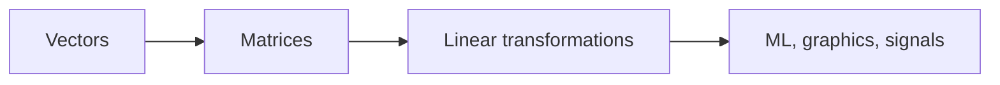

# What Is Linear Algebra?

> Linear Algebra 101 series (1/10)

<!-- a-grade-intro:begin -->

**Core question**: Is *linear algebra* just a *grid of numbers*, or is it the *language of space*?

> *Linear algebra is the language of *vectors and linear transformations* — the grammar behind every ML model.*

<!-- a-grade-intro:end -->

## What You Will Learn

- The *definition* of *linear algebra*
- Intuition for *vectors* and *matrices*
- *Linear transformations* as the unifying concept
- A 5-step hands-on walk-through
- Five common pitfalls

## Why It Matters

ML, statistics, graphics, and signal processing all run on *vectors and matrices*. If your *linear algebra is shaky*, you cannot *see inside* a model.

> *Linear algebra is the language of data.*

## Concept at a Glance



## Key Terms

- **Vector**: a *bundle of numbers* with *direction and magnitude*.
- **Matrix**: a *collection of vectors* or a *representation of a linear transformation*.
- **Linear transformation**: a rule that *maps vectors to vectors* and preserves *addition and scalar multiplication*.
- **Dimension**: the number of coordinates needed to describe a space.
- **Basis**: the *minimal set* that can *represent every point* in a space.

## Before/After

**Before**: *"A matrix is just a number grid."* — no idea *why* we multiply them.

**After**: *"Matrix multiplication = composition of linear transformations — a rule that rotates, scales, or reflects space."*

## Hands-on: Five Steps to Linear Algebra Intuition

### Step 1 — Build a vector

```python
import numpy as np
v = np.array([3.0, 4.0])
print("v:", v, "norm:", np.linalg.norm(v))
```

### Step 2 — Build a matrix

```python
A = np.array([[1.0, 2.0],
              [3.0, 4.0]])
print("A shape:", A.shape)
```

### Step 3 — Apply a linear transformation

```python
y = A @ v
print("Av:", y)
```

### Step 4 — A rotation matrix

```python
theta = np.pi / 2
R = np.array([[np.cos(theta), -np.sin(theta)],
              [np.sin(theta),  np.cos(theta)]])
print("R v:", R @ v)
```

### Step 5 — Compose transformations

```python
print("R(A v):", R @ (A @ v))
print("(R A) v:", (R @ A) @ v)
```

## What to Notice in This Code

- A *vector* has *direction + magnitude* — not just a list of numbers.
- *Matrix multiplication* is *composition* — order matters.
- *NumPy* is the standard *linear algebra* library.

## Five Common Mistakes

1. **Mismatched *row/column* shapes.**
2. **Confusing *matrix product* and *element-wise product*.**
3. **Forgetting that *matrix multiplication is non-commutative*.**
4. **Treating *vectors as plain number lists* only.**
5. **Memorizing *dimension/basis* without intuition.**

## How This Shows Up in Production

Recommender systems, image processing, graphics, and every layer of deep learning — *matrix operations* are the *engine of computation*. *NumPy / PyTorch / TensorFlow* are essentially *linear algebra accelerators*.

## How a Senior Engineer Thinks

- *Always print* the *shape*.
- *Sketch* the *meaning of the transformation*.
- Be aware of *order and non-commutativity*.
- Combine *geometric intuition* with *algebraic computation*.
- Care about *numerical stability*.

## Checklist

- [ ] You can build *vectors and matrices*.
- [ ] You can multiply matrices.
- [ ] You understand *linear transformations*.
- [ ] You can match *shapes*.

## Practice Problems

1. Compute by hand the result of *rotating* the 2D vector `[1, 0]` by *90 degrees*.
2. Construct two matrices `A`, `B` such that `A B` and `B A` are *not equal*.
3. Describe what the *identity matrix* `I` does to *any vector*.

## Wrap-up and Next Steps

Linear algebra is the *language of space*. The next post explores *vector operations* and their *geometric meaning* in depth.

- **What Is Linear Algebra? (current)**
- Vectors (upcoming)
- Matrices (upcoming)
- Inner Product and Distance (upcoming)
- Linear Transformations (upcoming)
- Basis and Dimension (upcoming)
- Eigenvalues and Eigenvectors (upcoming)
- Matrix Decomposition (upcoming)
- PCA (upcoming)
- Linear Algebra in Machine Learning (upcoming)
## References

- [3Blue1Brown — Essence of Linear Algebra](https://www.3blue1brown.com/topics/linear-algebra)
- [Khan Academy — Linear Algebra](https://www.khanacademy.org/math/linear-algebra)
- [Gilbert Strang — Linear Algebra (MIT OCW)](https://ocw.mit.edu/courses/18-06-linear-algebra-spring-2010/)
- [NumPy — Linear algebra](https://numpy.org/doc/stable/reference/routines.linalg.html)

Tags: LinearAlgebra, Foundations, Vectors, DataScience, Beginner

---

© 2026 YeongseonBooks. All rights reserved.
