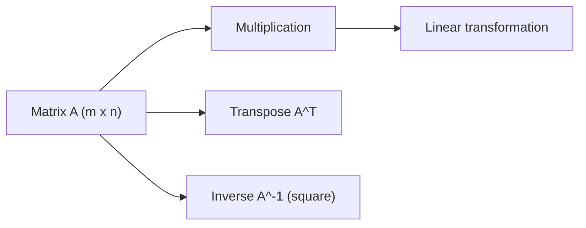

# Matrices

> Linear Algebra 101 series (3/10)

<!-- a-grade-intro:begin -->

**Core question**: Is a *matrix* just a *grid of numbers*, or a *representation of a transformation*?

> *A matrix is the *compressed form* of a function that *maps vectors to vectors*.*

<!-- a-grade-intro:end -->

## What You Will Learn

- The *definition* and *shape* of a *matrix*
- *Multiplication, transpose, inverse*
- The meaning of the *identity matrix* and the *inverse*
- A 5-step hands-on
- Five common pitfalls

## Why It Matters

A *matrix* is both a *dataset* and a *transformation*. Every layer of an ML model runs on *matrix multiplication*.

> *Matrices are linear transformations in disguise.*

## Concept at a Glance



## Key Terms

- **Matrix**: an `m x n` *array of numbers*.
- **Transpose**: *swap rows and columns* — `A^T`.
- **Identity I**: ones on the diagonal, zeros elsewhere — `I v = v`.
- **Inverse**: `A A^-1 = I` — only for *square* matrices, and not always exists.
- **Matrix product**: `(m x k)(k x n) = (m x n)` — *inner dimensions must match*.

## Before/After

**Before**: *"Matrix multiplication is just sums of rows times columns."* — no idea *why*.

**After**: *"Matrix multiplication = *composition of transformations*. Apply one, then the next."*

## Hands-on: Five Steps with Matrices

### Step 1 — Build a matrix

```python
import numpy as np
A = np.array([[1.0, 2.0], [3.0, 4.0]])
print("A:", A, "shape:", A.shape)
```

### Step 2 — Transpose

```python
print("A^T:", A.T)
```

### Step 3 — Matrix multiplication

```python
B = np.array([[5.0, 6.0], [7.0, 8.0]])
print("A B:", A @ B)
print("B A:", B @ A)  # different! non-commutative
```

### Step 4 — Identity matrix

```python
I = np.eye(2)
print("I:", I)
print("A I = A:", A @ I)
```

### Step 5 — Inverse

```python
A_inv = np.linalg.inv(A)
print("A^-1:", A_inv)
print("A A^-1 ~ I:", A @ A_inv)
```

## What to Notice in This Code

- *Matrix multiplication* is *non-commutative* — `A B != B A`.
- An *inverse* does *not always exist*.
- In *NumPy*, `@` is *matrix product* and `*` is *element-wise*.

## Five Common Mistakes

1. **Confusing `@` and `*`.**
2. **Triggering accidental *broadcasting* due to shape mismatch.**
3. **Inverting a *singular* matrix.**
4. **Forgetting that *matrix multiplication is non-commutative*.**
5. **Ignoring that *floating-point error* makes `A A^-1` only *approximately* `I`.**

## How This Shows Up in Production

The *normal equations* in linear regression, *weight matrices* in neural networks, *transformation matrices* in graphics, and *user-item matrices* in recommenders — all are *matrix operations*.

## How a Senior Engineer Thinks

- *Avoid explicit inverses* — solve via *decompositions*.
- *Always check shapes*.
- Be aware of *non-commutativity*.
- Use *purpose-built solvers* for *numerical stability*.
- *Visualize* the *geometric meaning*.

## Checklist

- [ ] You can do *matrix multiplication*.
- [ ] You can *transpose*.
- [ ] You know when an *inverse exists*.
- [ ] You are aware of *non-commutativity*.

## Practice Problems

1. Compute by hand the *transpose* and *inverse* of a 2x2 matrix `A`.
2. Multiply the *identity matrix* `I` with an arbitrary vector and check the result is unchanged.
3. Build an example of a *singular matrix* and explain why its *inverse does not exist*.

## Wrap-up and Next Steps

A matrix is a *compressed transformation*. The next post covers *inner product and distance*.

- [What Is Linear Algebra?](./01-what-is-linear-algebra.md)
- [Vectors](./02-vectors.md)
- **Matrices (current)**
- Inner Product and Distance (upcoming)
- Linear Transformations (upcoming)
- Basis and Dimension (upcoming)
- Eigenvalues and Eigenvectors (upcoming)
- Matrix Decomposition (upcoming)
- PCA (upcoming)
- Linear Algebra in Machine Learning (upcoming)
## References

- [3Blue1Brown — Matrix multiplication](https://www.3blue1brown.com/lessons/matrix-multiplication)
- [Khan Academy — Matrices](https://www.khanacademy.org/math/algebra-home/alg-matrices)
- [NumPy — linalg.inv](https://numpy.org/doc/stable/reference/generated/numpy.linalg.inv.html)
- [Wikipedia — Matrix](https://en.wikipedia.org/wiki/Matrix_(mathematics))

Tags: LinearAlgebra, Matrices, NumPy, DataScience, Beginner

---

© 2026 YeongseonBooks. All rights reserved.
