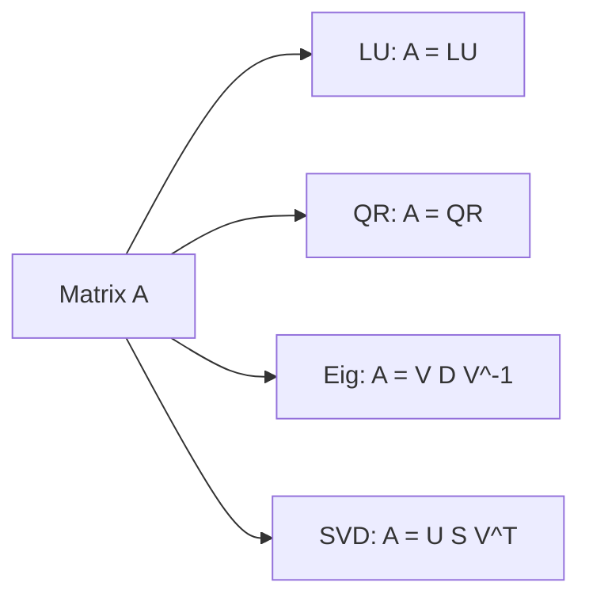

# Matrix Decomposition

> Linear Algebra 101 series (8/10)

<!-- a-grade-intro:begin -->

**Core question**: Can we *break a matrix* into *simpler pieces*?

> *Matrix decomposition rewrites a *complex transformation* as a *product of interpretable simple transformations*.*

<!-- a-grade-intro:end -->

## What You Will Learn

- *LU* and *QR* decomposition
- *Eigendecomposition* and *SVD*
- The *use case* of each decomposition
- A 5-step hands-on
- Five common pitfalls

## Why It Matters

Linear systems, least squares, PCA, dimensionality reduction — *matrix decompositions* are the *numerical core*. They are *more stable than inversion*.

> *Decompositions are how numerical linear algebra actually works.*

## Concept at a Glance



## Key Terms

- **LU**: product of *lower / upper triangular* — for *equation solving*.
- **QR**: *orthogonal* times *upper triangular* — for *least squares*.
- **Eigendecomposition**: `V D V^-1` — for *diagonalization*.
- **SVD**: `U S V^T` — works on *any matrix*, the *foundation of PCA*.
- **Singular values**: *diagonal entries of S* — *always non-negative*.

## Before/After

**Before**: *"Solve everything with the inverse."*

**After**: *"Use the right *decomposition* for the situation — *much faster and more stable*."*

## Hands-on: Five Steps with Decomposition

### Step 1 — LU decomposition

```python
import numpy as np
from scipy.linalg import lu
A = np.array([[4.0, 3.0], [6.0, 3.0]])
P, L, U = lu(A)
print("L:", L)
print("U:", U)
```

### Step 2 — QR decomposition

```python
Q, R = np.linalg.qr(A)
print("Q^T Q ~ I:", np.allclose(Q.T @ Q, np.eye(2)))
print("R:", R)
```

### Step 3 — Eigendecomposition

```python
vals, vecs = np.linalg.eig(A)
print("vals:", vals)
```

### Step 4 — SVD

```python
U, S, Vt = np.linalg.svd(A)
print("U:", U)
print("S:", S)
print("Vt:", Vt)
```

### Step 5 — Reconstruct from SVD

```python
A_reconstructed = U @ np.diag(S) @ Vt
print("close to A:", np.allclose(A_reconstructed, A))
```

## What to Notice in This Code

- *Each decomposition* has its own *use case*.
- *SVD* exists for *every matrix*.
- *Reconstruction* is a useful *verification*.

## Five Common Mistakes

1. **Trying to use *LU* on a *rectangular* matrix.**
2. **Not knowing the *difference between QR and SVD*.**
3. **Forgetting that *SVD singular values* come in a *fixed order*.**
4. **Comparing floats with *==*.**
5. **Using *np.linalg.inv* for *least squares* — numerically *unstable*.**

## How This Shows Up in Production

Linear systems (*LU*), least squares (*QR*), PCA (*SVD*), *recommender matrix factorization (MF)*, *image compression (low-rank SVD)* — all are *matrix decompositions*.

## How a Senior Engineer Thinks

- Uses *decompositions* instead of explicit inverses.
- Treats *SVD* as the *most general / powerful* tool.
- Watches the *condition number* and *numerical stability*.
- Uses *low-rank approximations* for *compression / denoising*.
- Knows the *cost / benefit* of each decomposition.

## Checklist

- [ ] You know the *use case* of *LU/QR/Eig/SVD*.
- [ ] You can compute decompositions with *NumPy*.
- [ ] You can *verify by reconstruction*.
- [ ] You *prefer decompositions to inverses*.

## Practice Problems

1. Compute the *SVD* of a *3x2 rectangular matrix* and report the *shapes*.
2. Solve a *least squares* problem using *QR decomposition*.
3. Approximate a matrix with a *low-rank SVD* and measure the *error from the original*.

## Wrap-up and Next Steps

Matrix decompositions are the *core of numerical linear algebra*. The next post covers *PCA*.

- [What Is Linear Algebra?](./01-what-is-linear-algebra.md)
- [Vectors](./02-vectors.md)
- [Matrices](./03-matrices.md)
- [Inner Product and Distance](./04-inner-product-and-distance.md)
- [Linear Transformations](./05-linear-transformation.md)
- [Basis and Dimension](./06-basis-and-dimension.md)
- [Eigenvalues and Eigenvectors](./07-eigenvalues-and-eigenvectors.md)
- **Matrix Decomposition (current)**
- PCA (upcoming)
- Linear Algebra in Machine Learning (upcoming)
## References

- [Wikipedia — Matrix decomposition](https://en.wikipedia.org/wiki/Matrix_decomposition)
- [Wikipedia — Singular value decomposition](https://en.wikipedia.org/wiki/Singular_value_decomposition)
- [NumPy — linalg.svd](https://numpy.org/doc/stable/reference/generated/numpy.linalg.svd.html)
- [SciPy — linalg.lu](https://docs.scipy.org/doc/scipy/reference/generated/scipy.linalg.lu.html)

Tags: LinearAlgebra, Decomposition, SVD, DataScience, Beginner

---

© 2026 YeongseonBooks. All rights reserved.
