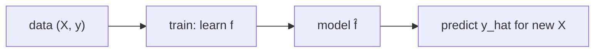

# What Is Machine Learning?

> Machine Learning 101 series (1/10)

<!-- a-grade-intro:begin -->

**Core question**: Is *machine learning* just *a new name for statistics*, or *a new programming paradigm*?

> *Machine learning *learns a function from data* and uses it to *predict on new inputs*.*

<!-- a-grade-intro:end -->

## What You Will Learn

- The *definition* of *machine learning*
- The intuition of *learning, generalization, prediction*
- The *difference* from *statistics* and *rule-based code*
- A 5-step first ML hands-on
- Five common mistakes

## Why It Matters

Recommendation, medicine, finance, autonomous driving — *every industry* is being *reshaped* by ML. Weak fundamentals make *every model collapse* later.

## Concept at a Glance



## Key Terms

- **Learning**: *estimating a function* from data.
- **Generalization**: *working well* on *unseen data*.
- **Prediction**: applying the learned *function* to *new inputs*.
- **Feature**: *input variable*.
- **Label**: *target to predict*.

## Before/After

**Before**: *"Code every rule with if-else"* — every new pattern adds code.

**After**: *"Give data, the model learns rules"* — scale with *data, not code*.

## Hands-on: Your First ML in Five Steps

### Step 1 — Data

```python
from sklearn.datasets import load_iris
X, y = load_iris(return_X_y=True)
print(X.shape, y.shape)
```

### Step 2 — Pick a model

```python
from sklearn.linear_model import LogisticRegression
model = LogisticRegression(max_iter=1000)
```

### Step 3 — Fit

```python
model.fit(X, y)
```

### Step 4 — Predict

```python
print(model.predict(X[:5]))
```

### Step 5 — Score

```python
print("acc:", model.score(X, y))
```

## What to Notice in This Code

- *fit / predict / score* is the *scikit-learn standard interface*.
- *score* here is only *training accuracy* — not generalization.
- *Model choice* depends on *problem type*.

## Five Common Mistakes

1. **Judging *success* on *training data only*.**
2. **Ignoring *feature scaling*.**
3. ***Target leakage* in features.**
4. **No *random seed* — not reproducible.**
5. **Training without handling *missing values or outliers*.**

## How This Shows Up in Production

Recommendation, fraud detection, demand forecasting, image recognition, NLP chatbots — the *data → train → predict* pipeline is the *backbone of every ML product*.

## How a Senior Engineer Thinks

- *Problem definition* matters more than *model selection*.
- *Data quality* matters more than *algorithm*.
- Always measure *generalization* on *separate data*.
- Build a *baseline model* first.
- Save *complex models* for *last*.

## Checklist

- [ ] I know what *X, y* mean.
- [ ] I call *fit/predict/score*.
- [ ] I know *training accuracy ≠ generalization*.
- [ ] I value *baselines*.

## Practice Problems

1. Run *fit/predict* on *your own dataset* (not iris).
2. Explain when *score* would be *over-optimistic*.
3. Show an example where *feature scaling* changes the result.

## Wrap-up and Next Steps

ML is *a function learned from data*. Next we cover *supervised vs unsupervised learning*.

- **What Is Machine Learning? (current)**
- Supervised and Unsupervised Learning (upcoming)
- Train/Test Split (upcoming)
- Linear Regression (upcoming)
- Logistic Regression (upcoming)
- Decision Tree and Random Forest (upcoming)
- Clustering (upcoming)
- Overfitting and Regularization (upcoming)
- Model Evaluation (upcoming)
- The ML Project Workflow (upcoming)
## References

- [scikit-learn — Getting Started](https://scikit-learn.org/stable/getting_started.html)
- [Andrew Ng — Machine Learning Specialization](https://www.coursera.org/specializations/machine-learning-introduction)
- [Hands-On Machine Learning — Aurélien Géron](https://www.oreilly.com/library/view/hands-on-machine-learning/9781098125967/)
- [Google — Machine Learning Crash Course](https://developers.google.com/machine-learning/crash-course)

Tags: MachineLearning, AI, DataScience, Foundations, Beginner

---

© 2026 YeongseonBooks. All rights reserved.
