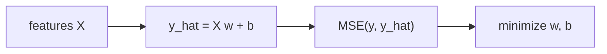

# Linear Regression

> Machine Learning 101 series (4/10)

<!-- a-grade-intro:begin -->

**Core question**: If a single line can explain 80% of the variation, why bother with anything more complex?

> *Linear regression is the simplest model and the strongest baseline. It is also the gold standard for interpretability.*

<!-- a-grade-intro:end -->

## What You Will Learn

- The equation and intuition of linear regression
- Mean squared error and the least-squares solution
- The meaning of R-squared
- How residual analysis validates model assumptions
- Five common pitfalls

## Why It Matters

Linear regression is interpretable, fast, and surprisingly strong. Always run it first. Without a baseline, no complex model is justified.

## Concept at a Glance



## Key Terms

- **Weights w**: feature contributions.
- **Intercept b**: baseline level.
- **MSE**: average squared error.
- **R-squared**: variance explained by the model.
- **Residual**: `y - y_hat`.

## Before/After

**Before**: "Looks like a straight line on the chart" — no numerical check.

**After**: Model, metric, and residuals form a three-step verification.

## Hands-on: 5 Steps of Regression

### Step 1 — Data

```python
from sklearn.datasets import fetch_california_housing
X, y = fetch_california_housing(return_X_y=True)
```

### Step 2 — Split

```python
from sklearn.model_selection import train_test_split
Xtr, Xte, ytr, yte = train_test_split(X, y, test_size=0.2, random_state=42)
```

### Step 3 — Fit

```python
from sklearn.linear_model import LinearRegression
model = LinearRegression().fit(Xtr, ytr)
```

### Step 4 — Evaluate

```python
from sklearn.metrics import mean_squared_error, r2_score
pred = model.predict(Xte)
print("MSE:", mean_squared_error(yte, pred))
print("R^2:", r2_score(yte, pred))
```

### Step 5 — Inspect coefficients

```python
for name, coef in zip(range(Xtr.shape[1]), model.coef_):
    print(f"x{name}: {coef:.3f}")
```

## What to Notice in This Code

- Sign and magnitude of `coef_` drive interpretation.
- A low R-squared often signals nonlinearity.
- MSE squares the error, so it reacts strongly to outliers.

## Five Common Mistakes

1. Comparing coefficients while ignoring scale differences.
2. Letting multicollinearity destabilize the coefficients.
3. Skipping the residual plot.
4. Allowing outliers to drag the line.
5. Extrapolating beyond the training range.

## How This Shows Up in Production

Pricing, demand modeling, and A/B effect estimation lean on linear regression because stakeholders need an interpretable lever, not a black box.

## How a Senior Engineer Thinks

- Always start from a baseline.
- Interpretability is a business tool, not just a technical one.
- Residuals are the model's diary.
- Standardize before comparing coefficients.
- Add Ridge or Lasso when regularization is needed.

## Checklist

- [ ] I report both MSE and R-squared.
- [ ] I plot the residuals.
- [ ] I scale features before reading coefficients.
- [ ] I flag extrapolation risks explicitly.

## Practice Problems

1. Add `PolynomialFeatures(degree=2)` and observe R-squared.
2. Plot residuals against predictions and describe any pattern.
3. Compare coefficient magnitudes between `Ridge(alpha=1.0)` and `LinearRegression`.

## Wrap-up and Next Steps

Linear regression is the starting point for every regression task. Next, we move to logistic regression for classification.

- [What Is Machine Learning?](./01-what-is-machine-learning.md)
- [Supervised and Unsupervised Learning](./02-supervised-and-unsupervised.md)
- [Train/Test Split](./03-train-test-split.md)
- **Linear Regression (current)**
- Logistic Regression (upcoming)
- Decision Tree and Random Forest (upcoming)
- Clustering (upcoming)
- Overfitting and Regularization (upcoming)
- Model Evaluation (upcoming)
- The ML Project Workflow (upcoming)
## References

- [scikit-learn — Linear models](https://scikit-learn.org/stable/modules/linear_model.html)
- [An Introduction to Statistical Learning — James et al.](https://www.statlearning.com/)
- [Seeing Theory — Regression](https://seeing-theory.brown.edu/regression-analysis/index.html)
- [StatQuest — Linear Regression](https://www.youtube.com/watch?v=nk2CQITm_eo)

Tags: MachineLearning, LinearRegression, Regression, scikit-learn, Beginner

---

© 2026 YeongseonBooks. All rights reserved.
