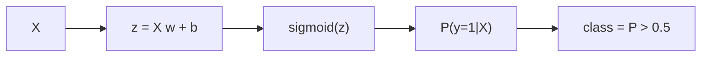

# Logistic Regression

> Machine Learning 101 series (5/10)

<!-- a-grade-intro:begin -->

**Core question**: It predicts 0 or 1, so why is it called regression?

> *Logistic regression predicts a continuous probability and uses a threshold to commit to a class.*

<!-- a-grade-intro:end -->

## What You Will Learn

- The sigmoid function and its probabilistic output
- The trap of always using 0.5 as a threshold
- The meaning of precision, recall, and F1
- How to extend to the multinomial case
- Five common pitfalls

## Why It Matters

Logistic regression is the standard classification baseline. It is interpretable, fast, and stays competitive on imbalanced data when you tune the threshold.

## Concept at a Glance



## Key Terms

- **Sigmoid**: maps any real number to (0, 1).
- **Probability**: the model's belief in class 1.
- **Threshold**: turns probability into a class label.
- **Precision**: fraction of predicted positives that are actually positive.
- **Recall**: fraction of actual positives that the model caught.

## Before/After

**Before**: "95% accuracy" — meaningless on imbalanced data.

**After**: Report precision, recall, F1, and AUC together.

## Hands-on: 5 Steps of Classification

### Step 1 — Data

```python
from sklearn.datasets import load_breast_cancer
X, y = load_breast_cancer(return_X_y=True)
```

### Step 2 — Split and scale

```python
from sklearn.model_selection import train_test_split
from sklearn.preprocessing import StandardScaler
Xtr, Xte, ytr, yte = train_test_split(X, y, test_size=0.2, stratify=y, random_state=42)
sc = StandardScaler().fit(Xtr)
Xtr, Xte = sc.transform(Xtr), sc.transform(Xte)
```

### Step 3 — Fit

```python
from sklearn.linear_model import LogisticRegression
model = LogisticRegression(max_iter=1000).fit(Xtr, ytr)
```

### Step 4 — Evaluate

```python
from sklearn.metrics import classification_report
print(classification_report(yte, model.predict(Xte)))
```

### Step 5 — Tune the threshold

```python
prob = model.predict_proba(Xte)[:, 1]
for t in [0.3, 0.5, 0.7]:
    pred = (prob >= t).astype(int)
    print(t, (pred == yte).mean())
```

## What to Notice in This Code

- `predict_proba` returns probabilities, not just labels.
- The threshold is a precision-recall trade-off knob.
- `StandardScaler` helps the optimizer converge.

## Five Common Mistakes

1. Treating raw probabilities as calibrated.
2. Always using 0.5 as the threshold.
3. Reporting accuracy on imbalanced data.
4. Forgetting to scale features.
5. Using defaults on multiclass instead of explicit multinomial.

## How This Shows Up in Production

Spam filtering, fraud detection, and churn modeling all rely on probability outputs because downstream systems need to weigh costs.

## How a Senior Engineer Thinks

- Business cost determines the threshold.
- Always plot the precision-recall curve.
- Use class weights for imbalance.
- Treat interpretability as leverage.
- Validate calibration explicitly.

## Checklist

- [ ] I use `predict_proba` for downstream decisions.
- [ ] I report precision and recall together.
- [ ] I select thresholds based on cost.
- [ ] I always scale features.

## Practice Problems

1. Sweep thresholds from 0.1 to 0.9 and plot precision and recall.
2. Compare results with `class_weight="balanced"`.
3. Apply `multi_class="multinomial"` to a multiclass dataset.

## Wrap-up and Next Steps

Logistic regression is the foundation of classification. Next, we cover decision trees and random forests for nonlinear modeling.

- [What Is Machine Learning?](./01-what-is-machine-learning.md)
- [Supervised and Unsupervised Learning](./02-supervised-and-unsupervised.md)
- [Train/Test Split](./03-train-test-split.md)
- [Linear Regression](./04-linear-regression.md)
- **Logistic Regression (current)**
- Decision Tree and Random Forest (upcoming)
- Clustering (upcoming)
- Overfitting and Regularization (upcoming)
- Model Evaluation (upcoming)
- The ML Project Workflow (upcoming)
## References

- [scikit-learn — Logistic Regression](https://scikit-learn.org/stable/modules/linear_model.html#logistic-regression)
- [scikit-learn — Classification metrics](https://scikit-learn.org/stable/modules/model_evaluation.html#classification-metrics)
- [Google — Classification thresholds](https://developers.google.com/machine-learning/crash-course/classification/thresholding)
- [StatQuest — Logistic Regression](https://www.youtube.com/watch?v=yIYKR4sgzI8)

Tags: MachineLearning, LogisticRegression, Classification, scikit-learn, Beginner

---

© 2026 YeongseonBooks. All rights reserved.
