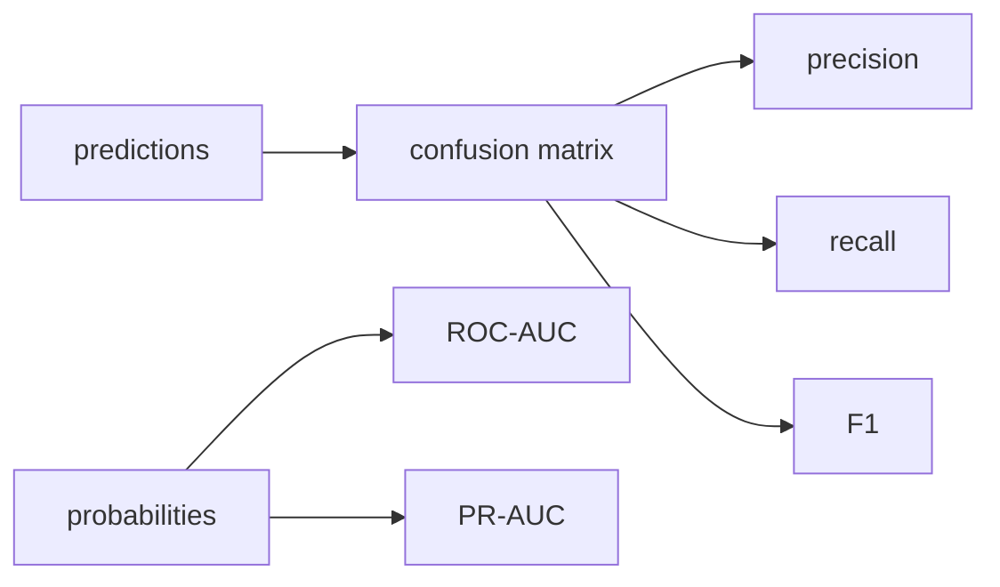

# Model Evaluation

> Machine Learning 101 series (9/10)

<!-- a-grade-intro:begin -->

**Core question**: When someone asks which model is better and you do not push back with "by which metric," you are already in trouble.

> *Model evaluation is where you prove, in code, that picking the metric comes before picking the model.*

<!-- a-grade-intro:end -->

## What You Will Learn

- Classification metrics: accuracy, precision, recall, F1, ROC-AUC, PR-AUC
- Regression metrics: MAE, MSE, RMSE, R-squared
- The anatomy of a confusion matrix
- When to choose ROC over PR (and vice versa)
- Five common pitfalls

## Why It Matters

Wrong metric, wrong decision. When business cost and metric drift apart, the model only looks good on paper.

## Concept at a Glance



## Key Terms

- **TP / FP / FN / TN**: the four quadrants of the confusion matrix.
- **Accuracy**: fraction of correct predictions.
- **Precision**: fraction of predicted positives that are right.
- **Recall**: fraction of actual positives caught.
- **AUC**: average performance across thresholds.

## Before/After

**Before**: A single accuracy number in the report.

**After**: Metric table, confusion matrix, and PR or ROC curves together.

## Hands-on: 5 Steps of Evaluation

### Step 1 — Data

```python
from sklearn.datasets import load_breast_cancer
from sklearn.model_selection import train_test_split
X, y = load_breast_cancer(return_X_y=True)
Xtr, Xte, ytr, yte = train_test_split(X, y, test_size=0.2, stratify=y, random_state=42)
```

### Step 2 — Model

```python
from sklearn.linear_model import LogisticRegression
m = LogisticRegression(max_iter=2000).fit(Xtr, ytr)
prob = m.predict_proba(Xte)[:, 1]
pred = (prob >= 0.5).astype(int)
```

### Step 3 — Confusion matrix

```python
from sklearn.metrics import confusion_matrix
print(confusion_matrix(yte, pred))
```

### Step 4 — Classification metrics

```python
from sklearn.metrics import classification_report, roc_auc_score, average_precision_score
print(classification_report(yte, pred))
print("ROC-AUC:", roc_auc_score(yte, prob))
print("PR-AUC :", average_precision_score(yte, prob))
```

### Step 5 — Regression metrics

```python
from sklearn.metrics import mean_absolute_error, mean_squared_error, r2_score
import numpy as np
yt, yp = np.array([3.0, 5.0, 2.5]), np.array([2.8, 5.4, 2.1])
print("MAE:", mean_absolute_error(yt, yp))
print("RMSE:", mean_squared_error(yt, yp) ** 0.5)
print("R^2:", r2_score(yt, yp))
```

## What to Notice in This Code

- AUC is independent of the threshold.
- PR-AUC is more informative on imbalanced data.
- RMSE and MAE differ in their sensitivity to outliers.

## Five Common Mistakes

1. Reporting accuracy on imbalanced data.
2. Trusting ROC-AUC on heavy class imbalance.
3. Ignoring threshold tuning while optimizing F1.
4. Reporting only one of MAE or RMSE for regression.
5. Repeated evaluation on the same test set leaks information.

## How This Shows Up in Production

A/B testing, model gates, and MLOps monitoring all rest on the metric definition. The metric is the language of organizational agreement.

## How a Senior Engineer Thinks

- Order: business cost, then metric, then threshold.
- The PR curve is the truth on imbalance.
- Maximize recall when missing positives is catastrophic.
- Calibration is part of evaluation, not optional.
- One metric is rarely enough.

## Checklist

- [ ] I always print a confusion matrix.
- [ ] I look at ROC and PR together.
- [ ] I report MAE and RMSE for regression.
- [ ] I touch the test set exactly once at the end.

## Practice Problems

1. Compare accuracy and F1 on imbalanced data.
2. Plot ROC and PR curves side by side.
3. Construct a dataset where MAE and RMSE strongly disagree.

## Wrap-up and Next Steps

Evaluation is the language of model selection. Next, we close the series with the end-to-end ML project workflow.

- [What Is Machine Learning?](./01-what-is-machine-learning.md)
- [Supervised and Unsupervised Learning](./02-supervised-and-unsupervised.md)
- [Train/Test Split](./03-train-test-split.md)
- [Linear Regression](./04-linear-regression.md)
- [Logistic Regression](./05-logistic-regression.md)
- [Decision Tree and Random Forest](./06-decision-tree-and-random-forest.md)
- [Clustering](./07-clustering.md)
- [Overfitting and Regularization](./08-overfitting-and-regularization.md)
- **Model Evaluation (current)**
- The ML Project Workflow (upcoming)
## References

- [scikit-learn — Model evaluation](https://scikit-learn.org/stable/modules/model_evaluation.html)
- [scikit-learn — ROC and PR curves](https://scikit-learn.org/stable/auto_examples/model_selection/plot_precision_recall.html)
- [Google — Classification metrics](https://developers.google.com/machine-learning/crash-course/classification/precision-and-recall)
- [Wikipedia — Confusion matrix](https://en.wikipedia.org/wiki/Confusion_matrix)

Tags: MachineLearning, Evaluation, Metrics, ROC, scikit-learn

---

© 2026 YeongseonBooks. All rights reserved.
