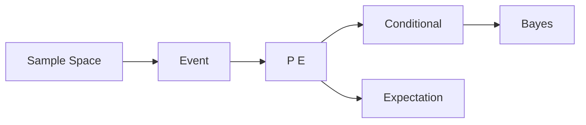

# Probability

> Math for CS 101 series (6/10)

<!-- a-grade-intro:begin -->

**Core question**: How do we *quantify* uncertainty instead of guessing?

> *Probability* is the *language of uncertainty* and the foundation of *machine learning* and *reliability*.

<!-- a-grade-intro:end -->

## What You Will Learn

- *Sample space* and *events*
- *Conditional probability*
- *Bayes theorem*
- *Expectation*
- *Variance*

## Why It Matters

*A/B testing*, *recommendation*, *classifiers*, and *failure rates* are all probability models.

## Concept at a Glance



## Key Terms

- **sample space**: set of *possible outcomes*.
- **event**: a *subset* of outcomes.
- **conditional**: probability *given* something.
- **Bayes**: update *posterior* from *prior*.
- **expectation**: *average* outcome.

## Before/After

**Before**: guess by intuition.

**After**: quantify with a *formula*.

## Hands-on: Mini Probability Kit

### Step 1 — Probability

```python
def prob(favorable, total):
    return favorable / total
```

### Step 2 — Conditional

```python
def cond(p_a_and_b, p_b):
    return p_a_and_b / p_b
```

### Step 3 — Bayes

```python
def bayes(p_b_given_a, p_a, p_b):
    return p_b_given_a * p_a / p_b
```

### Step 4 — Expectation

```python
def expect(values, probs):
    return sum(v * p for v, p in zip(values, probs))
```

### Step 5 — Variance

```python
def variance(values, probs):
    mu = expect(values, probs)
    return sum(p * (v - mu) ** 2 for v, p in zip(values, probs))
```

## What to Notice in This Code

- Probabilities *sum to 1*.
- Conditional is a *division*.
- Expectation is a *weighted average*.

## Five Common Mistakes

1. **Overusing the *independence* assumption.**
2. **Setting a *prior* to zero in Bayes.**
3. **Confusing *expectation* with *mode*.**
4. **Forgetting the *denominator zero* case.**
5. **Confusing *variance* with *standard deviation*.**

## How This Shows Up in Production

*Spam filters (Bayes)*, *ranking scores*, *SLA breach probabilities*, and *A/B test confidence intervals* all use probability.

## How a Senior Engineer Thinks

- Every estimate is a *distribution*.
- *Bayes* is an *update* procedure.
- *Expectation* drives decisions.
- *Variance* is *risk*.
- *Independence* is just an assumption.

## Checklist

- [ ] Define the *sample space*.
- [ ] Separate *events* clearly.
- [ ] State the *conditioning*.
- [ ] Validate *distributional* assumptions.

## Practice Problems

1. Define *conditional probability* in one line.
2. Write *Bayes theorem* in one line.
3. State the difference between *expectation* and *variance*.

## Wrap-up and Next Steps

Next post: *Linear Algebra*.

- [Why Math for CS](./01-why-math-for-cs.md)
- [Logic and Proofs](./02-logic-and-proofs.md)
- [Sets and Functions](./03-sets-and-functions.md)
- [Graphs](./04-graphs.md)
- [Combinatorics](./05-combinatorics.md)
- **Probability (current)**
- Linear Algebra (upcoming)
- Calculus (upcoming)
- Information Theory (upcoming)
- Algorithms and Math (upcoming)
## References

- [Probability - Khan Academy](https://www.khanacademy.org/math/statistics-probability/probability-library)
- [Bayes Theorem - Stanford Encyclopedia](https://plato.stanford.edu/entries/bayes-theorem/)
- [Introduction to Probability - Blitzstein](https://projects.iq.harvard.edu/stat110)
- [Python statistics Module](https://docs.python.org/3/library/statistics.html)

Tags: Math, Probability, Statistics, Bayes, Beginner

---

© 2026 YeongseonBooks. All rights reserved.
