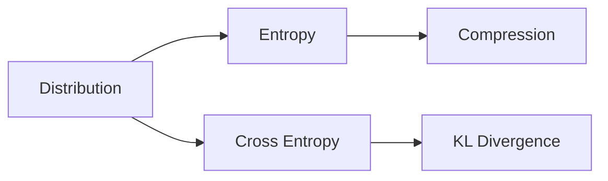

# Information Theory

> Math for CS 101 series (9/10)

<!-- a-grade-intro:begin -->

**Core question**: How do we *measure* the *amount* of information?

> *Information theory* gives us a *bit-level* unit for uncertainty behind *compression*, *communication*, and *ML loss*.

<!-- a-grade-intro:end -->

## What You Will Learn

- *Bits* and *information content*
- *Entropy*
- *Cross entropy*
- *KL divergence*
- *Compression* intuition

## Why It Matters

*Classifier losses*, *zip compression*, *communication codes*, and *language models* are all defined on top of information theory.

## Concept at a Glance



## Key Terms

- **bit**: a *binary* unit.
- **entropy**: *average information content*.
- **cross entropy**: cost of coding *truth* with *predictions*.
- **KL divergence**: a *distance* between distributions.
- **compression**: bounded *below* by entropy.

## Before/After

**Before**: every message gets the *same length*.

**After**: *common* messages short, *rare* ones long.

## Hands-on: Mini Information Kit

### Step 1 — Information Content

```python
import math

def info(p):
    return -math.log2(p)
```

### Step 2 — Entropy

```python
def entropy(probs):
    return sum(-p * math.log2(p) for p in probs if p > 0)
```

### Step 3 — Cross Entropy

```python
def cross_entropy(p, q):
    return sum(-pi * math.log2(qi) for pi, qi in zip(p, q) if qi > 0)
```

### Step 4 — KL Divergence

```python
def kl(p, q):
    return cross_entropy(p, q) - entropy(p)
```

### Step 5 — Average Code Length

```python
def avg_len(probs, lengths):
    return sum(p * L for p, L in zip(probs, lengths))
```

## What to Notice in This Code

- *log2* gives *bits*.
- *KL* is *asymmetric*.
- *Cross entropy* is the standard *loss*.

## Five Common Mistakes

1. **Forgetting to handle *log(0)*.**
2. **Assuming *KL* is *symmetric*.**
3. **Mixing up *entropy* and *cross entropy*.**
4. **Inputs whose *probabilities* do not sum to *1*.**
5. **Confusing *units* (bits vs nats).**

## How This Shows Up in Production

*Classifier loss*, *language model perplexity*, *zip/gzip*, and *ML regularization* all use information theory.

## How a Senior Engineer Thinks

- *Information* is *bits*.
- *Entropy* is the *compression floor*.
- *KL* is *distributional distance*.
- *Loss* is *cross entropy*.
- *Models* estimate *distributions*.

## Checklist

- [ ] Verify *probabilities sum to 1*.
- [ ] Guard *log(0)*.
- [ ] State the *units*.
- [ ] State the *direction* of *KL*.

## Practice Problems

1. Define *entropy* in one line.
2. Define *KL divergence* in one line.
3. Define *cross entropy* in one line.

## Wrap-up and Next Steps

Next post: the *Algorithms and Math* capstone.

- [Why Math for CS](./01-why-math-for-cs.md)
- [Logic and Proofs](./02-logic-and-proofs.md)
- [Sets and Functions](./03-sets-and-functions.md)
- [Graphs](./04-graphs.md)
- [Combinatorics](./05-combinatorics.md)
- [Probability](./06-probability.md)
- [Linear Algebra](./07-linear-algebra.md)
- [Calculus](./08-calculus.md)
- **Information Theory (current)**
- Algorithms and Math (upcoming)
## References

- [Information Theory - Stanford Encyclopedia](https://plato.stanford.edu/entries/information-theory/)
- [A Mathematical Theory of Communication - Shannon](https://people.math.harvard.edu/~ctm/home/text/others/shannon/entropy/entropy.pdf)
- [Elements of Information Theory - Cover and Thomas](https://www.wiley.com/en-us/Elements+of+Information+Theory%2C+2nd+Edition-p-9780471241959)
- [SciPy Stats Entropy Documentation](https://docs.scipy.org/doc/scipy/reference/generated/scipy.stats.entropy.html)

Tags: Math, InformationTheory, Entropy, Compression, Beginner

---

© 2026 YeongseonBooks. All rights reserved.
