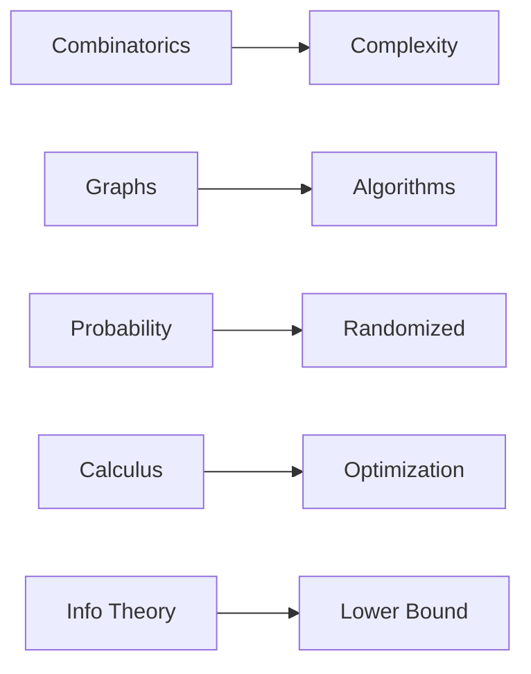

# Algorithms and Math

> Math for CS 101 series (10/10)

<!-- a-grade-intro:begin -->

**Core question**: How does the *math* from this series come together in *algorithm design*?

> *Math* shapes the *analysis*, *design*, and *limits* of every algorithm you write.

<!-- a-grade-intro:end -->

## What You Will Learn

- *Complexity* and *combinatorics*
- *Graph algorithms*
- *Randomized algorithms*
- Analysis of *gradient descent*
- *Information-theoretic* limits

## Why It Matters

This *capstone* synthesizes the series and shows that *seeing problems mathematically* changes *outcomes*.

## Concept at a Glance



## Key Terms

- **complexity**: *cost* vs *input size*.
- **shortest path**: *minimum-distance* route.
- **randomized**: branches on a *coin flip*.
- **optimization**: search for *min/max*.
- **lower bound**: a *line of impossibility*.

## Before/After

**Before**: an algorithm is *just code*.

**After**: an algorithm is *analyzed* and bounded by *math*.

## Hands-on: Mini Capstone Kit

### Step 1 — Combinatorial Complexity

```python
def subsets(n):
    return 2 ** n
```

### Step 2 — BFS Shortest Path

```python
from collections import deque

def shortest(G, s, t):
    q, seen = deque([(s, 0)]), {s}
    while q:
        v, d = q.popleft()
        if v == t:
            return d
        for n in G[v]:
            if n not in seen:
                seen.add(n)
                q.append((n, d + 1))
    return -1
```

### Step 3 — Randomized Estimate

```python
import random

def estimate_pi(n=10000):
    inside = sum(1 for _ in range(n) if random.random() ** 2 + random.random() ** 2 < 1)
    return 4 * inside / n
```

### Step 4 — Gradient Descent Min

```python
def minimize(f, x, lr=0.1, steps=100, h=1e-5):
    for _ in range(steps):
        g = (f(x + h) - f(x - h)) / (2 * h)
        x = x - lr * g
    return x
```

### Step 5 — Entropy Lower Bound

```python
import math

def lower_bound_bits(probs):
    return sum(-p * math.log2(p) for p in probs if p > 0)
```

## What to Notice in This Code

- *Combinatorics* explains *exponential blowup*.
- *Graphs* are *models*.
- *Randomness* enables *approximation*.
- *Calculus* powers *optimization*.
- *Entropy* sets the *compression floor*.

## Five Common Mistakes

1. **Skipping *complexity* analysis.**
2. **Failing to *model* the problem as a graph.**
3. **Treating *randomized* output as *deterministic*.**
4. **Ignoring *learning rate* tuning.**
5. **Ignoring *theoretical limits*.**

## How This Shows Up in Production

*Search indexing (graphs + info theory)*, *recommenders (linalg + probability)*, *training (calculus + probability)*, and *design reviews (complexity)* all combine these tools.

## How a Senior Engineer Thinks

- *Math* is a *lens*.
- *Complexity* is a *budget*.
- *Probability* is *reality*.
- *Information theory* sets *limits*.
- *Modeling* comes *before code*.

## Checklist

- [ ] State the *complexity*.
- [ ] State the *model*.
- [ ] Isolate *randomness*.
- [ ] Verify *convergence*.
- [ ] Acknowledge *theoretical limits*.

## Practice Problems

1. State the link between *complexity* and *combinatorics* in one line.
2. State an advantage of *randomized* algorithms in one line.
3. State a *limit* that *information theory* imposes in one line.

## Wrap-up and Next Steps

This post wraps the *Math for CS 101* series. *Math* is the *map* that gives your *code* both *direction* and *boundaries*.

- [Why Math for CS](./01-why-math-for-cs.md)
- [Logic and Proofs](./02-logic-and-proofs.md)
- [Sets and Functions](./03-sets-and-functions.md)
- [Graphs](./04-graphs.md)
- [Combinatorics](./05-combinatorics.md)
- [Probability](./06-probability.md)
- [Linear Algebra](./07-linear-algebra.md)
- [Calculus](./08-calculus.md)
- [Information Theory](./09-information-theory.md)
- **Algorithms and Math (current)**
## References

- [Introduction to Algorithms - CLRS](https://mitpress.mit.edu/9780262046305/introduction-to-algorithms/)
- [Algorithm Design - Kleinberg and Tardos](https://www.pearson.com/en-us/subject-catalog/p/algorithm-design/P200000003259)
- [Randomized Algorithms - Motwani and Raghavan](https://www.cambridge.org/9780521474658)
- [Convex Optimization - Boyd and Vandenberghe](https://web.stanford.edu/~boyd/cvxbook/)

Tags: Math, Algorithms, Complexity, Capstone, Beginner

---

© 2026 YeongseonBooks. All rights reserved.
