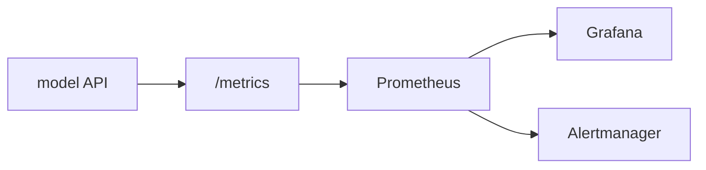

# Model Monitoring

> MLOps 101 series (6/10)

<!-- a-grade-intro:begin -->

**Core question**: How do you detect when a deployed model is *quietly degrading*?

> *Model monitoring continuously observes operational metrics and prediction distributions to surface problems early.*

<!-- a-grade-intro:end -->

## What You Will Learn

- The three layers of monitoring (system / model / business)
- The roles of Prometheus and Grafana
- Metrics vs logs vs traces
- Designing actionable alert rules
- Five common pitfalls

## Why It Matters

If you only watch *accuracy*, you find out too late. *Latency*, *error rate*, and *input distribution* shift first.

## Concept at a Glance



## Key Terms

- **Metric**: a numeric time series.
- **Log**: a textual event record.
- **Trace**: the path of a single request.
- **SLO**: a service level objective, e.g. 99% under 200 ms.
- **Alert**: a notification fired when a threshold is crossed.

## Before/After

**Before**: incidents are discovered when users complain.

**After**: alerts arrive in the team channel automatically.

## Hands-on: Add Prometheus Metrics to a FastAPI Model

### Step 1 — Install

```bash
pip install prometheus-client
```

### Step 2 — Counter and histogram

```python
from prometheus_client import Counter, Histogram

REQS = Counter("predict_requests_total", "total predict requests")
LAT = Histogram("predict_latency_seconds", "predict latency")
```

### Step 3 — Wire into FastAPI

```python
import time
from fastapi import FastAPI
from prometheus_client import make_asgi_app

app = FastAPI()
app.mount("/metrics", make_asgi_app())

@app.post("/predict")
def predict(x: float):
    start = time.time()
    REQS.inc()
    result = {"prediction": int(x > 0.5)}
    LAT.observe(time.time() - start)
    return result
```

### Step 4 — Track prediction distribution

```python
PRED = Counter("predict_class_total", "predicted class", ["cls"])

def record(p: int):
    PRED.labels(cls=str(p)).inc()
```

### Step 5 — Alert rule

```yaml
groups:
  - name: model
    rules:
      - alert: HighLatency
        expr: histogram_quantile(0.99, rate(predict_latency_seconds_bucket[5m])) > 0.5
        for: 5m
        labels:
          severity: warning
```

## What to Notice in This Code

- The `/metrics` endpoint is scraped by Prometheus on a schedule.
- A histogram lets you compute quantiles later.
- Labels turn one counter into many prediction-class series.

## Five Common Mistakes

1. **Only watching system metrics like CPU and memory.**
2. **Not recording prediction distribution — drift becomes invisible.**
3. **Too many alerts — humans go numb.**
4. **No SLO defined, so no shared bar to clear.**
5. **No dashboard, so context is lost during incidents.**

## How This Shows Up in Production

A payments fraud model emits metrics every minute. When fraud rate crosses an SLO, on-call gets paged with a runbook attached.

## How a Senior Engineer Thinks

- Watch all three layers (system, model, business).
- Every alert must be *actionable*.
- A dashboard should be readable in five seconds.
- An SLO is a business agreement, not a number.
- Runbooks live next to the alert.

## Checklist

- [ ] A `/metrics` endpoint is exposed.
- [ ] Latency and error-rate alerts are configured.
- [ ] Prediction distribution is tracked.
- [ ] Each alert links to a runbook.

## Practice Problems

1. Write an alert rule that fires when *error rate exceeds 1%*.
2. Add a metric for *mean input value* per minute.
3. Pick four widgets for the first screen of a Grafana dashboard.

## Wrap-up and Next Steps

Monitoring is the *prerequisite* for drift detection. The next post tackles *Data Drift and Model Drift* directly.

- [What is MLOps?](./01-what-is-mlops.md)
- [Experiment Tracking](./02-experiment-tracking.md)
- [Data Versioning](./03-data-versioning.md)
- [Model Training Pipeline](./04-training-pipeline.md)
- [Model Deployment](./05-model-deployment.md)
- **Model Monitoring (current)**
- Data Drift and Model Drift (upcoming)
- Retraining (upcoming)
- Feature Store (upcoming)
- Building a Production ML System (upcoming)
## References

- [Prometheus documentation](https://prometheus.io/docs/)
- [prometheus-client (Python)](https://github.com/prometheus/client_python)
- [Grafana documentation](https://grafana.com/docs/)
- [Google SRE workbook — SLOs](https://sre.google/workbook/implementing-slos/)

Tags: MLOps, Monitoring, Prometheus, Observability, DataScience

---

© 2026 YeongseonBooks. All rights reserved.
