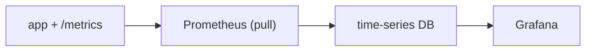

# Collecting and Visualizing Metrics

> Observability 101 series (3/10)

<!-- a-grade-intro:begin -->

**Core question**: How are metrics *collected*, and how do they *become a graph*?

> *Prometheus *pulls* exporters; Grafana *draws* what Prometheus stored.*

<!-- a-grade-intro:end -->

## What You Will Learn

- *Pull* vs *push* models
- *Exporters* and the `/metrics` endpoint
- A one-line *Prometheus* config
- Your first *Grafana* dashboard
- Five common pitfalls

## Why It Matters

A metric pipeline is the *starting line* of all observability. The moment the first byte flows, the system *starts talking*.

> *What you do not measure *does not exist*.*

## Concept at a Glance



## Key Terms

- **Exporter**: a component that *exposes metrics over HTTP*.
- **Scrape interval**: *how often* to pull.
- **Time series**: a sequence of *(label set, value, time)*.
- **PromQL**: the Prometheus *query language*.
- **Dashboard panel**: a single graph.

## Before/After

**Before**: You read logs and *guess the trend*.

**After**: A second-level graph shows the *trend immediately*.

## Hands-on: Metric Pipeline in 5 Steps

### Step 1 — Python `/metrics`

```python
from prometheus_client import Counter, start_http_server

reqs = Counter("http_requests_total", "Total requests", ["path"])

if __name__ == "__main__":
    start_http_server(8000)
    while True:
        reqs.labels(path="/health").inc()
```

### Step 2 — Prometheus config

```yaml
scrape_configs:
  - job_name: app
    scrape_interval: 5s
    static_configs:
      - targets: ["app:8000"]
```

### Step 3 — Run Prometheus (Docker)

```bash
docker run -d --name prom -p 9090:9090 \
  -v $(pwd)/prom.yml:/etc/prometheus/prometheus.yml \
  prom/prometheus
```

### Step 4 — First PromQL queries

```promql
rate(http_requests_total[1m])
sum by (path) (rate(http_requests_total[5m]))
```

### Step 5 — Grafana panel

```bash
docker run -d --name graf -p 3000:3000 grafana/grafana
# Browser: http://localhost:3000
# Datasource: Prometheus → http://prom:9090
# Panel: rate(http_requests_total[1m])
```

## What to Notice in This Code

- Prometheus *pulls*; the app *exposes*.
- `/metrics` returns *plain text*.
- `rate()` computes *per-second growth* (counter → rate).

## Five Common Mistakes

1. **Graphing a counter *as is*.** You need `rate()`.
2. **Putting *unique IDs* in labels.** Cardinality explodes.
3. **Setting scrape interval to *1 second*.** You crush the target.
4. **Pull blocked by a *firewall*.** Target reports *down*.
5. **Stuffing *every panel* into Grafana.** Meaningless *wallpaper*.

## How This Shows Up in Production

Most companies start with *Prometheus + Grafana* and grow into *Thanos / Mimir* for scale.

## How a Senior Engineer Thinks

- *Measure what is measurable.*
- *Pull lives or dies by *target discovery*.*
- *Counters always go through *rate()*.*
- *A dashboard is a *question*, not a panel.*
- *Cardinality is the first cost variable.*

## Checklist

- [ ] You expose `/metrics` from your app.
- [ ] Prometheus shows the target as *up*.
- [ ] You write one *PromQL* query.
- [ ] You build the first Grafana panel.

## Practice Problems

1. Expose both a `Counter` and a `Gauge`.
2. Explain the difference between `rate()` and `increase()`.
3. Build a 5-minute average throughput dashboard.

## Wrap-up and Next Steps

Once metrics flow, *the system speaks in graphs*. Next: *structured logging*.

- [What Is Observability?](./01-what-is-observability.md)
- [Metrics, Logs, and Traces](./02-metric-log-trace.md)
- **Collecting and Visualizing Metrics (current)**
- Structured Logging (upcoming)
- Distributed Tracing Basics (upcoming)
- Dashboard Design (upcoming)
- Alerts and On-Call (upcoming)
- SLI and SLO Basics (upcoming)
- Cost and Cardinality (upcoming)
- A Production-Ready Observability Stack (upcoming)
## References

- [Prometheus getting started](https://prometheus.io/docs/prometheus/latest/getting_started/)
- [prometheus_client (Python)](https://github.com/prometheus/client_python)
- [PromQL basics](https://prometheus.io/docs/prometheus/latest/querying/basics/)
- [Grafana docs](https://grafana.com/docs/grafana/latest/)

Tags: Observability, Metrics, Prometheus, Grafana, Monitoring

---

© 2026 YeongseonBooks. All rights reserved.
