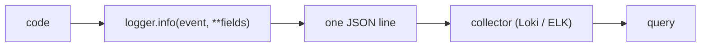

# Structured Logging

> Observability 101 series (4/10)

<!-- a-grade-intro:begin -->

**Core question**: Why is free-text logging *search hell*, and what changes when logs are *structured*?

> *Structured logs are *machine-readable data*. When a line is *JSON*, you can *query* instead of *grep*.*

<!-- a-grade-intro:end -->

## What You Will Learn

- *Unstructured* vs *structured* logs
- *Log levels* and when to use them
- Propagating *context* (request_id, user_id)
- Emitting *JSON* with Python `logging`
- Five common pitfalls

## Why It Matters

To find the responsible line *within five minutes* of an incident, logs must be *queryable*. The age of `print` is over.

> *A log is *data*, not prose.*

## Concept at a Glance



## Key Terms

- **Level**: DEBUG / INFO / WARNING / ERROR / CRITICAL.
- **Structured fields**: one key=value pair at a time.
- **Correlation ID**: an ID that *binds* a single request.
- **Sink**: where logs are *shipped*.
- **Sampling**: keeping *only a portion* when volume is high.

## Before/After

**Before**: `print(f"user {uid} failed: {e}")` — regex *hell*.

**After**: `logger.error("login_failed", user_id=uid, reason=str(e))` — *one query*.

## Hands-on: Structured Logging in 5 Steps

### Step 1 — Basic Python `logging`

```python
import logging
logging.basicConfig(level=logging.INFO)
log = logging.getLogger("app")
log.info("started")
```

### Step 2 — JSON formatter

```python
import json, logging

class JsonFmt(logging.Formatter):
    def format(self, r):
        return json.dumps({"lvl": r.levelname, "msg": r.getMessage(),
                            **getattr(r, "extra", {})})

h = logging.StreamHandler(); h.setFormatter(JsonFmt())
log = logging.getLogger("app"); log.addHandler(h); log.setLevel("INFO")
```

### Step 3 — Context fields

```python
def login(uid):
    log.info("login_attempt", extra={"extra": {"user_id": uid}})
```

### Step 4 — Correlation ID

```python
import uuid
def handle(req):
    rid = req.headers.get("x-request-id") or str(uuid.uuid4())
    log.info("request_in", extra={"extra": {"rid": rid}})
```

### Step 5 — Level policy

```text
DEBUG    → development detail
INFO     → normal events
WARNING  → cautions (actionable)
ERROR    → failed requests
CRITICAL → system risk
```

## What to Notice in This Code

- `extra` lets you add *arbitrary fields*.
- The *correlation ID* flows on every line.
- One JSON line ships into *Loki, ELK, or BigQuery* equally well.

## Five Common Mistakes

1. **Using only `print`.** *Unsearchable*.
2. **Logging everything at *INFO*.** Real signal *drowns*.
3. **Logging PII *as is*.** Compliance violation.
4. **Only *interpolating into the message*.** No fields, no query.
5. **Collapsing stack traces *into one line*.** Worst readability.

## How This Shows Up in Production

Most teams ship *JSON logs → Loki or ELK → Grafana / Kibana*. The correlation ID *links* logs to traces.

## How a Senior Engineer Thinks

- *A log is an *event*, not a *sentence*.*
- *Every request carries a *correlation ID*.*
- *Levels split by *actionability*.*
- *PII gets *masked* or *hashed*.*
- *DEBUG is *off in prod*; have a *switch* to flip it.*

## Checklist

- [ ] You emit one line as *JSON*.
- [ ] You have a *level* policy.
- [ ] You propagate a *correlation ID*.
- [ ] You *mask* sensitive fields.

## Practice Problems

1. Convert one `print` to a *structured log*.
2. Inject a *correlation ID* via middleware.
3. *Query* every ERROR for one user ID.

## Wrap-up and Next Steps

Once logs are *data*, *queries* begin. Next: *distributed tracing*.

- [What Is Observability?](./01-what-is-observability.md)
- [Metrics, Logs, and Traces](./02-metric-log-trace.md)
- [Collecting and Visualizing Metrics](./03-metric-collection.md)
- **Structured Logging (current)**
- Distributed Tracing Basics (upcoming)
- Dashboard Design (upcoming)
- Alerts and On-Call (upcoming)
- SLI and SLO Basics (upcoming)
- Cost and Cardinality (upcoming)
- A Production-Ready Observability Stack (upcoming)
## References

- [Python logging](https://docs.python.org/3/library/logging.html)
- [structlog](https://www.structlog.org/)
- [OpenTelemetry logs](https://opentelemetry.io/docs/concepts/signals/logs/)
- [Twelve-factor logs](https://12factor.net/logs)

Tags: Observability, Logging, Python, JSON, DevOps

---

© 2026 YeongseonBooks. All rights reserved.
