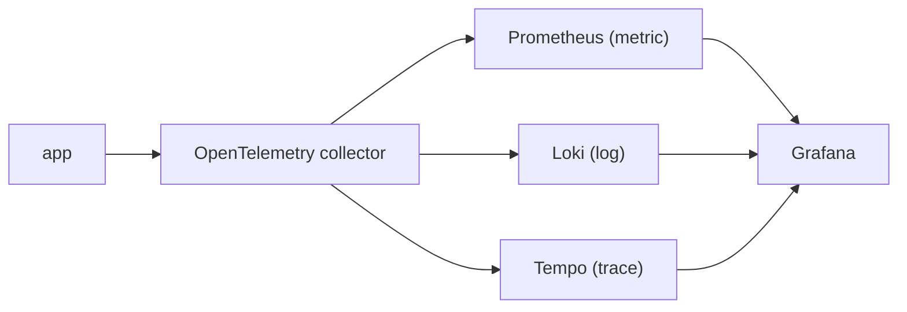

# A Production-Ready Observability Stack

> Observability 101 series (10/10)

<!-- a-grade-intro:begin -->

**Core question**: What does a *good-enough* observability stack look like that a *small team* can build *today*?

> *OpenTelemetry to *unify collection*, Prometheus / Loki / Tempo for the *three signals*, Grafana for *one screen* — that is a small team's *realistic baseline*.*

<!-- a-grade-intro:end -->

## What You Will Learn

- The simple flow *collect → store → query*
- An open-source *baseline stack*
- *Correlation* on one screen
- Five *operator SLOs*
- Five common pitfalls

## Why It Matters

There is no *perfect* stack for a small team. The best stack is *operable* and *replaceable*. Avoid lock-in and start *today*.

> *The perfect stack *will not arrive tomorrow*. Build the operable one *today*.*

## Concept at a Glance



## Key Terms

- **Collector**: a gateway that *receives and routes* signals.
- **Backend**: storage (Prometheus / Loki / Tempo).
- **Correlation**: linking the three signals via *trace_id*.
- **Datasource**: a backend wired into Grafana.
- **Exemplar**: a *representative trace_id* attached to a metric point.

## Before/After

**Before**: five tools, *not connected*; you juggle *five screens*.

**After**: *one Grafana*; click between *trace ↔ log ↔ metric*.

## Hands-on: Baseline Stack in 5 Steps

### Step 1 — Collector

```yaml
receivers:
  otlp: { protocols: { grpc: {}, http: {} } }
exporters:
  prometheus:    { endpoint: ":9464" }
  loki:          { endpoint: http://loki:3100/loki/api/v1/push }
  otlp/tempo:    { endpoint: tempo:4317, tls: { insecure: true } }
service:
  pipelines:
    metrics:  { receivers: [otlp], exporters: [prometheus] }
    logs:     { receivers: [otlp], exporters: [loki] }
    traces:   { receivers: [otlp], exporters: [otlp/tempo] }
```

### Step 2 — Docker Compose

```yaml
services:
  otel-collector: { image: otel/opentelemetry-collector }
  prometheus:     { image: prom/prometheus }
  loki:           { image: grafana/loki }
  tempo:          { image: grafana/tempo }
  grafana:        { image: grafana/grafana, ports: ["3000:3000"] }
```

### Step 3 — App emission

```python
from opentelemetry.exporter.otlp.proto.grpc.metric_exporter import OTLPMetricExporter
from opentelemetry.exporter.otlp.proto.grpc.trace_exporter import OTLPSpanExporter
# OTEL_EXPORTER_OTLP_ENDPOINT=http://otel-collector:4317
```

### Step 4 — Grafana correlation

```text
Datasources: Prometheus, Loki, Tempo
Tempo -> Loki: derived field "trace_id" -> log search
Loki  -> Tempo: log "trace_id" -> trace view
```

### Step 5 — Five operator SLOs

```text
1) /metrics scrape success > 99.5%
2) Loki ingest p95 < 5s
3) Tempo trace arrival > 99%
4) Grafana dashboard p95 < 2s
5) Alertmanager dispatch latency < 30s
```

## What to Notice in This Code

- *Unified collector* gives *standard collection*.
- *Trace_id correlation* turns debugging into one screen.
- *Exemplars* let you jump from metric to trace.

## Five Common Mistakes

1. **A different collector per signal.** Ops burden *triples*.
2. **No correlation set up.** You bounce between screens.
3. **No backup or retention policy.** Cost is *unpredictable*.
4. **Deep *vendor lock-in*.** *Replacement impossible*.
5. **No operator SLO.** Observability itself is a *black box*.

## How This Shows Up in Production

Small teams start with *OTel + LGTM (Loki/Grafana/Tempo/Mimir)*. As they scale, some move to *managed* (Grafana Cloud, Datadog, Honeycomb).

## How a Senior Engineer Thinks

- *Collection is *OTel*, backends are *replaceable*.*
- *Without trace_id correlation, you have *half a stack*.*
- *Observability is also a *product* — it has SLOs.*
- *Start small and *measure as you grow*.*
- *Vendor lock-in is *cost + risk*.*

## Checklist

- [ ] Collection is unified through one OTel collector.
- [ ] *All three signals* are visible in Grafana.
- [ ] Trace ↔ log jump works.
- [ ] Five operator SLOs are defined.

## Practice Problems

1. Bring up the baseline stack with Compose.
2. Trace a single request through the *three signals*.
3. Write the five operator SLOs in *PromQL*.

## Wrap-up and Next Steps

A small team's first stack must be *replaceable*. From here: *incident response*, *capacity planning*, *cost FinOps*.

- [What Is Observability?](./01-what-is-observability.md)
- [Metrics, Logs, and Traces](./02-metric-log-trace.md)
- [Collecting and Visualizing Metrics](./03-metric-collection.md)
- [Structured Logging](./04-structured-logging.md)
- [Distributed Tracing Basics](./05-distributed-tracing.md)
- [Dashboard Design](./06-dashboard-design.md)
- [Alerts and On-Call](./07-alert-and-oncall.md)
- [SLI and SLO Basics](./08-sli-and-slo.md)
- [Cost and Cardinality](./09-cost-and-cardinality.md)
- **A Production-Ready Observability Stack (current)**
## References

- [OpenTelemetry Collector](https://opentelemetry.io/docs/collector/)
- [Grafana LGTM stack](https://grafana.com/oss/)
- [Tempo docs](https://grafana.com/docs/tempo/latest/)
- [Loki docs](https://grafana.com/docs/loki/latest/)

Tags: Observability, SRE, OpenTelemetry, Grafana, Prometheus

---

© 2026 YeongseonBooks. All rights reserved.
