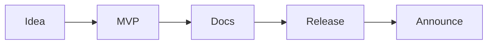

# My First Open Source Project

> Open Source 101 series (10/10)

<!-- a-grade-intro:begin -->

**Core question**: What do you need to release one *small tool* as open source?

> Code, docs, license, release, and community.

<!-- a-grade-intro:end -->

## What You Will Learn

- Picking an *idea*
- Building an *MVP*
- Preparing for *publication*
- Cutting the *first release*
- *Announcing* and gathering *feedback*

## Why It Matters

Releasing is what completes the learning.

## Concept at a Glance



## Key Terms

- **MVP**: Minimum viable product.
- **scope**: What is in.
- **roadmap**: The plan.
- **announcement**: A public release note.
- **feedback loop**: The cycle of input and revision.

## Before/After

**Before**: "I have an idea but no code."

**After**: "I shipped v0.1.0 and gathered feedback."

## Hands-on: Ship Your First Project

### Step 1 — Idea and Scope

```markdown
- Name: tinytool
- Goal: do X in one command
- Non-goals: GUI, i18n
```

### Step 2 — MVP Code

```bash
mkdir tinytool && cd tinytool
git init
python -m venv .venv
```

### Step 3 — Five Docs

```text
README.md
LICENSE
CONTRIBUTING.md
CODE_OF_CONDUCT.md
CHANGELOG.md
```

### Step 4 — Release v0.1.0

```bash
git tag v0.1.0
gh release create v0.1.0 --generate-notes
```

### Step 5 — Announce

```markdown
> Released tinytool v0.1.0. Feedback welcome!
```

## What to Notice in This Code

- The scope is small.
- Documentation is complete.
- The announcement drives traffic.

## Five Common Mistakes

1. **Perfectionism delays release.**
2. **No license.**
3. **A vague README.**
4. **No feedback channel.**
5. **No roadmap.**

## How This Shows Up in Production

Internal tools at companies onboard faster when they reuse the open source release playbook.

## How a Senior Engineer Thinks

- MVP is the start.
- Docs are half the product.
- Announcements are marketing.
- Feedback is direction.
- Sustainment completes the work.

## Checklist

- [ ] MVP works.
- [ ] Five docs in place.
- [ ] v0.1.0 released.
- [ ] Announcement posted.

## Practice Problems

1. One line: define MVP.
2. One line: effect of stating non-goals.
3. One line: example of a feedback loop.

## Wrap-up and Next Steps

The series ends here. Begin with your first PR or your first release.

- [What Is Open Source](./01-what-is-open-source.md)
- [Understanding Licenses](./02-understanding-licenses.md)
- [Reading Issues](./03-reading-issues.md)
- [Creating Pull Requests](./04-creating-pull-requests.md)
- [A Good README](./05-good-readme.md)
- [Release and Versioning](./06-release-and-versioning.md)
- [Community Management](./07-community-management.md)
- [The Maintainer Role](./08-maintainer-role.md)
- [An Open Source Portfolio](./09-open-source-portfolio.md)
- **My First Open Source Project (current)**
## References

- [Open Source Guides — Starting a Project](https://opensource.guide/starting-a-project/)
- [Choose a License](https://choosealicense.com/)
- [GitHub Releases](https://docs.github.com/en/repositories/releasing-projects-on-github)
- [Show HN](https://news.ycombinator.com/showhn.html)

Tags: OpenSource, Project, Capstone, GitHub, Beginner

---

© 2026 YeongseonBooks. All rights reserved.
