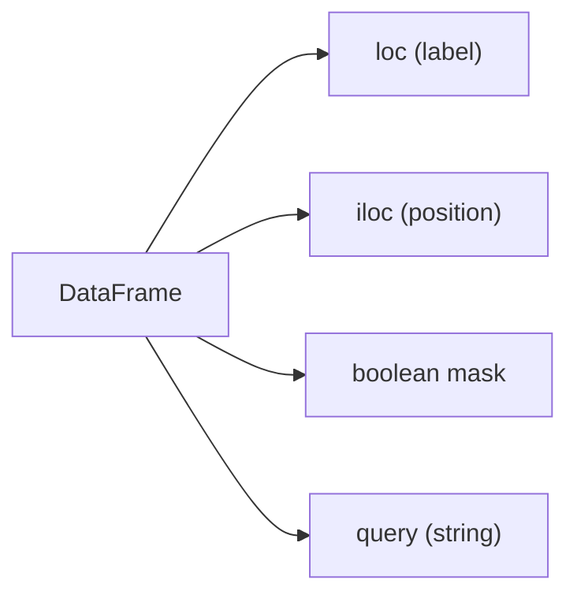

# Filtering and Selection

> Pandas 101 series (4/10)

<!-- a-grade-intro:begin -->

**Core question**: Why are there *four ways* to *pick rows* in Pandas?

> *Different intents (label, position, condition) need *different tools*. Do not force one approach to do everything.*

<!-- a-grade-intro:end -->

## What You Will Learn

- The difference between *loc* and *iloc*
- The intuition behind *boolean indexing*
- The readability of *query*
- A 5-step selection hands-on
- Five common mistakes

## Why It Matters

*Every step of analysis* involves *subset extraction*. *Slow or wrong selection* shakes the *whole pipeline*.

## Concept at a Glance



## Key Terms

- **loc**: *label-based* selection.
- **iloc**: *position-based* selection.
- **boolean mask**: a *True/False Series* selecting rows.
- **query**: filter with a *string expression*.
- **isin**: check *membership* in a *set of values*.

## Before/After

**Before**: *"Just use df[cond]"* — *chained indexing* and *warnings*.

**After**: *"Match tool to intent"* — *loc/iloc/query* used *deliberately*.

## Hands-on: Five Selection Steps

### Step 1 — Column selection

```python
import pandas as pd
df = pd.DataFrame({"x": [1, 2, 3], "y": [10, 20, 30]}, index=["a", "b", "c"])
print(df["x"])
print(df[["x", "y"]])
```

### Step 2 — loc

```python
print(df.loc["a"])
print(df.loc[["a", "c"], "x"])
```

### Step 3 — iloc

```python
print(df.iloc[0])
print(df.iloc[0:2, 0])
```

### Step 4 — Boolean indexing

```python
print(df[df["x"] > 1])
print(df[(df["x"] > 1) & (df["y"] < 30)])
```

### Step 5 — query and isin

```python
print(df.query("x > 1 and y < 30"))
print(df[df["x"].isin([1, 3])])
```

## What to Notice in This Code

- *loc* is *endpoint-inclusive*, *iloc* is *endpoint-exclusive*.
- *&* and *|* are *bitwise operators* — not *and/or*.
- *query* wins on *readability* with *large expressions*.

## Five Common Mistakes

1. **Using *and/or* in masks → error.** Need *&/|* and *parentheses*.
2. **Chained indexing**: `df[df["x"]>1]["y"] = ...` → *SettingWithCopyWarning*.
3. **Forgetting that *loc is endpoint-inclusive*.**
4. **Trying *labels with iloc*.**
5. **Replacing *isin* with long *|* chains.**

## How This Shows Up in Production

KPI dashboards, outlier detection, A/B test slicing — *condition-based selection* is the *core of analysis functions*. Many teams *enforce loc* as a code standard.

## How a Senior Engineer Thinks

- *Extract complex conditions* into *named variables*.
- Always use *loc* for *assignment*.
- Use *query* only when it *wins on readability*.
- Use *isin/between* to *shorten code*.
- *Never ignore warnings*.

## Checklist

- [ ] I distinguish *loc* and *iloc*.
- [ ] I use *&/|* with *parentheses*.
- [ ] I avoid *chained indexing*.
- [ ] I know *query* and *isin*.

## Practice Problems

1. Use *loc* to extract *a subset of specific labels*.
2. Use *iloc* to print the *first 5 rows*.
3. Express *two or more conditions* with *query*.

## Wrap-up and Next Steps

Selection is the *primitive operation of analysis*. Next we tackle *missing value handling*.

- [What Is Pandas?](./01-what-is-pandas.md)
- [Series and DataFrame](./02-series-and-dataframe.md)
- [Reading CSV and Excel](./03-read-csv-and-excel.md)
- **Filtering and Selection (current)**
- Handling Missing Values (upcoming)
- groupby (upcoming)
- Merge and Join (upcoming)
- Time Series (upcoming)
- apply and Vectorization (upcoming)
- Real-world Data Analysis (upcoming)
## References

- [pandas — Indexing and selecting data](https://pandas.pydata.org/docs/user_guide/indexing.html)
- [pandas — query](https://pandas.pydata.org/docs/reference/api/pandas.DataFrame.query.html)
- [pandas — Boolean indexing](https://pandas.pydata.org/docs/user_guide/indexing.html#boolean-indexing)
- [Real Python — Pandas DataFrame Indexing](https://realpython.com/pandas-dataframe/)

Tags: Pandas, Filtering, Selection, Indexing, Beginner

---

© 2026 YeongseonBooks. All rights reserved.
