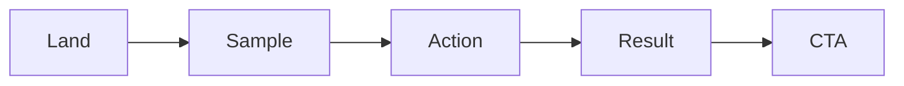

# Building the Demo

> Portfolio Project 101 series (4/10)

<!-- a-grade-intro:begin -->

**Core question**: *Why* should a *demo* prove *value* within *thirty seconds*?

> Visitors leave if they cannot feel *value* in *three clicks*.

<!-- a-grade-intro:end -->

## What You Will Learn

- A *demo scenario*
- *Seed data*
- *Video* vs *live*
- A *demo account*
- *Failure fallback*

## Why It Matters

When a *demo* is *alive*, the *project* is *alive*.

## Concept at a Glance



## Key Terms

- **landing**: the *first screen*.
- **seed**: *demo data*.
- **demo account**: a *shared login*.
- **video**: a *backup* clip.
- **fallback**: a *failure* response.

## Before/After

**Before**: A *blank* screen after login.

**After**: *Seed + core flow* is visible.

## Hands-on: Demo Table

### Step 1 — Scenario

```python
flow = ["land", "sample", "action", "result"]
```

### Step 2 — Seed data

```python
seed = {"users": 5, "tasks": 12}
```

### Step 3 — Demo account

```python
demo = {"id": "guest@demo", "pw": "demo1234"}
```

### Step 4 — Backup video

```python
video_url = "https://youtu.be/example"
```

### Step 5 — Healthcheck

```python
health = "/healthz"
```

## What to Notice in This Code

- The *first screen* shows the *seed*.
- The *account* is *shared*.
- The *video* is a *backup*.

## Five Common Mistakes

1. **Stuck at *login*.**
2. **No *seed* data.**
3. **The *account* is *private*.**
4. **No *backup video*.**
5. **No *healthcheck*.**

## How This Shows Up in Production

SaaS companies offer a *30-second guest mode* demo.

## How a Senior Engineer Thinks

- The *first screen* matters *most*.
- *Seed* is *required*.
- The *shared account* is *public*.
- The *video* is the *backup*.
- *Healthcheck* watches *state*.

## Checklist

- [ ] *Four-step* scenario.
- [ ] *Seed* data.
- [ ] *Shared* account.
- [ ] *Backup* video.

## Practice Problems

1. Define *demo scenario* in one line.
2. State the purpose of *seed data* in one line.
3. State the role of a *backup video* in one line.

## Wrap-up and Next Steps

Next post: *Deploying the Project*.

- [What is a Portfolio Project](./01-what-is-a-portfolio-project.md)
- [Traits of a Good Project](./02-traits-of-a-good-project.md)
- [Writing the README](./03-writing-the-readme.md)
- **Building the Demo (current)**
- Deploying the Project (upcoming)
- Tests and Documentation (upcoming)
- Recording Tech Decisions (upcoming)
- Summarizing as Blog Posts (upcoming)
- Explaining in Interviews (upcoming)
- Portfolio Improvement Checklist (upcoming)
## References

- [Demo-Driven Development - Robert Reppel](https://www.amazon.com/Demo-Driven-Development-Robert-Reppel/dp/B08GFL12CJ)
- [Great Demo - Peter Cohan](https://greatdemo.com/)
- [Showing the Product](https://basecamp.com/shapeup/2.4-chapter-09)
- [Heroku Buttons](https://devcenter.heroku.com/articles/heroku-button)

Tags: Portfolio, Demo, UX, Showcase, Beginner

---

© 2026 YeongseonBooks. All rights reserved.
