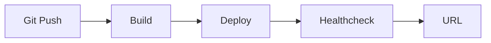

# Deploying the Project

> Portfolio Project 101 series (5/10)

<!-- a-grade-intro:begin -->

**Core question**: *Why* can *localhost-only* code never become a *portfolio*?

> Without *access*, there is no *proof*.

<!-- a-grade-intro:end -->

## What You Will Learn

- Choosing *hosting*
- Linking a *domain*
- *Environment variables*
- *Continuous deploy*
- Watching *cost*

## Why It Matters

*Deployment* connects your *work* to the *world*.

## Concept at a Glance



## Key Terms

- **hosting**: a *server provider*.
- **domain**: an *address*.
- **env var**: an *environment variable*.
- **CD**: *continuous deploy*.
- **cost**: *monthly bill*.

## Before/After

**Before**: Only *localhost* runs.

**After**: A *public URL* exists.

## Hands-on: Deploy Table

### Step 1 — Choose hosting

```python
host = "fly.io"  # or render, railway
```

### Step 2 — Environment variables

```python
env = {"DATABASE_URL": "...", "SECRET_KEY": "..."}
```

### Step 3 — Build command

```bash
docker build -t app .
```

### Step 4 — Deploy

```bash
fly deploy
```

### Step 5 — Healthcheck

```python
url = "https://app.fly.dev/healthz"
```

## What to Notice in This Code

- *Hosting* uses a *free tier*.
- *Env vars* hold *secrets*.
- *Healthchecks* are *automated*.

## Five Common Mistakes

1. ***Secrets* in *code*.**
2. **No *domain*.**
3. **No *healthcheck*.**
4. **Unknown *cost*.**
5. **Manual *redeploy*.**

## How This Shows Up in Production

Startups also ship MVPs on *Render*, *Fly.io*, and *Vercel*.

## How a Senior Engineer Thinks

- *Hosting* is *simple*.
- A *domain* is *professional*.
- *Secrets* live in *env vars*.
- *Continuous deploy* runs on *git push*.
- *Cost* is *monthly*.

## Checklist

- [ ] *Hosting* picked.
- [ ] *Public URL*.
- [ ] *Env vars*.
- [ ] *Healthcheck*.

## Practice Problems

1. Define *hosting* in one line.
2. State the purpose of *env vars* in one line.
3. State the role of *healthcheck* in one line.

## Wrap-up and Next Steps

Next post: *Tests and Documentation*.

- [What is a Portfolio Project](./01-what-is-a-portfolio-project.md)
- [Traits of a Good Project](./02-traits-of-a-good-project.md)
- [Writing the README](./03-writing-the-readme.md)
- [Building the Demo](./04-building-the-demo.md)
- **Deploying the Project (current)**
- Tests and Documentation (upcoming)
- Recording Tech Decisions (upcoming)
- Summarizing as Blog Posts (upcoming)
- Explaining in Interviews (upcoming)
- Portfolio Improvement Checklist (upcoming)
## References

- [Fly.io Docs](https://fly.io/docs/)
- [Render Docs](https://render.com/docs)
- [The Twelve-Factor App](https://12factor.net/)
- [Deployment Strategies - Martin Fowler](https://martinfowler.com/bliki/BlueGreenDeployment.html)

Tags: Portfolio, Deploy, DevOps, Hosting, Beginner

---

© 2026 YeongseonBooks. All rights reserved.
