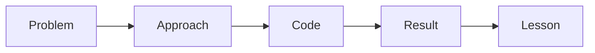

# Summarizing as Blog Posts

> Portfolio Project 101 series (8/10)

<!-- a-grade-intro:begin -->

**Core question**: *Why* do *blog posts* attract more traffic than *GitHub*?

> People *search* for *process*, not just *results*.

<!-- a-grade-intro:end -->

## What You Will Learn

- A *problem solution* format
- Code *excerpts* with *links*
- *Screenshot* usage
- *SEO* titles
- *Series* structure

## Why It Matters

A *blog* makes a *project* *discoverable*.

## Concept at a Glance



## Key Terms

- **post**: a *single* article.
- **excerpt**: a *small slice*.
- **SEO**: *search optimization*.
- **series**: a *thread* of posts.
- **canonical**: the *original URL*.

## Before/After

**Before**: A *code dump* post.

**After**: A *problem solution result* post.

## Hands-on: Post Skeleton

### Step 1 — One-line problem

```markdown
> How we fixed the lost team schedule problem
```

### Step 2 — Approach

```python
approach = ["observe", "hypothesis", "MVP", "deploy"]
```

### Step 3 — Code excerpt

```python
def normalize(date_str):
    return date_str.replace(".", "-")
```

### Step 4 — Result

```python
result = {"users": 30, "latency_ms": 120}
```

### Step 5 — Lesson

```python
lesson = "MVP only survives when small"
```

## What to Notice in This Code

- The *problem* is *one line*.
- *Code* is an *excerpt*.
- *Result* is *numeric*.

## Five Common Mistakes

1. **A *code dump*.**
2. **No *result*.**
3. **An *unclear SEO title*.**
4. **No *screenshots*.**
5. **No *next-post* link.**

## How This Shows Up in Production

Engineering blogs use the same *problem solution result* format.

## How a Senior Engineer Thinks

- *Problem* drives *empathy*.
- *Approach* is a *story*.
- *Code* is *minimal*.
- *Result* is *numeric*.
- *Lesson* is *honest*.

## Checklist

- [ ] *One-line* problem.
- [ ] At most *three* code blocks.
- [ ] *Numeric* result.
- [ ] *One-line* lesson.

## Practice Problems

1. State the meaning of *SEO* in one line.
2. Define *excerpt* in one line.
3. State the *series* structure in one line.

## Wrap-up and Next Steps

Next post: *Explaining in Interviews*.

- [What is a Portfolio Project](./01-what-is-a-portfolio-project.md)
- [Traits of a Good Project](./02-traits-of-a-good-project.md)
- [Writing the README](./03-writing-the-readme.md)
- [Building the Demo](./04-building-the-demo.md)
- [Deploying the Project](./05-deploying-the-project.md)
- [Tests and Documentation](./06-tests-and-documentation.md)
- [Recording Tech Decisions](./07-recording-tech-decisions.md)
- **Summarizing as Blog Posts (current)**
- Explaining in Interviews (upcoming)
- Portfolio Improvement Checklist (upcoming)
## References

- [On Writing Well - William Zinsser](https://www.harpercollins.com/products/on-writing-well-william-zinsser)
- [Google Search Central](https://developers.google.com/search/docs)
- [Hashnode for Devs](https://hashnode.com/)
- [Writing for Engineers - Heinemeier Hansson](https://world.hey.com/dhh)

Tags: Portfolio, Blog, Writing, Storytelling, Beginner

---

© 2026 YeongseonBooks. All rights reserved.
