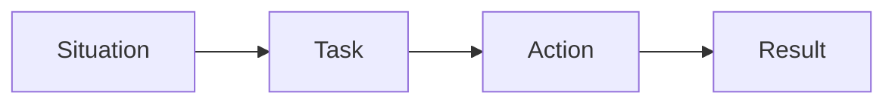

# Explaining in Interviews

> Portfolio Project 101 series (9/10)

<!-- a-grade-intro:begin -->

**Core question**: What do *interviewers* really want to *hear* about your *portfolio*?

> Less *code*, more *judgment*.

<!-- a-grade-intro:end -->

## What You Will Learn

- The *STAR* format
- Problem to solution narrative
- Speaking with *numbers*
- Predicting *follow-up* questions
- A *two minute* summary

## Why It Matters

Interviews are *short*, and *stories* are what people *remember*.

## Concept at a Glance



## Key Terms

- **STAR**: *Situation, Task, Action, Result*.
- **elevator pitch**: A *two minute* summary.
- **trade-off**: The *cost of a choice*.
- **metric**: A *numeric indicator*.
- **follow-up**: A *next question*.

## Before/After

**Before**: "I built an *API* with *Flask*."

**After**: "I solved a *thirty user* concurrency problem with *Flask and Redis*."

## Hands-on: A Two Minute Answer

### Step 1 — Situation

```python
situation = "The team schedule kept getting lost across tools"
```

### Step 2 — Task

```python
task = "Show every schedule on a single screen"
```

### Step 3 — Action

```python
action = ["Flask API", "PostgreSQL", "Deploy to Render"]
```

### Step 4 — Result

```python
result = {"users": 30, "latency_ms": 120}
```

### Step 5 — Lesson

```python
lesson = "Small MVPs survive"
```

## What to Notice in This Code

- *STAR* is the *order*.
- *Numbers* are the *evidence*.
- *Lesson* is the *closing line*.

## Five Common Mistakes

1. **Just *listing* technologies.**
2. **Having no *numbers*.**
3. **Skipping the *trade-off*.**
4. **Blurring your *personal contribution*.**
5. **Forgetting the *lesson*.**

## How This Shows Up in Production

Senior engineers also document *project retrospectives* in *STAR* form.

## How a Senior Engineer Thinks

- *Situation* invites *empathy*.
- *Task* must be *clear*.
- *Action* is *your* part.
- *Result* is in *numbers*.
- *Lesson* is *honest*.

## Checklist

- [ ] You finish in *two minutes*.
- [ ] At least *one number*.
- [ ] At least *one trade-off*.
- [ ] At least *one lesson*.

## Practice Problems

1. Write the meaning of *STAR* in one line.
2. Write the definition of *trade-off* in one line.
3. Write the length of an *elevator pitch* in one line.

## Wrap-up and Next Steps

The next post is the *Portfolio Improvement Checklist*.

- [What Is a Portfolio Project](./01-what-is-a-portfolio-project.md)
- [Traits of a Good Project](./02-traits-of-a-good-project.md)
- [Writing the README](./03-writing-the-readme.md)
- [Building the Demo](./04-building-the-demo.md)
- [Deploying the Project](./05-deploying-the-project.md)
- [Tests and Documentation](./06-tests-and-documentation.md)
- [Recording Tech Decisions](./07-recording-tech-decisions.md)
- [Summarizing as Blog Posts](./08-summarizing-as-blog-posts.md)
- **Explaining in Interviews (current)**
- Portfolio Improvement Checklist (upcoming)
## References

- [STAR Method - Indeed](https://www.indeed.com/career-advice/interviewing/how-to-use-the-star-interview-response-technique)
- [Cracking the Coding Interview - McDowell](https://www.crackingthecodinginterview.com/)
- [Behavioral Interviews - Google re:Work](https://rework.withgoogle.com/guides/hiring-use-structured-interviewing/steps/introduction/)
- [The Tech Resume Inside Out - Orosz](https://thetechresume.com/)

Tags: Portfolio, Interview, STAR, Communication, Beginner

---

© 2026 YeongseonBooks. All rights reserved.
